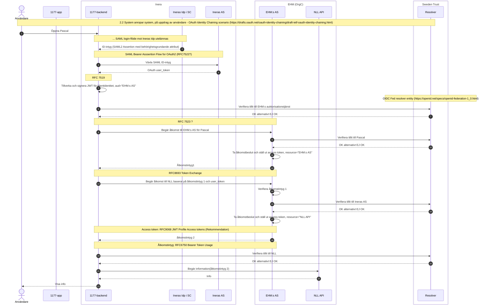

# Utestående frågor
1. 

```mermaid
sequenceDiagram
    autonumber
    actor ua as Användare
    participant c as 1177-app
    box Inera
        participant rsb as 1177-backend
        participant idpb as Ineras Idp i SC
        participant asb as Ineras AS
    end
    box EHM (OrgC)
        participant asc as EHM:s AS
        participant rsc as NLL API
    end
    box Sweden Trust
        participant rst as Resolver
    end


    Note over ua, rst: 2.2 System anropar system, på uppdrag av användare - OAuth Identity Chaining scenario (https://drafts.oauth.net/oauth-identity-chaining/draft-ietf-oauth-identity-chaining.html)

    ua->>rsb: Öppna Pascal
    note over idpb, rsb: ... SAML login-flöde mot Ineras Idp utelämnas
    idpb-->>rsb: ID-intyg (SAML2 Assertion med behörighetsgrundande attribut)

    Note over asb, rsb:SAML Bearer Asssertion Flow for OAuth2 (RFC7522?)
    rsb->>asb: Växla SAML ID-intyg 
    asb-->>rsb: OAuth user_token

    Note over rsb: RFC 7519
    rsb->>rsb: Tillverka och signera JWT för klientidentitet, aud="EHM:s AS"

    note over rst: OIDC Fed resolver entity (https://openid.net/specs/openid-federation-1_0.html)
    rsb->>rst: Verifiera tillit till EHM:s auktorisationstjänst
    rst-->>rsb: OK alternativt EJ OK
    note over rsb, asc: RFC 7523 ?
    rsb->>asc: Begär åtkomst till EHM:s AS för Pascal 
    asc->>rst: Verifiera tillit till Pascal
    rst-->>asc: OK alternativt EJ OK
    asc->>asc: Ta åtkomstbeslut och ställ ut access token, resource="EHM:s AS"
    asc-->>rsb: Åtkomstintyg1
    Note over rsb, asc: RFC8693 Token Exchange
    rsb->>asc: Begär åtkomst till NLL baserat på åtkomstintyg 1 och user_token
    asc->>asc: Verifiera åtkomstintyg 1
    asc->>rst: Verifiera tillit till Ineras AS
    rst-->>asc: OK alternativt EJ OK
    asc->>asc: Ta åtkomstbeslut och ställ ut access token, resource="NLL API"

    Note over rsb, asc: Access token: RFC9068 JWT Profile Access tokens (Rekommendation)
    asc-->>rsb: åtkomstintyg 2
    Note over rsb, asc: Åtkomstintyg: RFC6750 Bearer Token Usage
    rsb->>rst: Verifiera tillit till NLL
    rst-->>rsb: OK alternativt EJ OK
    rsb->>rsc: Begär information(åtkomstintyg 2)
    rsc-->>rsb: Info
    rsb-->>ua: Visa info
    
```
