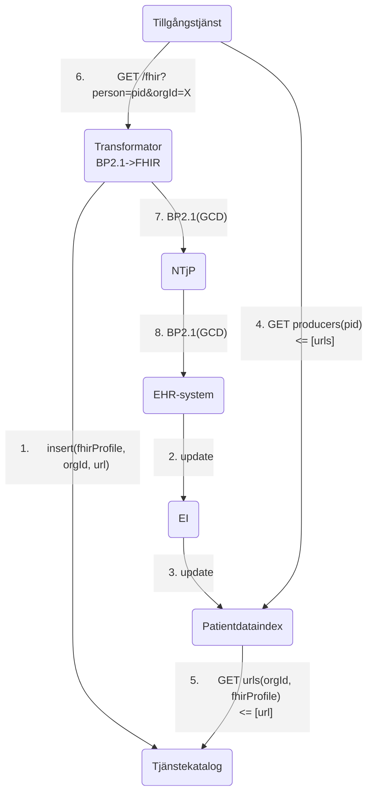

```mermaid
graph 
ntjp(NTjP)
t(Transformator<br>BP2.1->FHIR)
ei(EI)
ehr(EHR-system)
ntk(Tjänstekatalog)
pdi(Patientdataindex)
tt(Tillgångstjänst)

t-- <ol start=1><li> insert(fhirProfile, orgId, url)-->ntk
ehr-- <ol start=2><li>update-->ei-- <ol start=3><li>update-->pdi
tt-- <ol start=4><li> GET producers(pid)<br>&lt= [urls]-->pdi
pdi--<ol start=5><li>GET urls(orgId, fhirProfile)<br>&lt= [url]-->ntk
tt--<ol start=6><li>GET /fhir?person=pid&orgId=X-->t
t--<ol start=7><li>BP2.1(GCD)-->ntjp
ntjp--<ol start=8><li>BP2.1(GCD)-->ehr

```