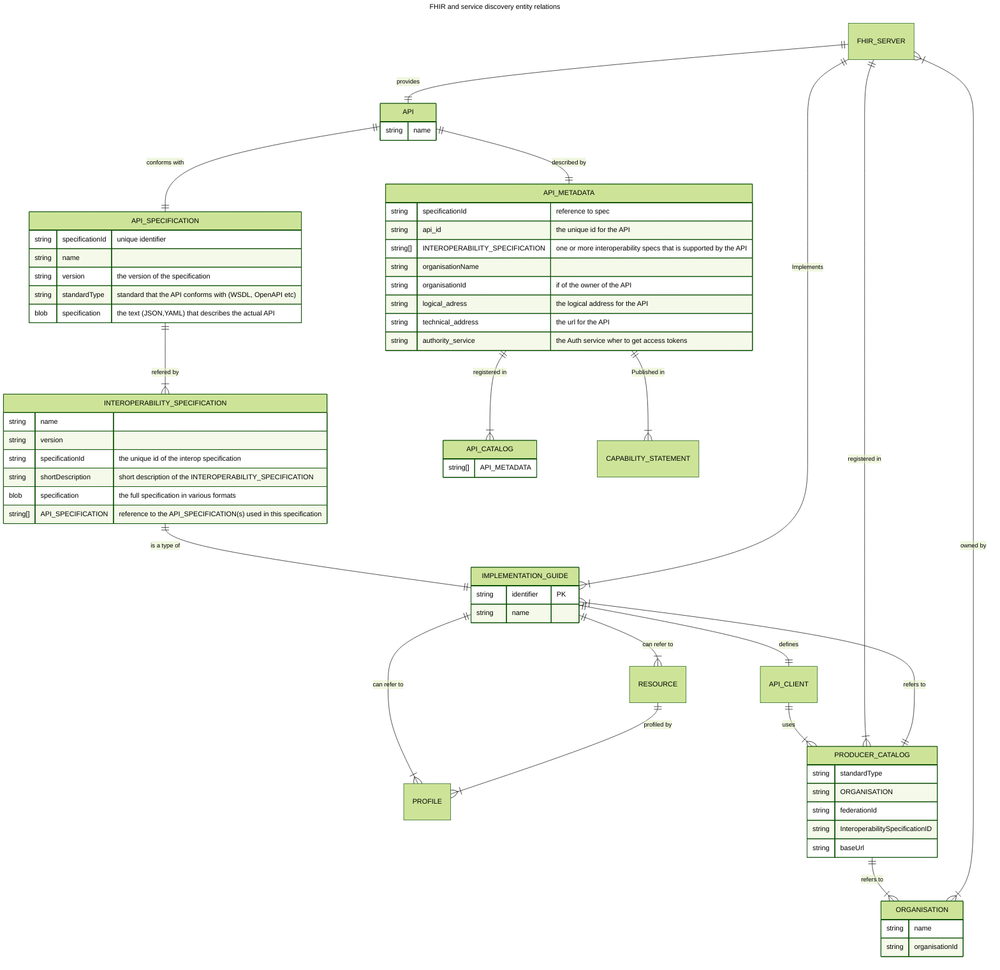

```mermaid
---
title: FHIR and service discovery entity relations
---

erDiagram
%%{init: {'theme':'forest'}}%%

API_SPECIFICATION ||--|{ INTEROPERABILITY_SPECIFICATION : "refered by"
IMPLEMENTATION_GUIDE ||--|| API_CLIENT: "defines"
INTEROPERABILITY_SPECIFICATION ||--|| IMPLEMENTATION_GUIDE :" is a type of"
IMPLEMENTATION_GUIDE ||--|{ RESOURCE: "can refer to"
IMPLEMENTATION_GUIDE ||--|{ PROFILE: "can refer to"

PRODUCER_CATALOG ||--|{IMPLEMENTATION_GUIDE:"refers to"
PRODUCER_CATALOG ||--|{ORGANISATION:"refers to"


API_METADATA ||--|{API_CATALOG: "registered in"
API_METADATA ||--|{CAPABILITY_STATEMENT: "Published in"
API ||--|| API_METADATA: "described by"
%%API ||--|{ RESOURCE : handles
%%RESOURCE ||--|| API:"Accessed thru"
API ||--|| API_SPECIFICATION : "conforms with"

API_CLIENT ||--|{PRODUCER_CATALOG : "uses"
FHIR_SERVER }|--|{ ORGANISATION: "owned by"
FHIR_SERVER ||--|{ PRODUCER_CATALOG: "registered in"
FHIR_SERVER ||--|| API : "provides"
FHIR_SERVER ||--|{IMPLEMENTATION_GUIDE:"Implements"

RESOURCE ||--|{ PROFILE : "profiled by"


IMPLEMENTATION_GUIDE{
string identifier PK
string name
}

PRODUCER_CATALOG {
string standardType
string ORGANISATION
string federationId
string InteroperabilitySpecificationID
string baseUrl
}


API_SPECIFICATION {
string specificationId "unique identifier"
string name 
string version "the version of the specification"
string standardType "standard that the API conforms with (WSDL, OpenAPI etc)"
blob specification "the text (JSON,YAML) that describes the actual API"
}
API {
string name

}
API_METADATA {
string specificationId "reference to spec"
string api_id "the unique id for the API"
string[] INTEROPERABILITY_SPECIFICATION "one or more interoperability specs that is supported by the API"
string organisationName 
string organisationId "if of the owner of the API"
string logical_adress " the logical address for the API"
string technical_address "the url for the API"
string authority_service "the Auth service wher to get access tokens"
}

API_CATALOG {
string[] API_METADATA
}
INTEROPERABILITY_SPECIFICATION {
string name
string version
string specificationId "the unique id of the interop specification"
string shortDescription "short description of the INTEROPERABILITY_SPECIFICATION"
blob specification "the full specification in various formats"
string[] API_SPECIFICATION "reference to the API_SPECIFICATION(s) used in this specification"
}
ORGANISATION {
string name
string organisationId
}

```
