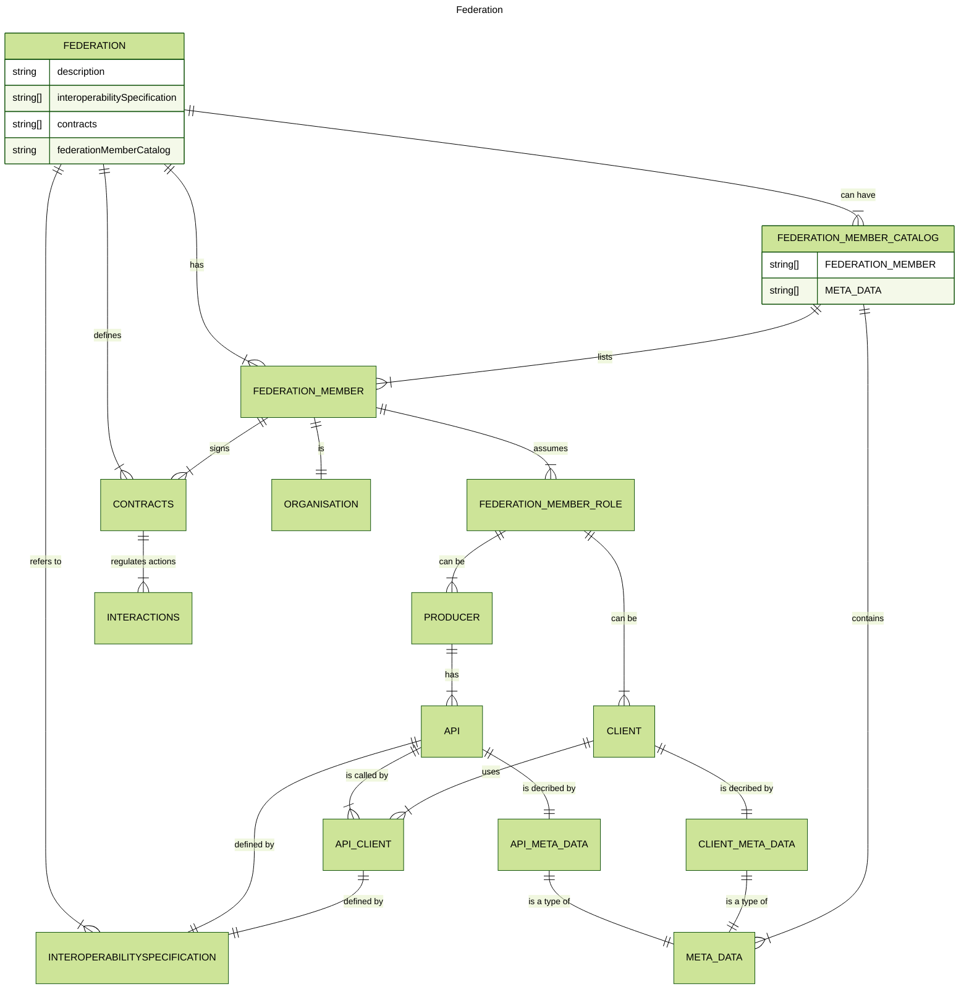

```mermaid
---
title: Federation
---
erDiagram
%%{init: {'theme':'forest'}}%%

FEDERATION {
string description
string[] interoperabilitySpecification
string[] contracts 
string federationMemberCatalog
}
CONTRACTS{}
INTEROPERABILITYSPECIFICATION {}
FEDERATION_MEMBER{}
FEDERATION_MEMBER_ROLE{}
FEDERATION_MEMBER_CATALOG{
string[] FEDERATION_MEMBER 
string[] META_DATA
}
CLIENT{}
PRODUCER{}
FEDERATION ||--|{ CONTRACTS:"defines"
FEDERATION ||--|{ INTEROPERABILITYSPECIFICATION:"refers to"
FEDERATION ||--|{FEDERATION_MEMBER: "has"
FEDERATION ||--|{FEDERATION_MEMBER_CATALOG: "can have"

FEDERATION_MEMBER_CATALOG ||--|{ FEDERATION_MEMBER: "lists"
FEDERATION_MEMBER ||--|| ORGANISATION :"is"
FEDERATION_MEMBER ||--|{ CONTRACTS: "signs"

CONTRACTS ||--|{ INTERACTIONS:"regulates actions "
FEDERATION_MEMBER ||--|{FEDERATION_MEMBER_ROLE: "assumes"
FEDERATION_MEMBER_ROLE ||--|{ CLIENT: "can be"

FEDERATION_MEMBER_ROLE ||--|{ PRODUCER: "can be"
PRODUCER ||--|{ API:"has"
%%API_CLIENT ||--|| API :" calls"
API||--|{API_CLIENT: "is called by"
API ||--|| INTEROPERABILITYSPECIFICATION: "defined by"
API_CLIENT ||--|| INTEROPERABILITYSPECIFICATION: "defined by"
CLIENT ||--|| CLIENT_META_DATA:"is decribed by"
%%META_DATA ||--|{ API_META_DATA:"can be of type"
%%META_DATA ||--|{ CLIENT_META_DATA:"can be of type"

API_META_DATA ||--|| META_DATA:"is a type of"
CLIENT_META_DATA ||--|| META_DATA:"is a type of"

API ||--|| API_META_DATA:"is decribed by"
FEDERATION_MEMBER_CATALOG ||--|{ META_DATA: "contains"


CLIENT ||--|{ API_CLIENT:"uses"
```