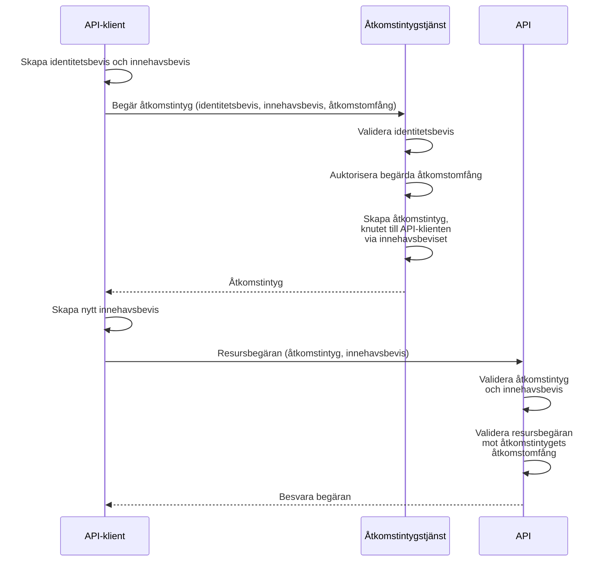

```mermaid
sequenceDiagram
participant c as API-klient
participant as as Åtkomstintygstjänst
participant api as API

c->>c: Skapa identitetsbevis och innehavsbevis
c->>as: Begär åtkomstintyg (identitetsbevis, innehavsbevis, åtkomstomfång)
as->>as: Validera identitetsbevis
as->>as: Auktorisera begärda åtkomstomfång
as->>as: Skapa åtkomstintyg, <br>knutet till API-klienten <br>via innehavsbeviset
as-->>c: Åtkomstintyg
c->>c: Skapa nytt innehavsbevis
c->>api: Resursbegäran (åtkomstintyg, innehavsbevis)
api->>api: Validera åtkomstintyg<br>och innehavsbevis 
api->>api: Validera resursbegäran <br>mot åtkomstintygets<br>åtkomstomfång
api-->>c: Besvara begäran
```