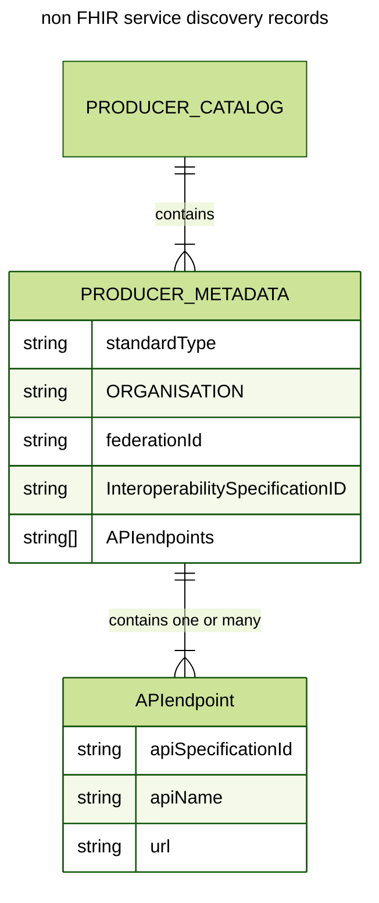

```mermaid
---
title: non FHIR service discovery records
---
erDiagram
%%{init: {'theme':'forest'}}%%

PRODUCER_CATALOG ||--|{ PRODUCER_METADATA: "contains"
PRODUCER_METADATA ||--|{APIendpoint : "contains one or many"
PRODUCER_METADATA {
string standardType
string ORGANISATION
string federationId
string InteroperabilitySpecificationID
string[] APIendpoints
}


APIendpoint {
string apiSpecificationId
string apiName
string url
}
```