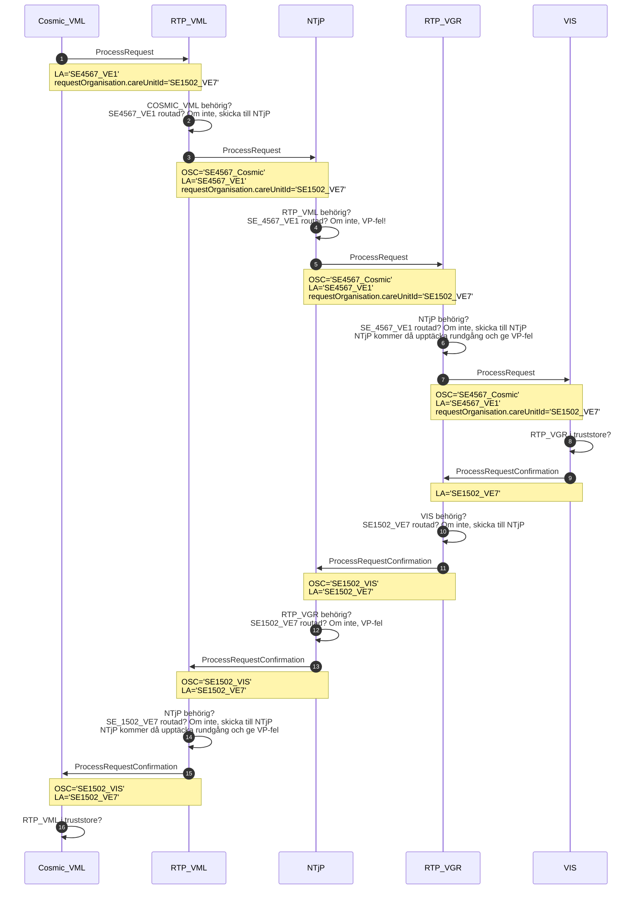

```mermaid
%%{init: {"sequence": {"noteAlign": "left"}} }%%
sequenceDiagram
autonumber

Cosmic_VML->>RTP_VML: ProcessRequest
note over Cosmic_VML, RTP_VML: LA='SE4567_VE1'<br>requestOrganisation.careUnitId='SE1502_VE7'
RTP_VML->>RTP_VML: COSMIC_VML behörig?<br>SE4567_VE1 routad? Om inte, skicka till NTjP
RTP_VML->>NTjP: ProcessRequest
note over RTP_VML, NTjP: OSC='SE4567_Cosmic'<br>LA='SE4567_VE1'<br>requestOrganisation.careUnitId='SE1502_VE7'
NTjP->>NTjP: RTP_VML behörig?<br>SE_4567_VE1 routad? Om inte, VP-fel!
NTjP->>RTP_VGR: ProcessRequest
note over NTjP,RTP_VGR: OSC='SE4567_Cosmic'<br>LA='SE4567_VE1'<br>requestOrganisation.careUnitId='SE1502_VE7'
RTP_VGR->>RTP_VGR: NTjP behörig?<br>SE_4567_VE1 routad? Om inte, skicka till NTjP<br>NTjP kommer då upptäcka rundgång och ge VP-fel
RTP_VGR->>VIS: ProcessRequest
note over RTP_VGR,VIS: OSC='SE4567_Cosmic'<br>LA='SE4567_VE1'<br>requestOrganisation.careUnitId='SE1502_VE7'
VIS->>VIS: RTP_VGR i truststore?

VIS->>RTP_VGR: ProcessRequestConfirmation
note over RTP_VGR,VIS: LA='SE1502_VE7'
RTP_VGR->>RTP_VGR: VIS behörig?<br>SE1502_VE7 routad? Om inte, skicka till NTjP
RTP_VGR->>NTjP: ProcessRequestConfirmation
note over NTjP,RTP_VGR: OSC='SE1502_VIS'<br>LA='SE1502_VE7'
NTjP->>NTjP: RTP_VGR behörig?<br>SE1502_VE7 routad? Om inte, VP-fel
NTjP->>RTP_VML: ProcessRequestConfirmation
note over NTjP,RTP_VML: OSC='SE1502_VIS'<br>LA='SE1502_VE7'
RTP_VML->>RTP_VML: NTjP behörig?<br>SE_1502_VE7 routad? Om inte, skicka till NTjP<br>NTjP kommer då upptäcka rundgång och ge VP-fel
RTP_VML->>Cosmic_VML: ProcessRequestConfirmation
note over RTP_VML,Cosmic_VML: OSC='SE1502_VIS'<br>LA='SE1502_VE7'
Cosmic_VML->>Cosmic_VML: RTP_VML i truststore?

```