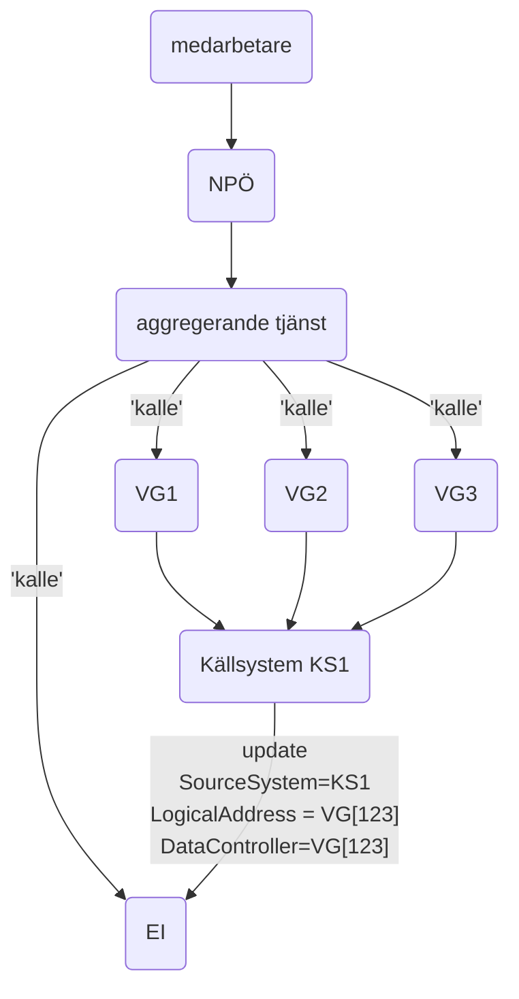
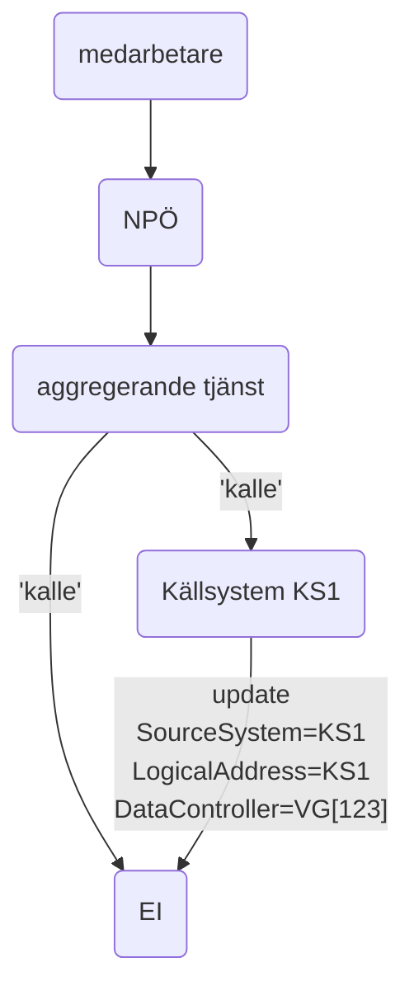

# Verksamhetsbaserad logisk adressering

```mermaid
graph 
p(medarbetare)-->npö(NPÖ)-->agg(aggregerande tjänst)--'kalle'-->ei(EI) & p1(VG1) & p2(VG2) & p3(VG3)
p1 & p2 & p3 -->k(Källsystem KS1)
k--update\nSourceSystem=KS1\nLogicalAddress = VG[123]\nDataController=VG[123]-->ei
```

# Källsystemsbaserad logisk adressering

```mermaid
graph 
p(medarbetare)-->npö(NPÖ)-->agg(aggregerande tjänst)--'kalle'-->ei(EI) & k(Källsystem KS1)
k--update\nSourceSystem=KS1\nLogicalAddress=KS1\nDataController=VG[123]-->ei
```
