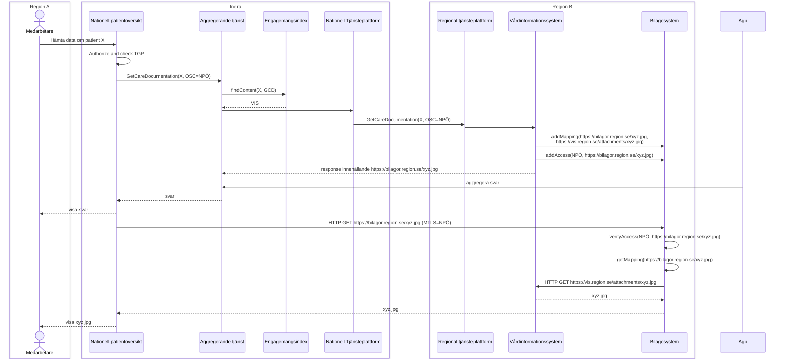

# Alternativ 1 - bilagereferenser via HTTP

```mermaid
sequenceDiagram

box Region A
    actor U as Medarbetare
end

box Inera
    participant NPÖ as Nationell patientöversikt
    participant AgP as Aggregerande tjänst
    participant EI as Engagemangsindex
    participant NTjP as Nationell Tjänsteplattform
end

box Region B
    participant RTP as Regional tjänsteplattform
    participant VIS as Vårdinformationssystem
    participant BS as Bilagesystem
end

U->>NPÖ: Hämta data om patient X
NPÖ->>NPÖ: Authorize and check TGP
NPÖ->>AgP: GetCareDocumentation(X, OSC=NPÖ)
AgP->>EI: findContent(X, GCD) 
EI-->>AgP: VIS
AgP->>NTjP: 
NTjP->>RTP: GetCareDocumentation(X, OSC=NPÖ)
RTP->>VIS: 
VIS->>BS: addMapping(https://bilagor.region.se/xyz.jpg, <br/>https://vis.region.se/attachments/xyz.jpg)
VIS->>BS: addAccess(NPÖ, https://bilagor.region.se/xyz.jpg)
VIS-->>AgP: response innehållande https://bilagor.region.se/xyz.jpg
Agp->>AgP: aggregera svar
AgP-->>NPÖ: svar
NPÖ-->>U: visa svar
NPÖ->>BS: HTTP GET https://bilagor.region.se/xyz.jpg (MTLS=NPÖ)
BS->>BS: verifyAccess(NPÖ, https://bilagor.region.se/xyz.jpg)
BS->>BS: getMapping(https://bilagor.region.se/xyz.jpg)
BS->>VIS: HTTP GET https://vis.region.se/attachments/xyz.jpg
VIS-->>BS: xyz.jpg
BS-->>NPÖ: xyz.jpg
NPÖ-->>U: visa xyz.jpg
 
```
# Alternativ 2 - bilagereferenser via nationellt tjänstekontrakt

```mermaid
sequenceDiagram

box Region A
    actor U as Medarbetare
end

box Inera
    participant NPÖ as Nationell patientöversikt
    participant AgP as Aggregerande tjänst
    participant EI as Engagemangsindex
    participant NTjP as Nationell Tjänsteplattform
end

box Region B
    participant RTP as Regional tjänsteplattform
    participant VIS as Vårdinformationssystem
    participant BS as Bilagesystem
end

U->>NPÖ: Hämta data om patient X
NPÖ->>NPÖ: Authorize and check TGP
NPÖ->>AgP: GetCareDocumentation(X, OSC=NPÖ)
AgP->>EI: findContent(X, GCD) 
EI-->>AgP: VIS
AgP->>NTjP: 
NTjP->>RTP: GetCareDocumentation(X, OSC=NPÖ)
RTP->>VIS: 
VIS->>BS: addMapping(https://bilagor.region.se/xyz.jpg, <br/>https://vis.region.se/attachments/xyz.jpg)
VIS->>BS: addAccess(NPÖ, https://bilagor.region.se/xyz.jpg)
VIS-->>AgP: response innehållande https://bilagor.region.se/xyz.jpg
Agp->>AgP: aggregera svar
AgP-->>NPÖ: svar
NPÖ-->>U: visa svar
NPÖ->>BS: HTTP GET https://bilagor.region.se/xyz.jpg (MTLS=NPÖ)
BS->>BS: verifyAccess(NPÖ, https://bilagor.region.se/xyz.jpg)
BS->>BS: getMapping(https://bilagor.region.se/xyz.jpg)
BS->>VIS: HTTP GET https://vis.region.se/attachments/xyz.jpg
VIS-->>BS: xyz.jpg
BS-->>NPÖ: xyz.jpg
NPÖ-->>U: visa xyz.jpg
```