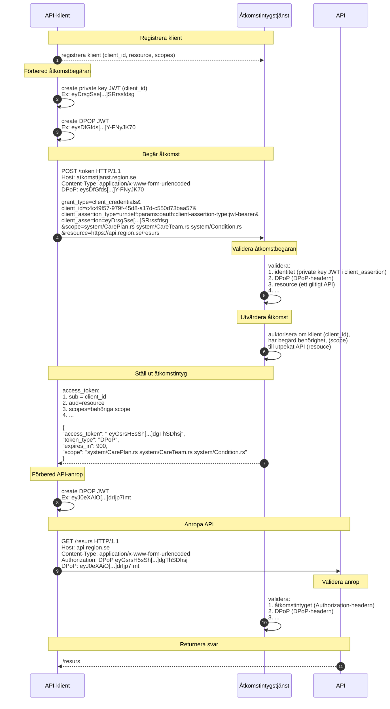

```mermaid
%%{init: { 'sequence': {'messageAlign': 'left'} }}%%
sequenceDiagram
autonumber
participant c as API-klient
participant auth as Åtkomstintygstjänst
participant api as API

note over c, auth: Registrera klient
c-->>auth:registrera klient (client_id, resource, scopes)

note over c: Förbered åtkomstbegäran
c->>c: create private key JWT (client_id) <br/>Ex: eyDrsgSse[...]SRrssfdsg
c->>c: create DPOP JWT <br/>Ex: eysDfGfds[...]Y-FNyJK70
                                
note over c, auth: Begär åtkomst
c->>auth: POST /token HTTP/1.1<br/>Host: atkomsttjanst.region.se<br/>Content-Type: application/x-www-form-urlencoded<br/>DPoP: eysDfGfds[...]Y-FNyJK70<br/>​<br/>grant_type=client_credentials&<br/>client_id=c4c49f57-979f-45d8-a17d-c550d73baa57&<br/>client_assertion_type=urn:ietf:params:oauth:client-assertion-type:jwt-bearer&<br/>client_assertion=eyDrsgSse[...]SRrssfdsg<br/>&scope=system/CarePlan.rs system/CareTeam.rs system/Condition.rs<br/>&resource=https://api.region.se/resurs

note over auth: Validera åtkomstbegäran
auth->>auth: validera:<br/> 1. identitet (private key JWT i client_assertion)<br/>2. DPoP (DPoP-headern)<br/>3. resource (ett giltigt API)<br/>4. ...

note over auth: Utvärdera åtkomst 
auth->>auth: auktorisera om klient (client_id),<br/> har begärd behörighet, (scope)<br/>till utpekat API (resouce)

note over c, auth: Ställ ut åtkomstintyg
auth-->>c: access_token:<br>1. sub = client_id<br/>2. aud=resource<br/>3. scopes=behöriga scope<br/>4. ...<br/><br/>{<br/>  "access_token": " eyGsrsH5sSh[...]dgThSDhsj",<br/>  "token_type": "DPoP",<br/>  "expires_in": 900,<br/>  "scope": "system/CarePlan.rs system/CareTeam.rs system/Condition.rs"<br/>}

note over c: Förbered API-anrop
c->>c: create DPOP JWT <br/>Ex: eyJ0eXAiO[...]drIjp7Imt

note over c,api: Anropa API
c->>api: GET /resurs HTTP/1.1<br/>Host: api.region.se<br/>Content-Type: application/x-www-form-urlencoded<br/>Authorization: DPoP eyGsrsH5sSh[...]dgThSDhsj<br/>DPoP: eyJ0eXAiO[...]drIjp7Imt

note over api: Validera anrop
auth->>auth: validera:<br/> 1. åtkomstintyget (Authorization-headern)<br/>2. DPoP (DPoP-headern)<br/>3. ...
note over c, api: Returnera svar
api-->>c: /resurs
```