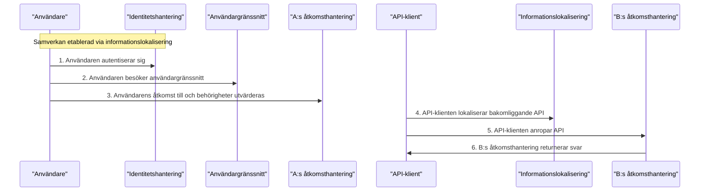

```mermaid
sequenceDiagram

participant Användare as "Användare"
participant Identitetshantering as "Identitetshantering"
participant Användargränssnitt as "Användargränssnitt"
participant As_åtkomsthantering as "A:s åtkomsthantering"
participant API-klient as "API-klient"
participant Informationslokalisering as "Informationslokalisering"
participant Bs_åtkomsthantering as "B:s åtkomsthantering"

Note over Användare,Identitetshantering: Samverkan etablerad via informationslokalisering
Användare->>Identitetshantering: 1. Användaren autentiserar sig
Användare->>Användargränssnitt: 2. Användaren besöker användargränssnitt
Användare->>As_åtkomsthantering: 3. Användarens åtkomst till och behörigheter utvärderas
API-klient->>Informationslokalisering: 4. API-klienten lokaliserar bakomliggande API
API-klient->>Bs_åtkomsthantering: 5. API-klienten anropar API
Bs_åtkomsthantering->>API-klient: 6. B:s åtkomsthantering returnerar svar
```