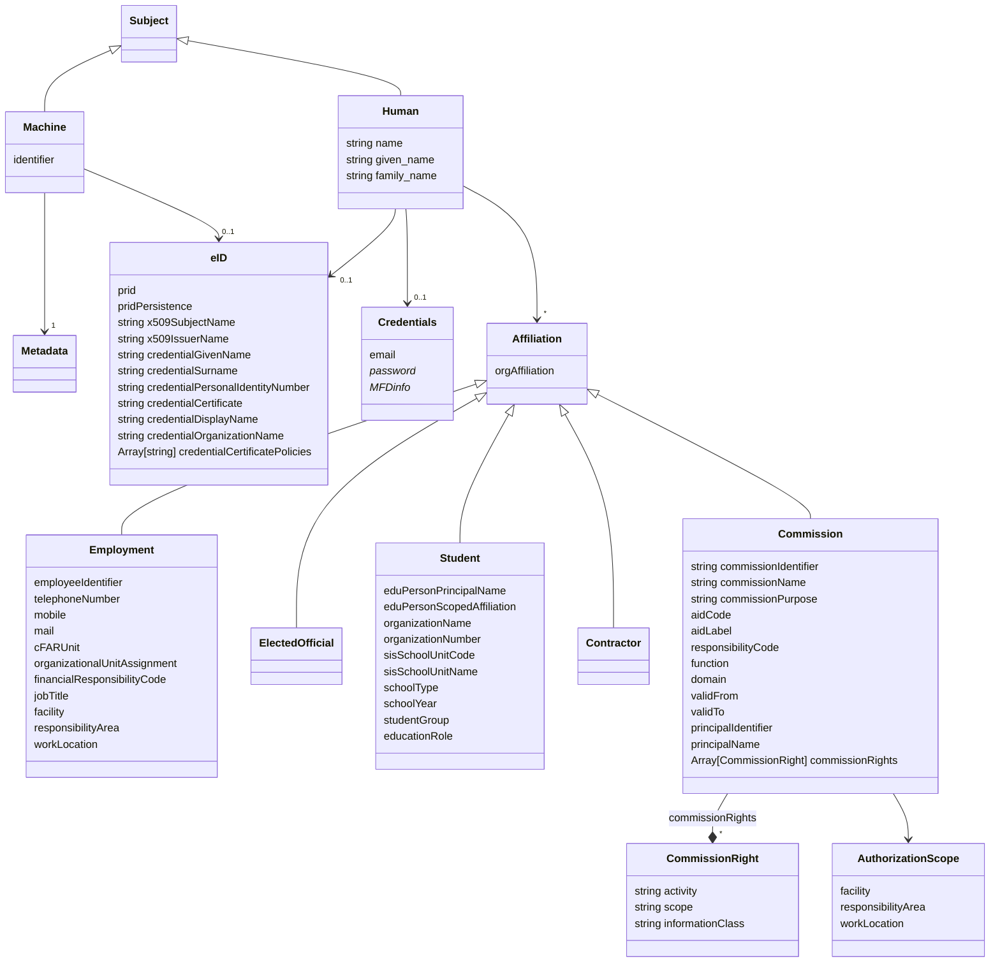
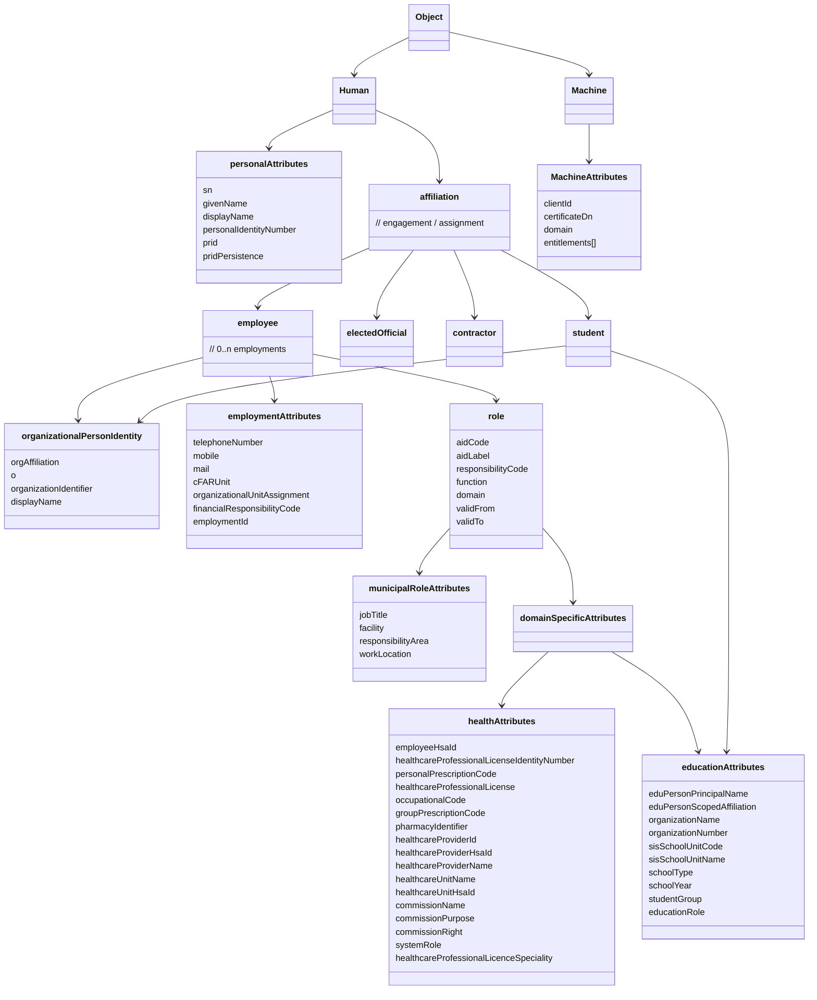

# Authorization model


# Claims model
When representing especially a human in a JSON structure, one should be able to send a structured data set, even if there are only one instance of an employment for example.
```json
{
    "subject": {
        "type": "Human",
        "name": "Anna Andersson",
        "given_name": "Anna",
        "family_name": "Andersson",
        "eID": {
            "prid": "SE:NO:199001011234",
            "pridPersistence": "A",
            "x509SubjectName": "CN=Anna Andersson,SERIALNUMBER=199001011234,C=SE",
            "x509IssuerName": "CN=SITHS e-id Function CA v1,O=Inera AB,C=SE",
            "credentialGivenName": "Anna",
            "credentialSurname": "Andersson",
            "credentialPersonalIdentityNumber": "199001011234",
            "credentialCertificate": "MIIGHz...",
            "credentialDisplayName": "Anna Andersson",
            "credentialOrganizationName": "Region Stockholm",
            "credentialCertificatePolicies": [
                "1.2.752.26.11.1.15.4",
                "1.2.752.26.11.1.15.14"
            ]
        },
        "credentials": {
            "email": "anna.andersson@regionstockholm.se"
        },
        "affiliations": [
            {
                "type": "Employment",
                "orgAffiliation": "SE2321000016-5BCD",
                "employeeIdentifier": "SE2321000016-ABC123",
                "telephoneNumber": "+4608123456",
                "mobile": "+46701234567",
                "mail": "anna.andersson@regionstockholm.se",
                "cFARUnit": "12345678",
                "organizationalUnitAssignment": "Akutmottagningen",
                "financialResponsibilityCode": "1234",
                "jobTitle": "Läkare",
                "facility": "Karolinska Universitetssjukhuset",
                "responsibilityArea": "Akut",
                "workLocation": "Huddinge"
            },
            {
                "type": "Commission",
                "orgAffiliation": "SE2321000016-5BCD",
                "commissionIdentifier": "SE2321000016-COMM01",
                "commissionName": "Förskrivare",
                "commissionPurpose": "Vård och behandling",
                "aidCode": "000",
                "aidLabel": "Läkare",
                "responsibilityCode": "1",
                "function": "Behandlande läkare",
                "domain": "Vård",
                "validFrom": "2025-01-01",
                "validTo": "2026-12-31",
                "principalIdentifier": "SE2321000016-VARD01",
                "principalName": "Region Stockholm Vård AB",
                "commissionRights": [
                    {
                        "activity": "Förskriva",
                        "scope": "Slutenvård",
                        "informationClass": "Läkemedel"
                    },
                    {
                        "activity": "Läsa",
                        "scope": "Öppenvård",
                        "informationClass": "Journal"
                    }
                ],
                "authorizationScope": {
                    "facility": "Karolinska Universitetssjukhuset",
                    "responsibilityArea": "Akut",
                    "workLocation": "Huddinge"
                }
            }
        ]
    }
}
```

## Example: Student
```json
{
    "subject": {
        "type": "Human",
        "name": "Erik Johansson",
        "given_name": "Erik",
        "family_name": "Johansson",
        "credentials": {
            "email": "erik.johansson@elev.skola.se"
        },
        "affiliations": [
            {
                "type": "Student",
                "orgAffiliation": "SE212000028-AB12",
                "eduPersonPrincipalName": "erik.johansson@skola.se",
                "eduPersonScopedAffiliation": "student@skola.se",
                "organizationName": "Värmdö kommuns skolor",
                "organizationNumber": "212000-0028",
                "sisSchoolUnitCode": "53513510",
                "sisSchoolUnitName": "Gustavsbergsskolan",
                "schoolType": "Grundskola",
                "schoolYear": "8",
                "studentGroup": "8B",
                "educationRole": "student"
            }
        ]
    }
}
```

## Example: School teacher in Värmdö kommun
```json
{
    "subject": {
        "type": "Human",
        "name": "Maria Lindström",
        "given_name": "Maria",
        "family_name": "Lindström",
        "eID": {
            "prid": "SE:SE:197505152345",
            "pridPersistence": "A",
            "x509SubjectName": "CN=Maria Lindström,SERIALNUMBER=197505152345,C=SE",
            "x509IssuerName": "CN=SITHS e-id Person CA v2,O=Inera AB,C=SE",
            "credentialGivenName": "Maria",
            "credentialSurname": "Lindström",
            "credentialPersonalIdentityNumber": "197505152345",
            "credentialCertificate": "MIIGHz...",
            "credentialDisplayName": "Maria Lindström",
            "credentialOrganizationName": "Värmdö kommun",
            "credentialCertificatePolicies": [
                "1.2.752.26.11.1.15.4"
            ]
        },
        "credentials": {
            "email": "maria.lindstrom@varmdo.se"
        },
        "affiliations": [
            {
                "type": "Employment",
                "orgAffiliation": "SE212000028-AB12",
                "employeeIdentifier": "SE212000028-EMP456",
                "telephoneNumber": "+4608570800",
                "mobile": "+46709876543",
                "mail": "maria.lindstrom@varmdo.se",
                "cFARUnit": "87654321",
                "organizationalUnitAssignment": "Gustavsbergsskolan",
                "financialResponsibilityCode": "2210",
                "jobTitle": "Lärare",
                "facility": "Gustavsbergsskolan",
                "responsibilityArea": "Grundskola år 7-9",
                "workLocation": "Gustavsberg"
            },
            {
                "type": "Commission",
                "orgAffiliation": "SE212000028-AB12",
                "commissionIdentifier": "SE212000028-COMM01",
                "commissionName": "Klasslärare 8B",
                "commissionPurpose": "Undervisning och elevvård",
                "aidCode": "310",
                "aidLabel": "Lärare grundskola",
                "responsibilityCode": "1",
                "function": "Klasslärare",
                "domain": "Utbildning",
                "validFrom": "2025-08-15",
                "validTo": "2026-06-15",
                "principalIdentifier": "SE212000028-NÄMND01",
                "principalName": "Värmdö kommuns barn- och ungdomsnämnd",
                "commissionRights": [
                    {
                        "activity": "Registrera",
                        "scope": "Elevdokumentation",
                        "informationClass": "Betyg"
                    },
                    {
                        "activity": "Läsa",
                        "scope": "Elevdokumentation",
                        "informationClass": "Åtgärdsprogram"
                    }
                ],
                "authorizationScope": {
                    "facility": "Gustavsbergsskolan",
                    "responsibilityArea": "Grundskola år 7-9",
                    "workLocation": "Gustavsberg"
                }
            }
        ]
    }
}
```

# Indata KZ

# Indata AM
