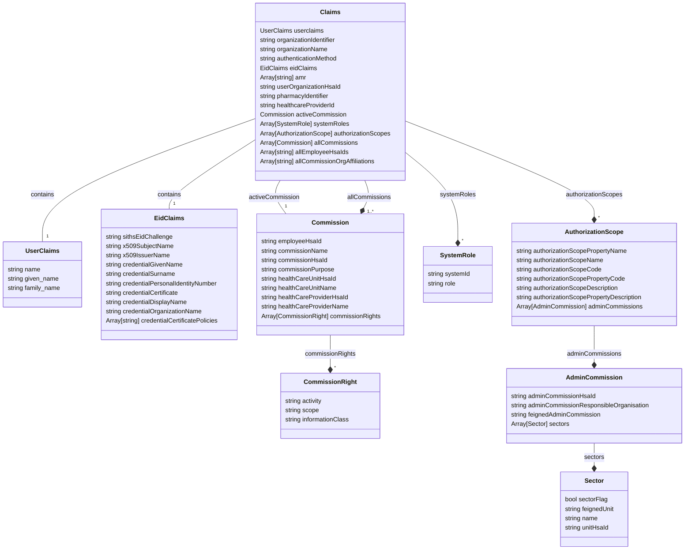

```mermaid
classDiagram

    class Claims {
        UserClaims userclaims
        string organizationIdentifier
        string organizationName
        string authenticationMethod
        EidClaims eidClaims
        Array[string] amr
        string userOrganizationHsaId
        string pharmacyIdentifier
        string healthcareProviderId
        Commission activeCommission
        Array[SystemRole] systemRoles
        Array[AuthorizationScope] authorizationScopes
        Array[Commission] allCommissions
        Array[string] allEmployeeHsaIds
        Array[string] allCommissionOrgAffiliations
    }

    Claims -- "1" UserClaims: contains
    Claims -- "1" EidClaims : contains
    Claims -- "1" Commission : activeCommission
    Claims --* "*" SystemRole : systemRoles
    Claims --* "*" AuthorizationScope : authorizationScopes
    Claims --* "1..*" Commission : allCommissions

    class UserClaims {
        string name
        string given_name
        string family_name
    }

    class EidClaims{
        string sithsEidChallenge
        string x509SubjectName
        string x509IssuerName
        string credentialGivenName
        string credentialSurname
        string credentialPersonalIdentityNumber
        string credentialCertificate
        string credentialDisplayName
        string credentialOrganizationName
        Array[string] credentialCertificatePolicies
    }

    class Commission {
        string employeeHsaId
        string commissionName
        string commissionHsaId
        string commissionPurpose
        string healthCareUnitHsaId
        string healthCareUnitName
        string healthCareProviderHsaId
        string healthCareProviderName
        Array[CommissionRight] commissionRights
    }
    Commission --* "*" CommissionRight : commissionRights

    class CommissionRight {
        string activity
        string scope
        string informationClass
    }

    class SystemRole {
        string systemId
        string role
    }

    class AuthorizationScope {
        string authorizationScopePropertyName
        string authorizationScopeName
        string authorizationScopeCode
        string authorizationScopePropertyCode
        string authorizationScopeDescription
        string authorizationScopePropertyDescription
        Array[AdminCommission] adminCommissions
    }
    AuthorizationScope --* AdminCommission : adminCommissions

    class AdminCommission {
        string adminCommissionHsaId
        string adminCommissionResponsibleOrganisation
        string feignedAdminCommission
        Array[Sector] sectors
    }
    AdminCommission --* Sector : sectors

    class Sector {
        bool sectorFlag
        string feignedUnit
        string name
        string unitHsaId
    }

    
```