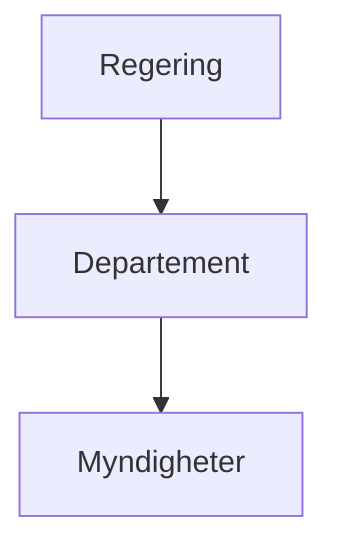
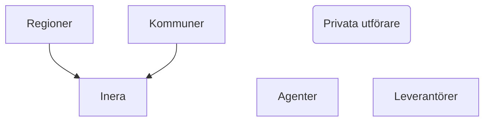
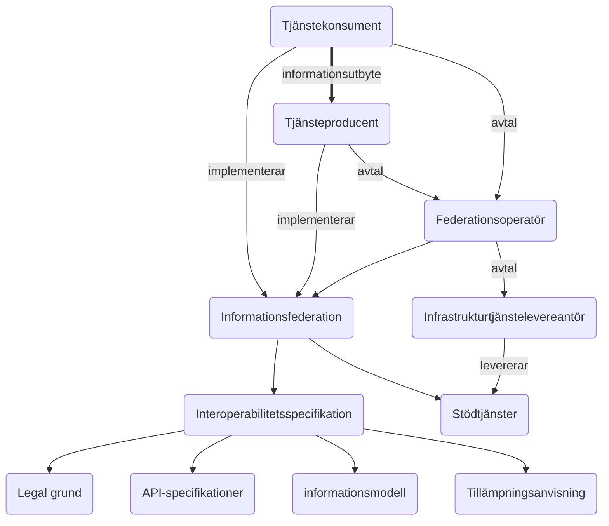

# Digitalisering av välfärden

## Det digitala ekosystemet
Aktörerna som bidrar till välfärdens digitalisering omfattar många parter, som alla har olika roller, förmågor och mandat.

 

## Ineras uppdrag

### Arkitektur
- linjera mot europeisk arkitektur
- förankra inom det digitala ekosystemet
- jämka inom det digitala ekosystemet
  
- Tekniska förmågor
    - *Tillitsramverk*: 
    - *Aktörsregister*: organisationsidentifierare
    - *Avtal*: informationsfederationer, komersiella avtal, PUB-avtal
    - *Verksamhetsutbud*: 
    - *Tjänstesökning*: interoperabilitetsspecifikation, aktör
    - *Identitetshantering*: certifikat och klientid för systemanvändare, e-legitimation och e-tjänstelegitimation för fysiska användare
    - *Åtkomsthantering*: behörighetsgrundande information - personlig info, tjänstrelaterade attribut, ombudsattribut
- Semantiska förmågor
    - *Informationsmängder*: kodverk, standarder, profileringar
    - ...

### Infrastruktur
- erbjud förvaltningsgemensam infrastruktur till alla i det digitala ekosystemet (inom Tekalundantagets ramar)
- skapa referensimplementationer för lokal instansiering

### Interoperabilitetestillämpningar
- skapa syftesspecifika/lagrumsspecifika informationsförsörjningstjänster som kan nyttjas både lokalt och av förvaltningsgemensamma tjänster
- bygg in legal grund för informationsutbyte, d.v.s. API:er behöver filtrera beroende på vilken organisation eller användare som begär information och applicera regler för aktuellt lagutrymme.
- Förvaltningsgemensamt framtagna tillämpningar måste kunna nyttjas för att informationsförsörja lokala tillämpningar

### Invånartjänster

Stödja lokalt drivna digitaliseringsinitiativ

Informationsförsörjning via nationella informationsförsörjningstjänster av egen data

Tillgång till gemensamma stödtjänster för lokala behov

Underlätta förflyttningar av tillämpningar från lokal till nationell skala

Etablera bred förankring kring standarder inom offentliga Sverige för kostnadsbesparingar på alla nivåer

Använd internationellt och nationellt överenskomna standarder för arkitektur, API-utformning och semantik

Driv nationell standardisering inom regionala och kommunala verksamhetsområden

Delta aktivt inom standardisering som kommuner och regioner behöver förhålla sig till

Underlätta informationsförsörjning för mindre aktörer genom förvaltningsgemensamma, syftesspecifika, sammansatta bastjänster (t.ex. SSBTEK), aggregerande tjänster.

