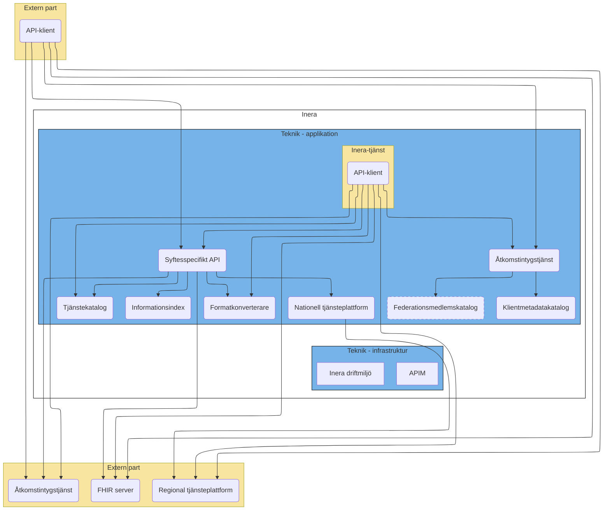
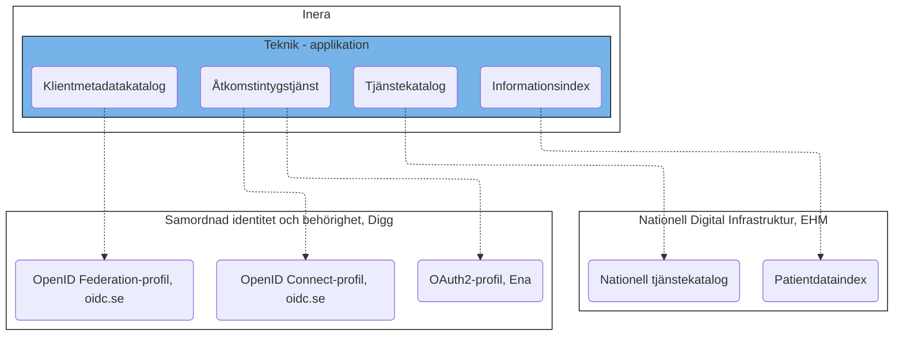

# Samverkansinfrastrukturen

## Lösningsarkitektur

## Komponenter med externa beroenden

# Scenarion
<b>Not:</b> Med "syftesspecifikt API" ned avses att förmedlad data filtreras och kompletteras utifrån en specifik tillämpning inom ett specifikt lagrum

1. <b>Inera-tjänst anropar logiskt adresserad tjänsteproducent-API direkt</b> 
a) tjänsten begär åtkomst till Tjänstekatalogen från Ineras Åtkomstintygstjänst 
b) tjänsten hämtar metadata om tjänsteproducentens API från Tjänstekatalog 
c) tjänsten begär åtkomst till API från tjänsteproducents AS 
d) tjänsten anropar tjänsteproducents API 
e) tjänsten hämtar refererad information från tjänsteproducentens API 
f) tjänsten konverterar information till 
 

1. <b>Inera-tjänst anropar syftesspecifikt aggregerande API</b> 
...TBC 
 
1. <b>Extern tjänst anropar syftesspecifik aggregerande API hos Inera</b> 
...TBC 
 

1. <b>Extern tjänst anropar syftesspecifik API som inte aggregerar information</b> 
...TBC 
 

