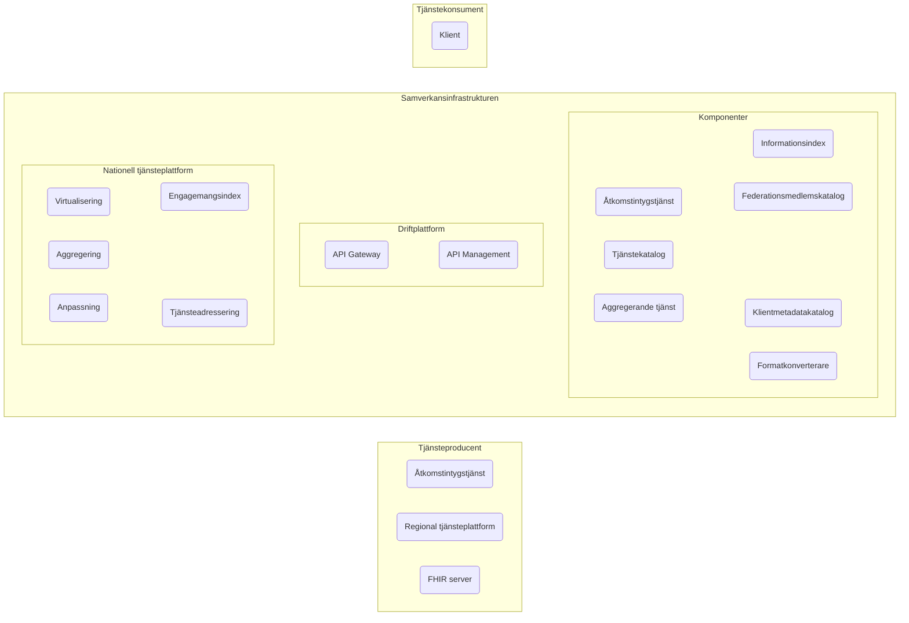
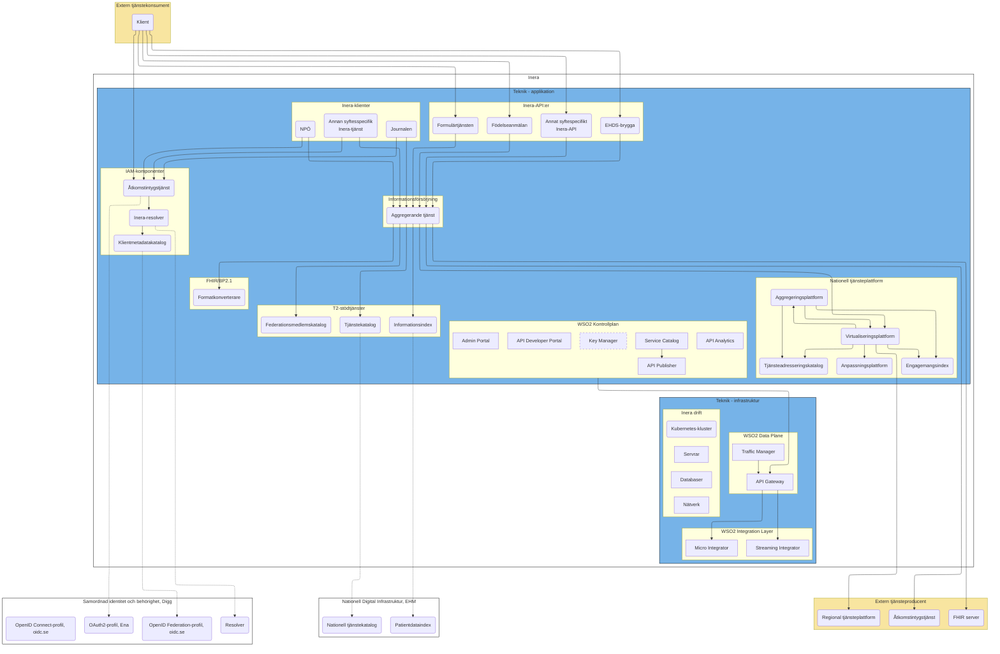

# Lösningsarkitektur

## Översikt

```mermaid
graph TB
    subgraph tk[Tjänstekonsument]
        tkc(Klient)
    end
    

    subgraph si[Samverkansinfrastrukturen]
        direction TB
        subgraph si1[Komponenter]
            sias(Åtkomstintygstjänst) & sitk(Tjänstekatalog) & siagg(Aggregerande tjänst)
            ~~~
            siii(Informationsindex) & sifmk(Federationsmedlemskatalog) & sikk(Klientmetadatakatalog) & sifk(Formatkonverterare)
        end
        subgraph drift[Driftplattform]
            gw(API Gateway)~~~ap(API Management)

        end
        subgraph ntjp[Nationell tjänsteplattform]
            vp(Virtualisering) & ag(Aggregering) & anp(Anpassning)
            ~~~
            ei(Engagemangsindex) & tak(Tjänsteadressering)
        end
    end
    subgraph tp[Tjänsteproducent]
        tpas(Åtkomstintygstjänst)
        tprtp(Regional tjänsteplattform)
        tpfs(FHIR server)
    end
    tk ~~~ si ~~~ tp
```

```mermaid
graph TB
%%{init: {"flowchart": {"defaultRenderer": "elk"}} }%%

subgraph inera[Inera]

    subgraph app[Teknik - applikation]

        subgraph itk[Inera-klienter]
            itk1(Annan syftesspecifik<br>Inera-tjänst)
            itk2(NPÖ)
            itk3(Journalen)
        end

        subgraph siiam[IAM-komponenter]
            sias(Åtkomstintygstjänst)
            sikk(Klientmetadatakatalog)
            sir(Inera-resolver)
        end

        subgraph siit[Informationsförsörjning]
            svodc(Aggregerande tjänst)
        end

        subgraph si1[T2-stödtjänster]
            sitk(Tjänstekatalog)
            siii(Informationsindex)
            sifmk(Federationsmedlemskatalog)
        end

        subgraph si2[FHIR/BP2.1]
            sifk(Formatkonverterare)
        end

        subgraph ntjp[Nationell tjänsteplattform]
            vp(Virtualiseringsplattform)
            ag(Aggregeringsplattform)
            anp(Anpassningsplattform)
            ei(Engagemangsindex)
            tak(Tjänsteadresseringskatalog)
        end

        subgraph itp[Inera-API:er]
            itp1(Formulärtjänsten)
            itp2(Födelseanmälan)
            itp3(Annat syftespecifikt<br>Inera-API)
            itp4(EHDS-brygga)
        end

        subgraph cp[WSO2 Kontrollplan]
            PUB[API Publisher]
            DEV[API Developer Portal]
            ADM[Admin Portal]
            KEY[Key Manager]
            ANA[API Analytics]
            SC[Service Catalog]
        end

    end

    subgraph infra[Teknik - infrastruktur]

        subgraph drift[Inera drift]
            kubernetes(Kubernetes-kluster)
            ~~~
            Servrar
            ~~~
            Databaser
            ~~~
            Nätverk
        end
    
        subgraph DP[WSO2 Data Plane]
            GW[API Gateway]
            TM[Traffic Manager]
        end

        subgraph IL[WSO2 Integration Layer]
            MI[Micro Integrator]
            SI[Streaming Integrator]
        end
    end
end

subgraph tk[Extern tjänstekonsument]
    tkc(Klient)
end

subgraph tp[Extern tjänsteproducent]
    tpas(Åtkomstintygstjänst)
    tprtp(Regional tjänsteplattform)
    tpfs(FHIR server)
end

subgraph ndi[Nationell Digital Infrastruktur, EHM]
    ntk(Nationell tjänstekatalog)
    pdi(Patientdataindex)
end

subgraph sib[Samordnad identitet och behörighet, Digg]
    res(Resolver)
    oi(OpenID Connect-profil, oidc.se)
    o2(OAuth2-profil, Ena)
    of(OpenID Federation-profil, oidc.se)
end


SC --> PUB
cp-->GW

GW --> MI
GW --> SI
TM --> GW

sias -.-> o2
sitk -.-> ntk
siii -.-> pdi
sikk -.-> of
sir -.-> res
sias --> sir
sir --> sikk
ag --> vp
ag --> ei
ag --> tak
vp --> anp
vp --> ag
vp --> ei
vp --> tak
svodc --> vp
svodc --> siii
svodc --> sifk
svodc --> sifmk
svodc --> sitk
vp ----> tprtp
tkc --> itp1 & itp2 & itp3 & itp4  --> svodc
itk1 & itk2 & itk3 --> svodc
svodc --> tpas
svodc --> tpfs
tkc --> sias
itk1 & itk2 & itk3 --> sias

style inera fill:#FFFFFF,stroke:#000000
style app fill:#76b3e8,stroke:#000000
style infra fill:#76b3e8,stroke:#000000
style tk fill:#F8E5A0
style tp fill:#F8E5A0
style ndi fill:#FFFFFF,stroke:#000000
style sib fill:#FFFFFF,stroke:#000000
style KEY stroke-dasharray: 5 5

%% Formatting for elk renderer

%% Formatting for dagre (standard) renderer
sias~~~~~~~~~ndi & sib & tp
tak~~~~GW

```
