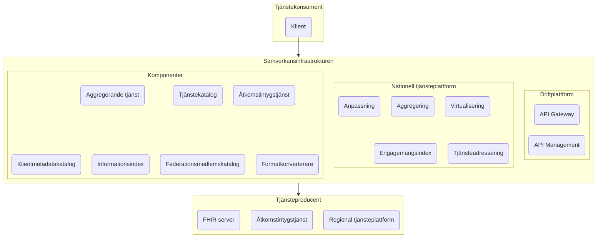
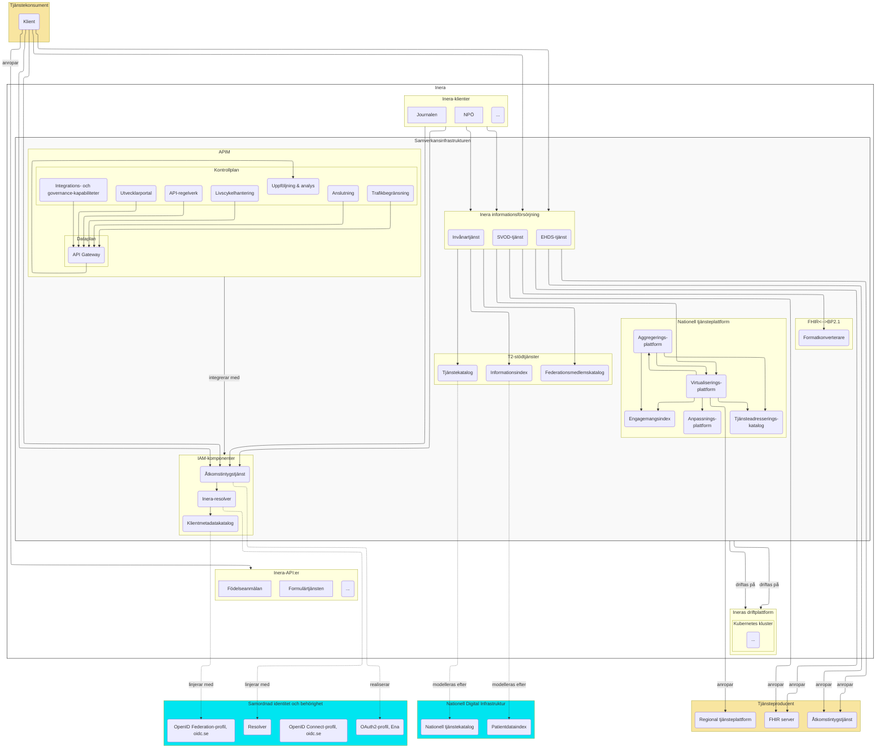

# Lösningsarkitektur

## Översikt

```mermaid
%%{init: {"flowchart": {"defaultRenderer": "elk"}} }%%
graph 
    subgraph tk[Tjänstekonsument]
        tkc(Klient)
    end
    

    subgraph si[Samverkansinfrastrukturen]
        subgraph si1[Komponenter]
            sias(Åtkomstintygstjänst) & sitk(Tjänstekatalog) & siagg(Aggregerande tjänst)
            ~~~
            siii(Informationsindex) & sifmk(Federationsmedlemskatalog) & sikk(Klientmetadatakatalog) & sifk(Formatkonverterare)
        end
        subgraph drift[Driftplattform]
            gw(API Gateway)~~~ap(API Management)

        end
        subgraph ntjp[Nationell tjänsteplattform]
            vp(Virtualisering) & ag(Aggregering) & anp(Anpassning)
            ~~~
            ei(Engagemangsindex) & tak(Tjänsteadressering)
        end
    end
    subgraph tp[Tjänsteproducent]
        tpas(Åtkomstintygstjänst)
        tprtp(Regional tjänsteplattform)
        tpfs(FHIR server)
    end
    %%tk --> si --> tp
    tkc-->si-->tp

```

## Detaljerad

```mermaid
%%{init: {"flowchart": {"defaultRenderer": "elk"}} }%%
graph 

subgraph i[Inera]
    subgraph itk[Inera-klienter]
        NPÖ
        mmm(...)
        Journalen
    end

    subgraph si[Samverkansinfrastrukturen]

        subgraph siit[Inera informationsförsörjning]
            svodc(SVOD-tjänst)
            ehdsc(EHDS-tjänst)
            jc(Invånartjänst)
        end
    
        subgraph si1[T2-stödtjänster]
            sitk(Tjänstekatalog)
            siii(Informationsindex)
            sifmk(Federationsmedlemskatalog)
        end
    
        subgraph si2[FHIR<-->BP2.1]
            sifk(Formatkonverterare)
        end
    
        subgraph siiam[IAM-komponenter]
            sias(Åtkomstintygstjänst)
            sikk(Klientmetadatakatalog)
            sir(Inera-resolver)
        end
    
        subgraph ntjp[Nationell tjänsteplattform]
            vp(Virtualiserings-<br>plattform)
            ag(Aggregerings-<br>plattform)
            anp(Anpassnings-<br>plattform)
            ei(Engagemangsindex)
            tak(Tjänsteadresserings-<br>katalog)
        end
    
        subgraph apim[APIM]
            subgraph dp[Dataplan]
                gw(API Gateway)
            end
            subgraph cp[Kontrollplan]
                cp1(Utvecklarportal)
                cp2(API-regelverk)
                cp3(Uppföljning & analys)
                cp4(Livscykelhantering)
                cp5(Anslutning)
                cp6(Trafikbegränsning)
                cp7(Integrations- och governance‑kapabiliteter)
            end
        end
    
    end

    subgraph itp[Inera-API:er]
        Formulärtjänsten
        mm(...)
        Födelseanmälan
    end

    subgraph drift[Ineras driftplattform]
        subgraph kk[Kubernetes kluster]
            s(...)
        end
    end

end

subgraph tk[Tjänstekonsument]
    tkc(Klient)
end

subgraph tp[Tjänsteproducent]
    tpas(Åtkomstintygstjänst)
    tprtp(Regional tjänsteplattform)
    tpfs(FHIR server)
end


subgraph ndi[Nationell Digital Infrastruktur]
    ntk(Nationell tjänstekatalog)
    pdi(Patientdataindex)
end

subgraph sib[Samordnad identitet och behörighet]
    res(Resolver)
    oi(OpenID Connect-profil, oidc.se)
    o2(OAuth2-profil, Ena)
    of(OpenID Federation-profil, oidc.se)
end

cp1 & cp2 & cp4 & cp5 & cp6 & cp7 -->gw -->cp3
sias -. realiserar .-> o2
sitk -. modelleras efter .-> ntk
siii -. modelleras efter .-> pdi
sikk -. linjerar med .-> of
sir -. linjerar med .-> res
sias --> sir --> sikk
ag --> vp & ei & tak
vp --> anp & ag & ei & tak
siit --> vp  & siii & sifk & sifmk & sitk
vp -- anropar --> tprtp
si -- driftas på --> drift 
tkc & itk --> siit -- anropar --> tpas & tpfs
tkc & itk --> sias
tkc -- anropar --> itp
si ~~~ itp
apim -- integrerar med --> siiam
si -- driftas på --> drift 
tkc --> siit
itk --> siit
siit -- anropar --> tpas
siit -- anropar --> tpfs
tkc --> sias
itk --> sias
si ~~~ itp

style i fill:#ffffff,stroke:#000000
style si fill:#f9f9f9,stroke:#000000

style tk fill:#F8E5A0
style tp fill:#F8E5A0
style ndi fill:#00E5F0
style sib fill:#00E5F0


```
