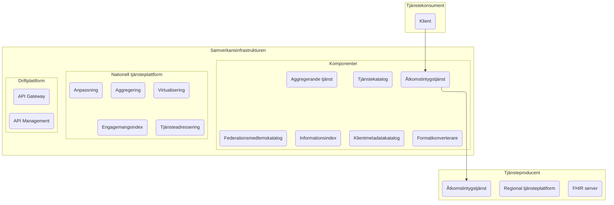
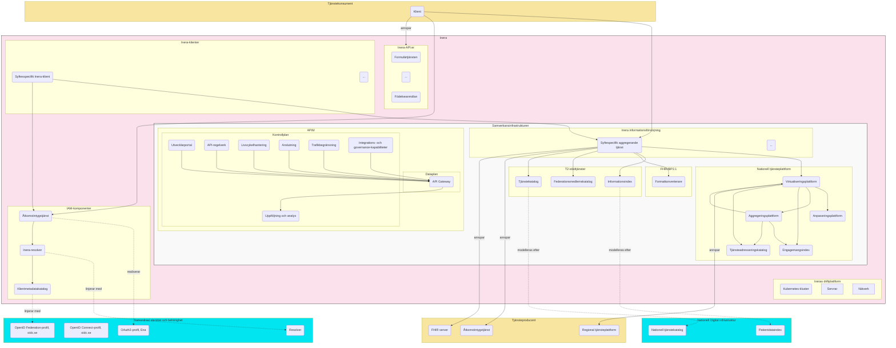

# Lösningsarkitektur

## Översikt

```mermaid
%%{init: {"flowchart": {"defaultRenderer": "elk"}} }%%
graph 
    subgraph tk[Tjänstekonsument]
        tkc(Klient)
    end
    

    subgraph si[Samverkansinfrastrukturen]
        subgraph si1[Komponenter]
            sias(Åtkomstintygstjänst) & sitk(Tjänstekatalog) & siagg(Aggregerande tjänst)
            ~~~
            siii(Informationsindex) & sifmk(Federationsmedlemskatalog) & sikk(Klientmetadatakatalog) & sifk(Formatkonverterare)
        end
        subgraph drift[Driftplattform]
            gw(API Gateway)~~~ap(API Management)

        end
        subgraph ntjp[Nationell tjänsteplattform]
            vp(Virtualisering) & ag(Aggregering) & anp(Anpassning)
            ~~~
            ei(Engagemangsindex) & tak(Tjänsteadressering)
        end
    end
    subgraph tp[Tjänsteproducent]
        tpas(Åtkomstintygstjänst)
        tprtp(Regional tjänsteplattform)
        tpfs(FHIR server)
    end
    %%tk --> si --> tp
    tkc --> sias
    sias --> tpas

```

## Detaljerad

```mermaid
graph 
%%{init: {"flowchart": {"defaultRenderer": "elk2"}} }%%

subgraph inera[Inera]
    subgraph itk[Inera-klienter]
        npo(Syftesspecifik Inera-klient)
        itkmm(...)
    end

    subgraph siiam[IAM-komponenter]
        sias(Åtkomstintygstjänst)
        sikk(Klientmetadatakatalog)
        sir(Inera-resolver)
    end


    subgraph si[Samverkansinfrastrukturen]
        subgraph siit[Inera informationsförsörjning]
            svodc(Syftespecifik aggregerande tjänst)
            ehdsc(...)
        end

        subgraph si1[T2-stödtjänster]
            sitk(Tjänstekatalog)
            siii(Informationsindex)
            sifmk(Federationsmedlemskatalog)
        end

        subgraph si2[FHIR/BP2.1]
            sifk(Formatkonverterare)
        end

        subgraph ntjp[Nationell tjänsteplattform]
            vp(Virtualiseringsplattform)
            ag(Aggregeringsplattform)
            anp(Anpassningsplattform)
            ei(Engagemangsindex)
            tak(Tjänsteadresseringskatalog)
        end

        subgraph apim[APIM]
            subgraph dp[Dataplan]
                gw(API Gateway)
            end
            subgraph cp[Kontrollplan]
                cp1(Utvecklarportal)
                cp2(API-regelverk)
                cp3(Uppföljning och analys)
                cp4(Livscykelhantering)
                cp5(Anslutning)
                cp6(Trafikbegränsning)
                cp7(Integrations- och governance-kapabiliteter)
            end
        end

        cp1 --> gw
        cp2 --> gw
        cp4 --> gw
        cp5 --> gw
        cp6 --> gw
        cp7 --> gw
        gw --> cp3
    end

    subgraph itp[Inera-API:er]
        formular(Formulärtjänsten)
        itpmm(...)
        fodelse(Födelseanmälan)
    end

    subgraph drift[Ineras driftplattform]
        kubernetes(Kubernetes-kluster)
        Servrar
        Nätverk
    end
end

subgraph tk[Tjänstekonsument]
    tkc(Klient)
end

subgraph tp[Tjänsteproducent]
    tpas(Åtkomstintygstjänst)
    tprtp(Regional tjänsteplattform)
    tpfs(FHIR server)
end

subgraph ndi[Nationell Digital Infrastruktur]
    ntk(Nationell tjänstekatalog)
    pdi(Patientdataindex)
end

subgraph sib[Samordnad identitet och behörighet]
    res(Resolver)
    oi(OpenID Connect-profil, oidc.se)
    o2(OAuth2-profil, Ena)
    of(OpenID Federation-profil, oidc.se)
end

sias -. "realiserar" .-> o2
sitk -. "modelleras efter" .-> ntk
siii -. "modelleras efter" .-> pdi
sikk -. "linjerar med" .-> of
sir -. "linjerar med" .-> res
sias --> sir
sir --> sikk
ag --> vp
ag --> ei
ag --> tak
vp --> anp
vp --> ag
vp --> ei
vp --> tak
svodc --> vp
svodc --> siii
svodc --> sifk
svodc --> sifmk
svodc --> sitk
vp -- "anropar" --> tprtp
tkc --> svodc
npo --> svodc
svodc -- "anropar" --> tpas
svodc -- "anropar" --> tpfs
tkc --> sias
npo --> sias
tkc -- "anropar" --> itp
%%gw -- "integrerar med" --> sias
%%si1 & itp & svodc  -. "exponeras via" .->apim

style inera fill:#fae1eb,stroke:#000000
style si fill:#f9f9f9,stroke:#000000
style tk fill:#F8E5A0
style tp fill:#F8E5A0
style ndi fill:#00E5F0
style sib fill:#00E5F0

%% Formatting for elk renderer
tkc~~~itk
ei~~~kubernetes

%% Formatting for dagre (standard) renderer
gw~~~~~~sib & ndi & tp
```
