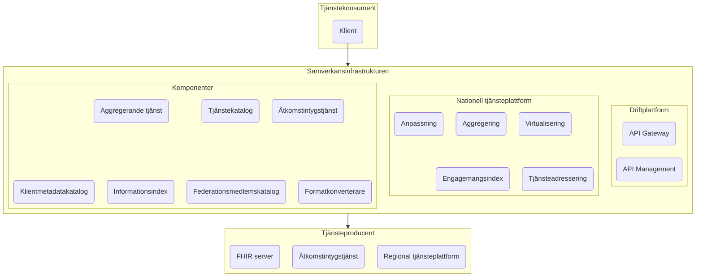

# Lösningsarkitektur

## Översikt



## Detaljerad

```mermaid
flowchart 

subgraph i[<h1>Inera</b>]
    subgraph itk[<h3>Inera-klienter</h3>]
        npo(NPÖ)
        itkmm(...)
        journalen(Journalen)
    end

    subgraph si[<h2>Samverkansinfrastrukturen</h2>]
        subgraph siit[<h3>Inera informationsförsörjning</h3>]
            svodc(SVOD-tjänst)
            ehdsc(EHDS-tjänst)
            jc(Invånartjänst)
        end

        subgraph si1[<h3>T2-stödtjänster</h3>]
            sitk(Tjänstekatalog)
            siii(Informationsindex)
            sifmk(Federationsmedlemskatalog)
        end

        subgraph si2[<h3>FHIR/BP2.1</h3>]
            sifk(Formatkonverterare)
        end

        subgraph siiam[<h3>IAM-komponenter</h3>]
            sias(Åtkomstintygstjänst)
            sikk(Klientmetadatakatalog)
            sir(Inera-resolver)
        end

        subgraph ntjp[<h3>Nationell tjänsteplattform</h3>]
            vp(Virtualiseringsplattform)
            ag(Aggregeringsplattform)
            anp(Anpassningsplattform)
            ei(Engagemangsindex)
            tak(Tjänsteadresseringskatalog)
        end

        subgraph apim[<h3>APIM</h3>]
            subgraph dp[<h4>Dataplan</h4>]
                gw(API Gateway)
            end
            subgraph cp[<h4>Kontrollplan</h4>]
                cp1(Utvecklarportal)
                cp2(API-regelverk)
                cp3(Uppföljning och analys)
                cp4(Livscykelhantering)
                cp5(Anslutning)
                cp6(Trafikbegränsning)
                cp7(Integrations- och governance-kapabiliteter)
            end
        end

        cp1 --> gw
        cp2 --> gw
        cp4 --> gw
        cp5 --> gw
        cp6 --> gw
        cp7 --> gw
        gw --> cp3
    end

    subgraph itp[<h3>Inera-API:er</h3>]
        formular(Formulärtjänsten)
        itpmm(...)
        fodelse(Födelseanmälan)
    end

    subgraph drift[<h3>Ineras driftplattform</h3>]
        subgraph kk[<h4>Kubernetes-kluster</h4>]
            s(...)
        end
    end
end

subgraph tk[<h2>Tjänstekonsument</h2>]
    tkc(Klient)
end

subgraph tp[<h2>Tjänsteproducent</h2>]
    tpas(Åtkomstintygstjänst)
    tprtp(Regional tjänsteplattform)
    tpfs(FHIR server)
end

subgraph ndi[<h2>Nationell Digital Infrastruktur</h2>]
    ntk(Nationell tjänstekatalog)
    pdi(Patientdataindex)
end

subgraph sib[<h2>Samordnad identitet och behörighet</h2>]
    res(Resolver)
    oi(OpenID Connect-profil, oidc.se)
    o2(OAuth2-profil, Ena)
    of(OpenID Federation-profil, oidc.se)
end

sias -. "realiserar" .-> o2
sitk -. "modelleras efter" .-> ntk
siii -. "modelleras efter" .-> pdi
sikk -. "linjerar med" .-> of
sir -. "linjerar med" .-> res
sias --> sir
sir --> sikk
ag --> vp
ag --> ei
ag --> tak
vp --> anp
vp --> ag
vp --> ei
vp --> tak
siit --> vp
siit --> siii
siit --> sifk
siit --> sifmk
siit --> sitk
vp -- "anropar" --> tprtp
si -- "driftas på" --> drift
tkc --> siit
itk --> siit
siit -- "anropar" --> tpas
siit -- "anropar" --> tpfs
tkc --> sias
itk --> sias
tkc -- "anropar" --> itp
si -.-> itp
apim -- "integrerar med" --> siiam

style i fill:#fae1eb,stroke:#000000
style si fill:#f9f9f9,stroke:#000000

style tk fill:#F8E5A0
style tp fill:#F8E5A0
style ndi fill:#00E5F0
style sib fill:#00E5F0

```
