# Lösningsarkitektur – Samverkansinfrastrukturen

## Innehåll

- [1. Syfte och omfattning](#1-syfte-och-omfattning)
	- [Intressentvy](#intressentvy)
- [2. Arkitekturprinciper](#2-arkitekturprinciper)
- [3. Konceptuell målbild](#3-konceptuell-målbild)
	- [3.2 Nyckelkopplingar i den detaljerade målbilden](#32-nyckelkopplingar-i-den-detaljerade-målbilden)
	- [Affärs- och förmågevy](#affärs--och-förmågevy)
- [4. Byggblock och ansvar](#4-byggblock-och-ansvar)
	- [Logisk vy (containers)](#logisk-vy-containers)
	- [4.1 Tjänstekonsument](#41-tjänstekonsument)
	- [4.2 Tillitshantering och åtkomst](#42-tillitshantering-och-åtkomst)
	- [4.3 Lös koppling](#43-lös-koppling)
	- [4.4 Datainhämtning och transformation](#44-datainhämtning-och-transformation)
	- [4.5 Exponering, styrning och drift](#45-exponering-styrning-och-drift)
	- [4.6 Externa beroenden och linjering](#46-externa-beroenden-och-linjering)
- [5. Huvudflöden](#5-huvudflöden)
	- [Processöversikt (E2E)](#processöversikt-e2e)
	- [5.1 Flöde A – Anropa tjänst med åtkomstintyg](#51-flöde-a--anropa-tjänst-med-åtkomstintyg)
	- [5.2 Flöde B – Katalogsynkronisering (central/lokal)](#52-flöde-b--katalogsynkronisering-centrallokal)
	- [5.3 Flöde C – Informationsförsörjning (aggregerat/strömmat)](#53-flöde-c--informationsförsörjning-aggregeratströmmat)
- [6. Säkerhetsarkitektur](#6-säkerhetsarkitektur)
	- [6.1 Tillitsmodell](#61-tillitsmodell)
	- [6.2 Kontrollpunkter](#62-kontrollpunkter)
	- [6.3 Profilering och standardlinjering](#63-profilering-och-standardlinjering)
	- [Säkerhetsvy (tillit och kontroller)](#säkerhetsvy-tillit-och-kontroller)
- [7. Informations- och integrationsarkitektur](#7-informations--och-integrationsarkitektur)
	- [7.1 Canonical och kontrakt](#71-canonical-och-kontrakt)
	- [7.2 Integrationsmönster](#72-integrationsmönster)
	- [Datavy (informationsobjekt)](#datavy-informationsobjekt)
- [8. Drift- och plattformsarkitektur](#8-drift--och-plattformsarkitektur)
	- [8.1 Logisk driftmodell](#81-logisk-driftmodell)
	- [8.2 Infrastruktur](#82-infrastruktur)
	- [8.3 Tillgänglighet och robusthet](#83-tillgänglighet-och-robusthet)
	- [Implementationsvy (tekniska byggblock)](#implementationsvy-tekniska-byggblock)
	- [Distributionsvy (drift och zoner)](#distributionsvy-drift-och-zoner)
- [9. Icke-funktionella krav (NFR)](#9-icke-funktionella-krav-nfr)
	- [9.1 Säkerhet och regelefterlevnad](#91-säkerhet-och-regelefterlevnad)
	- [9.2 Prestanda](#92-prestanda)
	- [9.3 Förvaltning och förändringsbarhet](#93-förvaltning-och-förändringsbarhet)
	- [9.4 Tillgänglighet, robusthet och skalbarhet](#94-tillgänglighet-robusthet-och-skalbarhet)
	- [9.5 Dataintegritet och observerbarhet](#95-dataintegritet-och-observerbarhet)
	- [NFR-översikt (målnivåer)](#nfr-översikt-målnivåer)
- [10. Beslutslista (ADR-kandidater)](#10-beslutslista-adr-kandidater)
- [11. MVP-indelning och införandeplan](#11-mvp-indelning-och-införandeplan)
	- [MVP 1 – Grundläggande åtkomst och katalog](#mvp-1--grundläggande-åtkomst-och-katalog)
	- [MVP 2 – Informationsförsörjning](#mvp-2--informationsförsörjning)
	- [MVP 3 – Strömning och robusthet](#mvp-3--strömning-och-robusthet)
	- [MVP 4 – Plattformsmognad och förvaltning](#mvp-4--plattformsmognad-och-förvaltning)
- [12. Spårbarhet till kravunderlag](#12-spårbarhet-till-kravunderlag)
	- [12.1 Spårbarhet – användningskrav (CSV)](#121-spårbarhet--användningskrav-csv)
	- [12.2 Spårbarhet – systemkrav (CSV)](#122-spårbarhet--systemkrav-csv)
	- [12.3 Tolkningar och öppna punkter från kravunderlag](#123-tolkningar-och-öppna-punkter-från-kravunderlag)
	- [Spårbarhetsvy (kravområde till komponent)](#spårbarhetsvy-kravområde-till-komponent)
- [13. Kompakta krav per komponent](#13-kompakta-krav-per-komponent)
	- [13.1 Minimikrav för produktionssättning per komponent](#131-minimikrav-för-produktionssättning-per-komponent)
- [14. Anslutningsprocess](#14-anslutningsprocess)
	- [14.1 Roller och ansvarsfördelning](#141-roller-och-ansvarsfördelning)
	- [14.2 Övergripande processflöde](#142-övergripande-processflöde)
	- [14.3 Steg per fas](#143-steg-per-fas)
	- [14.4 Verifiering och certifiering](#144-verifiering-och-certifiering)
	- [14.5 Samverkansetablering](#145-samverkansetablering)
	- [14.6 Testinfrastruktur och stöd från Inera](#146-testinfrastruktur-och-stöd-från-inera)

---

## 1. Syfte och omfattning

Detta dokument beskriver en komplett målarkitektur för samverkansinfrastrukturen med fokus på:

- säker tjänsteanrop mellan tjänstekonsument och tjänsteproducent,
- lös koppling via kataloger och index,
- informationsförsörjning via aggregerande tjänster,
- interoperabilitet mellan SOAP och FHIR,
- driftbarhet i modern API- och integrationsplattform.

Arkitekturen baseras på innehållet i `solution.md`, `t2-krav.md`, `Krav T2-infrastruktur.docx`, `MVP-indelning Samverkansinfrastrukturen` och `Krav Samverkansinfrastrukturen`.

### Intressentvy

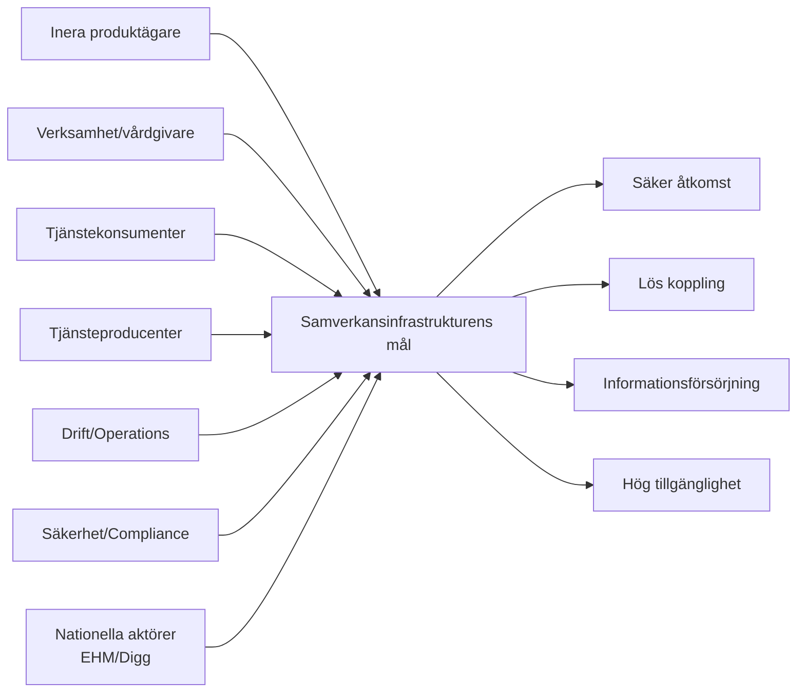

---

## 2. Arkitekturprinciper

1. **Lös koppling före punktintegration**
	 - Tjänster hittas via kataloger, inte via hårdkodade endpoint-adresser.

2. **Federerad tillit och policydriven åtkomst**
	 - Åtkomstbeslut tas med federationsmedlemskap, klientmetadata och policys som grund.

3. **Separation mellan kontrollplan och dataplan**
	 - API-styrning, livscykel och policy hanteras i kontrollplanet, trafik i dataplanet.

4. **Informationscentrerad tjänsteexponering**
	 - Producentdata hämtas, normaliseras och levereras i efterfrågat format (FHIR/SOAP).

5. **Standardnära integration**
	 - Linjering mot nationella profiler och katalogmodeller (OIDC/OAuth2/Federation, tjänstekatalog, index).

---

## 3. Konceptuell målbild

- **Applikationslager (Inera)**: Inera-klienter, IAM-komponenter, informationsförsörjningstjänster, T2-stödtjänster, formatkonvertering, nationell tjänsteplattform, Inera-API:er.
- **Plattformslager**: WSO2 Kontrollplan, WSO2 Data Plane samt WSO2 Integration Layer.
- **Infrastrukturlager**: Kubernetes-kluster, nätverk, servrar och databaser.
- **Externa ekosystem**: Externa tjänstekonsumenter/-producenter, Nationell digital infrastruktur (EHM) och Samordnad identitet/behörighet (Digg).

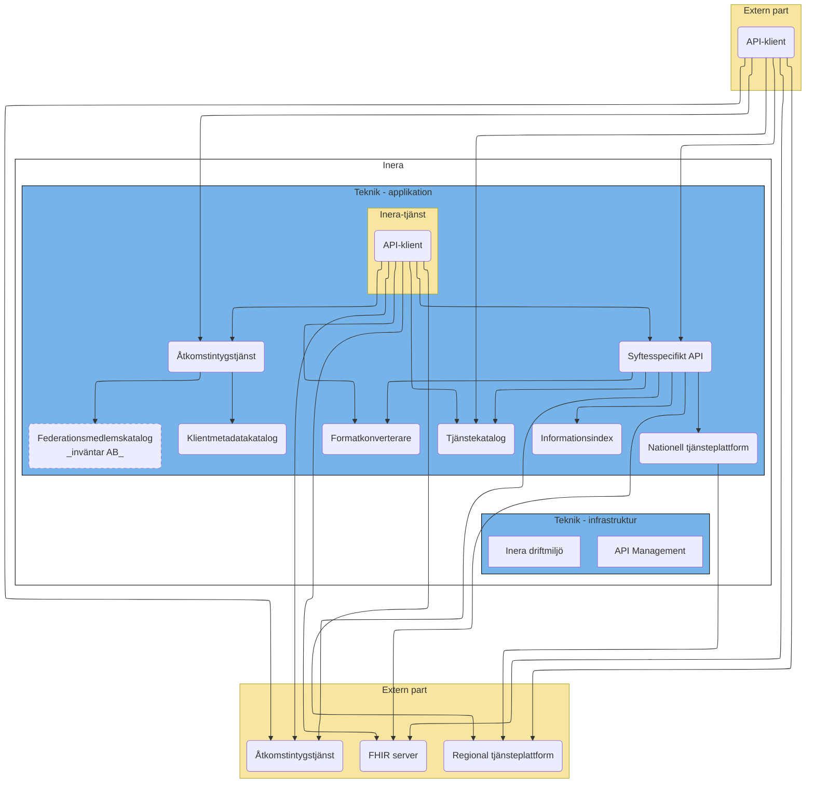

### 3.2 Nyckelkopplingar i den detaljerade målbilden

- Åtkomstintygstjänsten kopplas till resolver- och federationsmönster för tillitsupplösning.
- Tjänstekatalog och informationsindex modelleras mot nationella katalog- och indexmönster.
- Aggregerande tjänst fungerar som nav mot både T2-stödtjänster och producentlandskap.
- WSO2 Kontrollplan styr API-livscykel och policy, medan Data Plane/Integration Layer hanterar trafik och integration.

### Affärs- och förmågevy

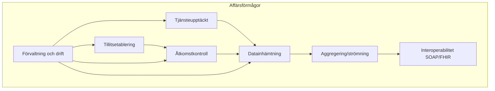

---

## 4. Byggblock och ansvar

### Logisk vy (containers)

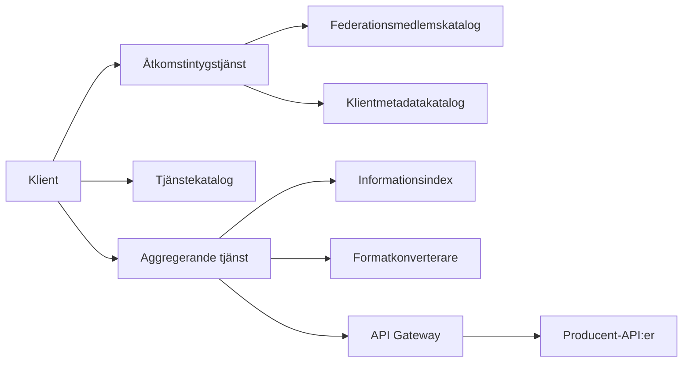

### 4.1 Tjänstekonsument

- Initierar anrop och begär åtkomstintyg.
- Anropar API:er direkt eller via aggregerande informationsförsörjningstjänst.

### 4.2 Tillitshantering och åtkomst

- **Åtkomstintygstjänst (ÅT)**
	- Tar emot begäran om åtkomstintyg.
	- Verifierar federationsmedlemskap.
	- Hämtar klientmetadata.
	- Tar policybaserat åtkomstbeslut och utfärdar intyg.

- **Federationsmedlemskatalog (FM)**
	- Källa för medlemskap i federation.

- **Klientmetadatakatalog (KM)**
	- Källa för klientregistrering, metadata och tillitsattribut.

### 4.3 Lös koppling

- **Tjänstekatalog (TC)**
	- Sökning och upplösning av tjänster och tekniska gränssnitt.
	- Minskar beroende till statiska endpoint-konfigurationer.

- **Informationsindex (IT)**
	- Svarar på frågan vilka producenter som har data för visst subjekt/informationsmängd.

### 4.4 Datainhämtning och transformation

- **Aggregerande tjänst (AT)**
	- Orkestrerar hämtning från flera producenter.
	- Hanterar parallellisering, strömning av delsvar och sammanställning av slutresultat.

- **Formatkonverterare (FK)**
	- Konverterar mellan formatprofiler, t.ex. SOAP ↔ FHIR.

### 4.5 Exponering, styrning och drift

- **API Gateway (dataplan)**
	- Trafikstyrning, policy enforcement, throttling, routing.

- **API Management / Kontrollplan**
	- Publicering, livscykelhantering, utvecklarportal, nyckelhantering, analys.

- **Integrationslager**
	- Micro Integrator och Streaming Integrator för transformations- och integrationsflöden.

### 4.6 Externa beroenden och linjering

- **Nationell digital infrastruktur (EHM)**
	- Tjänstekatalog linjerar mot nationell tjänstekatalog.
	- Informationsindex linjerar mot patientdataindex.

- **Samordnad identitet och behörighet (Digg)**
	- Åtkomstintygstjänsten realiserar OAuth2-profil enligt Ena.
	- Resolver- och federationmönster används för tillitsupplösning och metadata.

- **Nationell tjänsteplattform**
	- Virtualiserings-/aggregerings-/anpassningsplattform används som integrationsyta mot regionala plattformar.

---

## 5. Huvudflöden

### Processöversikt (E2E)

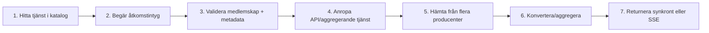

### 5.1 Flöde A – Anropa tjänst med åtkomstintyg

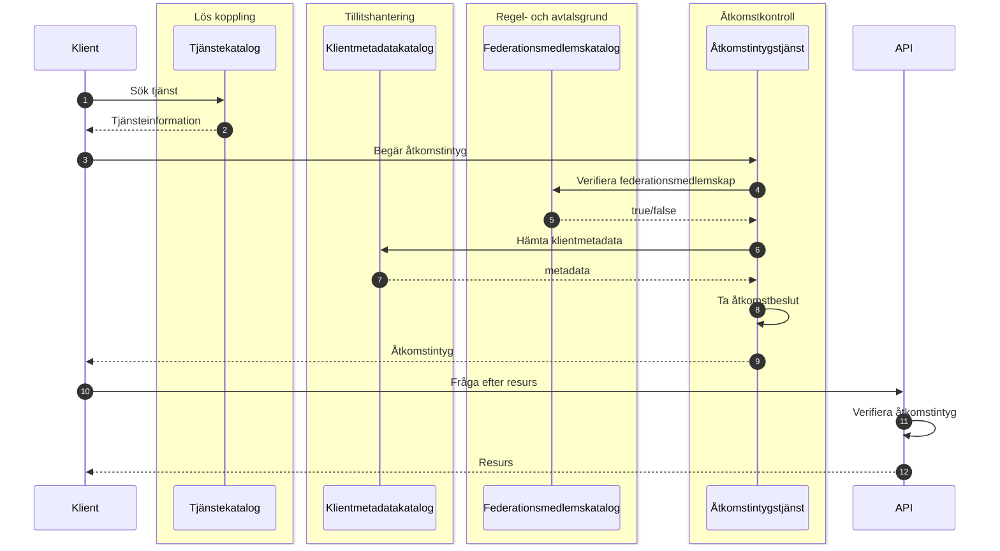

### 5.2 Flöde B – Katalogsynkronisering (central/lokal)

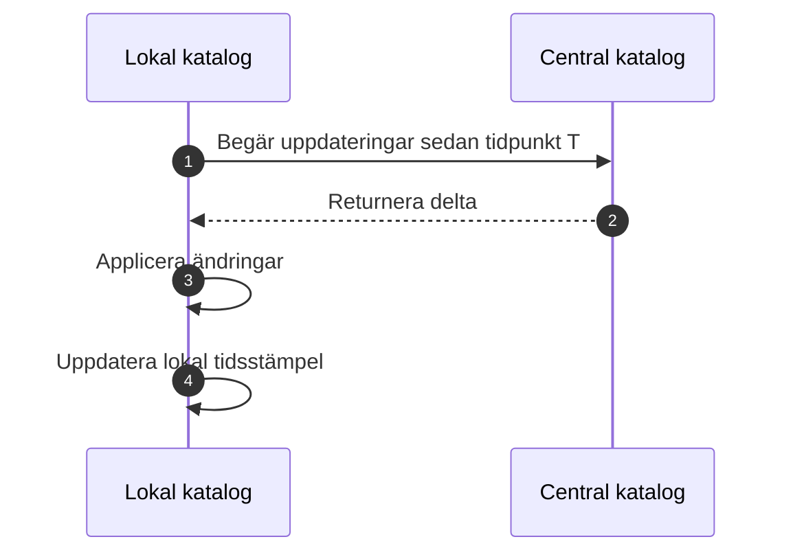

### 5.3 Flöde C – Informationsförsörjning (aggregerat/strömmat)

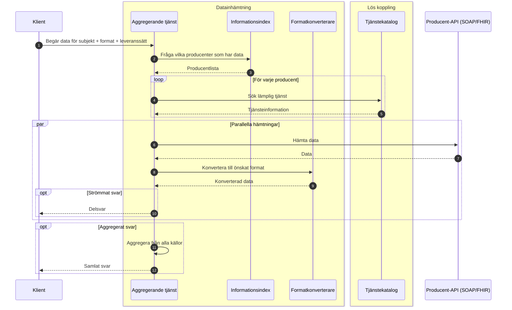

---

## 6. Säkerhetsarkitektur

### 6.1 Tillitsmodell

- Federerad tillit etableras via medlemskap och metadata.
- Åtkomstintyg är bäraren av beslutad behörighet i anropskedjan.

### 6.2 Kontrollpunkter

- Klientautentisering vid begäran om intyg.
- Policybeslut i Åtkomstintygstjänst.
- Intygsverifiering i mål-API/gateway.
- Spårbarhet med korrelations-id i hela kedjan.

### 6.3 Profilering och standardlinjering

- OAuth2/OIDC-profiler för tokenflöden.
- Federation-/resolvermönster för tillitsuppslag.
- Katalog- och indexmodeller linjerade med nationella motsvarigheter.

### Säkerhetsvy (tillit och kontroller)

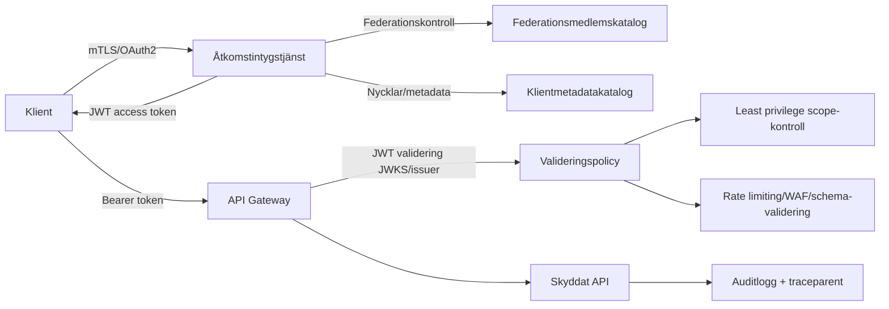

---

## 7. Informations- och integrationsarkitektur

### 7.1 Canonical och kontrakt

- Informationsindex används för att hitta datakällor per informationsbehov.
- Tjänstekatalog används för teknisk upplösning av endpoint/kontrakt.
- Formatkonvertering möjliggör en enhetlig extern konsumtion trots heterogena producentgränssnitt.

### 7.2 Integrationsmönster

- Synkront tjänsteanrop för punktfrågor.
- Parallell datainhämtning för minskad total svarstid.
- Strömmat delsvar för tidig tillgång till delmängder.
- Aggregerat slutsvar för komplett sammanställning.

### Datavy (informationsobjekt)

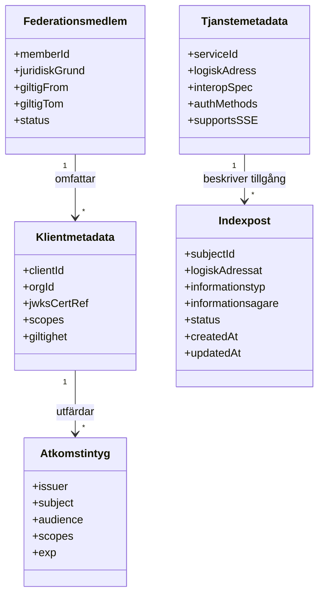

---

## 8. Drift- och plattformsarkitektur

### 8.1 Logisk driftmodell

- Kontrollplan: API-publicering, portaler, nycklar, analys.
- Dataplan: gateway och trafikhantering.
- Integrationslager: transformering, routing och eventuella strömningsflöden.

Kontrollplan och dataplan/integrationslager realiseras enligt referensupplägg i `solution.md`:

- **Kontrollplan (WSO2)**: API Publisher, Developer Portal, Admin Portal, Key Manager, API Analytics och Service Catalog.
- **Data Plane (WSO2)**: API Gateway och Traffic Manager.
- **Integration Layer (WSO2)**: Micro Integrator och Streaming Integrator.

### 8.2 Infrastruktur

- Container-/Kubernetes-baserad drift.
- Separering av applikationslager, integrationslager och stödtjänster.
- Observability med loggning, mätvärden och distribuerad spårning.

### 8.3 Tillgänglighet och robusthet

- Horisontell skalning av gateway och aggregerande tjänst.
- Tydliga timeout-, retry- och circuit breaker-strategier mot producent-API:er.
- Degraderingsläge vid partiella producentfel (fortsatt strömmat/partiellt svar där policy tillåter).
### Implementationsvy (tekniska byggblock)

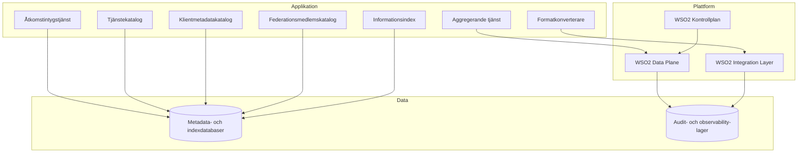

### Distributionsvy (drift och zoner)

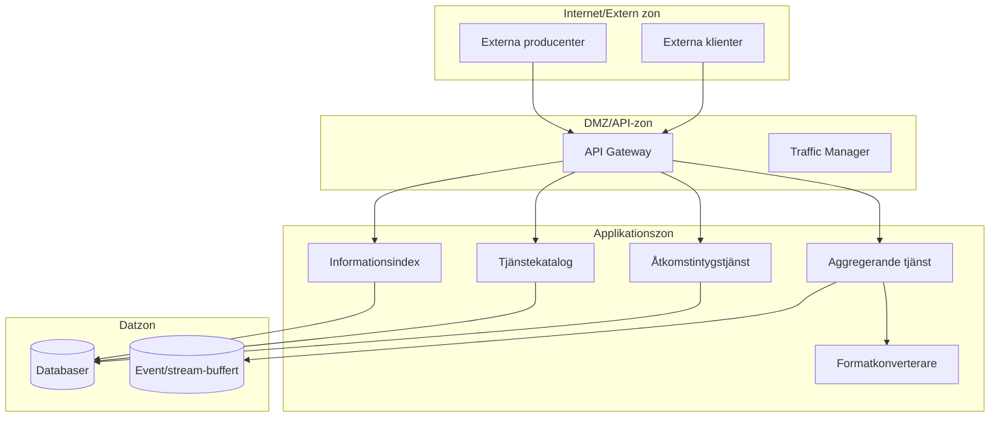
---

## 9. Icke-funktionella krav (NFR)

### 9.1 Säkerhet och regelefterlevnad

- All transport ska vara krypterad och autentiserad med minst TLS 1.2.
- Åtkomstintygstjänst och tokenflöden ska följa profilerad OAuth2/OIDC (Ena/Digg).
- Auktorisation ska tillämpa least privilege via scopes/claims per resurs.
- Skydd mot OWASP API Top 10 ska realiseras i gateway/policylager.
- Personuppgiftshantering ska vara GDPR-förenlig inklusive DPIA där tillämpligt.

### 9.2 Prestanda

- Katalog- och indexsökningar: P95 ≤ 500 ms vid normal belastning.
- Tokenutgivning/validering i Åtkomstintygstjänst: P95 ≤ 300 ms.
- Minst 1000 samtidiga förfrågningar utan degradering utöver P95-krav.
- Inkrementell synk till lokala kataloger/index: ≤ 5 minuter.
- Full synk till lokala kataloger/index: ≤ 30 minuter.

### 9.3 Förvaltning och förändringsbarhet

- SemVer på gränssnitt, med minst två parallella majorversioner.
- Äldre majorversion ska kunna samexistera i minst 18 månader efter ny major.
- OpenAPI/AsyncAPI ska publiceras och förvaltas med livscykelpolicy.
- Automatiserade tester (enhet/kontrakt/e2e) ska finnas i CI/CD för kritiska flöden.

### 9.4 Tillgänglighet, robusthet och skalbarhet

- Tjänstetillgänglighet: minst 99,9% per kalendermånad.
- Redundans: minst två noder per kritisk komponent och zon.
- Lokala instanser med persisterad katalogdata ska möjliggöra fortsatt läsning vid centralt bortfall > 60 min.
- Timeouts, retry med ökande pauser och circuit breakers ska vara konfigurerbara per klient och endpoint.
- Graceful degradation ska stödjas (t.ex. read-only i kataloger och partiella svar i aggregerad dataleverans).
- Horisontell skalning/autoskalning ska stödjas med stateless-princip där möjligt.

### 9.5 Dataintegritet och observerbarhet

- Konfliktupplösning vid uppdatering/synk ska vara deterministisk och auditloggad.
- Revisionsspår ska innehålla vem/när/vad samt verifierbar integritet (t.ex. hash/signatur).
- Synkintegritet ska verifieras med checksummor/digests/signaturer.
- Strukturerade loggar, metrics, tracing och korrelations-id (traceparent) ska vara end-to-end.
- Larm ska utlösas på definierade trösklar för latens, felkvot och ködjup.

### NFR-översikt (målnivåer)

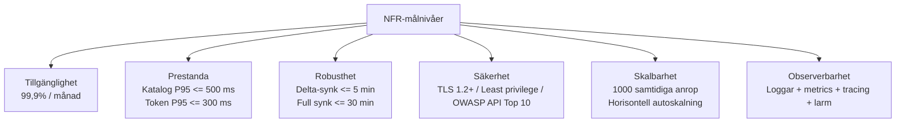

---

## 10. Beslutslista (ADR-kandidater)

1. Åtkomstintyg utfärdas av dedikerad Åtkomstintygstjänst och valideras vid konsumtion.
2. Tjänsteupplösning sker via katalog, inte via statisk endpoint-konfiguration.
3. Informationsförsörjning implementeras som aggregerande orkestrering med stöd för strömning och aggregering.
4. SOAP/FHIR-interoperabilitet hanteras via formatkonvertering och tydliga kontrakt.
5. API-hantering separeras i kontrollplan/dataplan.

---

## 11. MVP-indelning och införandeplan

### MVP 1 – Grundläggande åtkomst och katalog

- Etablera ÅT, KM, FM och TC.
- Införa basflöde för säkert API-anrop (A01, A02, A04, A06).
- Etablera maskinläsbar metadata (OpenAPI/Well-known) för upptäckt/bindning.

### MVP 2 – Informationsförsörjning

- Etablera IT, AT och FK.
- Aktivera parallell inhämtning och aggregerat svar (A08).
- Implementera producentspårbarhet i svar och deterministisk formatkonvertering.

### MVP 3 – Strömning och robusthet

- Aktivera strömmade delsvar via SSE (A03, A07).
- Säkerställ partiella svar vid källfel och konfigurerbar resilient kommunikation (timeouts/retry/circuit-breaker).

### MVP 4 – Plattformsmognad och förvaltning

- Konsolidera kontrollplan/dataplan-processer.
- Standardisera onboarding för nya producenter och konsumenter.
- Etablera full observability, policydriven drift, versions- och livscykelstyrning samt regelefterlevnad.

---

## 12. Spårbarhet till kravunderlag

- Från `t2-krav.md` täcks:
	- anropa tjänst med åtkomstintyg,
	- katalogsynkronisering,
	- informationsförsörjning med aggregering/strömning,
	- övergripande komponentrelationer.

- Från `solution.md` täcks:
	- målbildens byggblock och externa beroenden,
	- kontrollplan/dataplan/integrationslager,
	- linjering mot nationella profiler och katalogstrukturer,
	- resolvermönster och federationskoppling,
	- explicit lagerindelning (applikation/plattform/infrastruktur).

### 12.1 Spårbarhet – användningskrav (CSV)

- **A01 Hitta API**: realiseras i Tjänstekatalog med logisk adressering och interoperabilitetsmetadata.
- **A02 Hitta metadata för åtkomstbegäran**: realiseras i Tjänstekatalog (mTLS/OAuth2-metadata) samt ÅT/KM.
- **A03 Hitta metadata för API-anrop**: realiseras i Tjänstekatalog via metadata för synkront svar respektive SSE.
- **A04 Begär åtkomst till API**: realiseras i ÅT med stöd för CC/AC-flöden samt FM/KM-kontroller.
- **A06 Anropa API**: realiseras i API-gateway med token-/mTLS-verifiering och routing.
- **A07 Förmedla anrop (synkront/delsvar)**: realiseras i AT/API med valbart leveranssätt.
- **A08 Hämta aggregerad personrelaterad data**: realiseras i IT + TC + AT + FK med SOAP/FHIR-interoperabilitet.

### 12.2 Spårbarhet – systemkrav (CSV)

- **Lös koppling (LK-01..LK-05)**: SemVer, OpenAPI/Well-known, logisk adressering och standardprotokoll.
- **Tillit/Åtkomst (TH-01..TH-04, Å-01..Å-04, RA-01..RA-03)**: federationskontroller, metadata, tokenprofiler och policystyrd åtkomst.
- **Datainhämtning (D-01..D-11)**: AT för aggregation/partiella svar, FK för deterministisk konvertering, IT för indexering/ägarskap/deduplicering.
- **Tillgänglighet/Prestanda/Robusthet (TG-01..TG-05, P-01..P-03, R-01..R-06)**: lokala instanser, redundans, SLA/SLO, synkkrav och resilient anropsmönster.
- **Säkerhet/Skalbarhet/Integritet (SÄ-01..SÄ-08, SK-01..SK-03, DI-01..DI-05)**: TLS, least privilege, autoskalning, revisionsspår, backup och verifierbar synk.
- **Övervakning/Förvaltning/Regelefterlevnad (Ö-01..Ö-04, F-01..F-05, RE-01..RE-05)**: metrics/logs/tracing, CI/CD-kvalitet, livscykelhantering, GDPR/RIV-TA/eIDAS/WCAG.

### 12.3 Tolkningar och öppna punkter från kravunderlag

- Kravet kring asynkrona mönster i LK-03 tolkas som **obligatoriskt för informationsförsörjning (AT/API)** men **inte obligatoriskt för katalogernas synkgränssnitt**, där pull-baserad delta/full-synk är huvudmönster.
- I systemkravslistan finns dubbel-ID för P-02; tolkning i detta dokument är att båda prestandakraven gäller (1000 samtidiga förfrågningar samt 5 min inkrementell synk).
- RE-02 anger profiler utan uttömmande lista; arkitekturen utgår från Ena OAuth2-profil, OIDC/OAuth2-profiler samt RIV-TA.

### Spårbarhetsvy (kravområde till komponent)

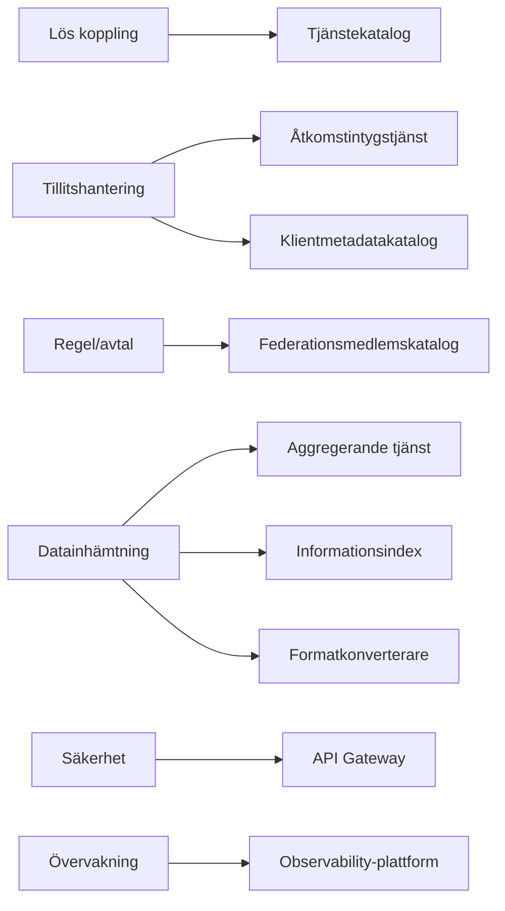

---

## 13. Kompakta krav per komponent

| Komponent | Primärt ansvar | Nyckelkrav (ID) | MVP-fokus | Status |
|---|---|---|---|---|
| Tjänstekatalog (TC) | API-upptäckt, logisk adressering, metadata för anrop/åtkomst | A01, A02, A03, LK-01..LK-05, TG-02, TG-05, P-01, R-02, F-03 | MVP 1 | Planerad |
| Klientmetadatakatalog (KM) | Klientidentitet, nycklar/certifikat, metadata för tillit | A04, TH-02, TH-04, TG-02, P-01, DI-01..DI-04, SÄ-07, SÄ-08 | MVP 1 | Planerad |
| Federationsmedlemskatalog (FM) | Verifiering av medlemskap och rättslig grund | A04, TH-01, RA-01..RA-03, TG-02, R-02, RE-01 | MVP 1 | Planerad |
| Åtkomstintygstjänst (ÅT/ATS) | Utfärda/validera åtkomstintyg och tokenflöden (CC/AC) | A04, TH-03, Å-02, Å-03, P-03, SÄ-01..SÄ-03, RE-04 | MVP 1 | Planerad |
| API Gateway | Verifiering (OAuth2/mTLS), policy enforcement, routing | A06, Å-01, Å-03, SÄ-05, Ö-01..Ö-03, SK-01, TG-03 | MVP 1 | Planerad |
| Informationsindex (IT) | Indexera subjekt/adressat/informationstyp och hitta datakällor | A08, D-05..D-11, TG-02, P-01, R-02, DI-01..DI-04 | MVP 2 | Planerad |
| Aggregerande tjänst (AT) | Orkestrera hämtning, aggregat/delsvar, felisolering | A07, A08, D-01..D-03, R-03, SK-03, Ö-04, SÄ-03 | MVP 2-3 | Planerad |
| Formatkonverterare (FK) | Deterministisk och versionsstyrd SOAP/FHIR-konvertering | A08, D-04, P-02, SÄ-01, F-02, F-04 | MVP 2 | Planerad |
| Katalogsynk (lokal-central) | Delta/full-synk, cache-resiliens och fortsatt läsning | TG-02, P-02 (synk 5 min), R-01, R-02, R-05, DI-04 | MVP 1-2 | Planerad |
| Drift/Observability | Larm, tracing, loggar/metrics, tillgänglighet och autoskalning | TG-01, TG-03, SK-01..SK-03, Ö-01..Ö-04, R-04, F-05 | MVP 3-4 | Planerad |

Statusvärden: **Planerad**, **Pågår**, **Klar**.

### 13.1 Minimikrav för produktionssättning per komponent

- **Säkerhet**: SÄ-01, SÄ-02, SÄ-03 uppfyllda före produktion.
- **Observerbarhet**: Ö-01, Ö-02, Ö-03 och korrelations-id (Ö-04) verifierade i testmiljö.
- **Resiliens**: R-03/R-04 implementerade för AT och gateway; R-01/R-02 för kataloger/index.
- **Prestanda**: P95-krav verifierade (P-01/P-03) samt samtidighet/synkkrav (P-02).
- **Förvaltningsbarhet**: SemVer + publicerade kontrakt (F-01..F-04) och CI/CD-testning (F-05).

---

## 14. Anslutningsprocess

Anslutningsprocessen beskriver hur ett nytt system ansluts till Samverkansinfrastrukturen och grundar sig på
Ineras generella [Testmodell](https://nordicmedtest.atlassian.net/wiki/spaces/NoWi/pages/647991/2.+Testmodellen) som tagits fram i samarbete med regioner och e-hälsoaktörer.
Testmodellen betonar en tydlig ansvarsfördelning, en tillitsmodell baserad på självdeklarationer och
möjligheten för kunder att i stor utsträckning själva verifiera att de uppfyller ställda krav.

### 14.1 Roller och ansvarsfördelning

| Roll | Beskrivning | Kvalitetssäkring |
|---|---|---|
| **Tjänstekonsument** | System som initierar informationsutbytet (t.ex. NPÖ, Journalen, vårdinformationssystem) | Verifiering eller certifiering beroende på tjänst och åtkomst till patientuppgifter |
| **Tjänsteproducent** | System som svarar på konsumentens begäran (t.ex. regional tjänsteplattform, FHIR-server) | Verifiering för att säkerställa hög tillgänglighet och korrekt information |
| **Inera** | Tillhandahåller infrastruktur, testsviter, mockar, testdata, testmiljöer och support | Godkänner och signerar anslutning |

Ett och samma system kan agera både tjänstekonsument och tjänsteproducent.

### 14.2 Övergripande processflöde

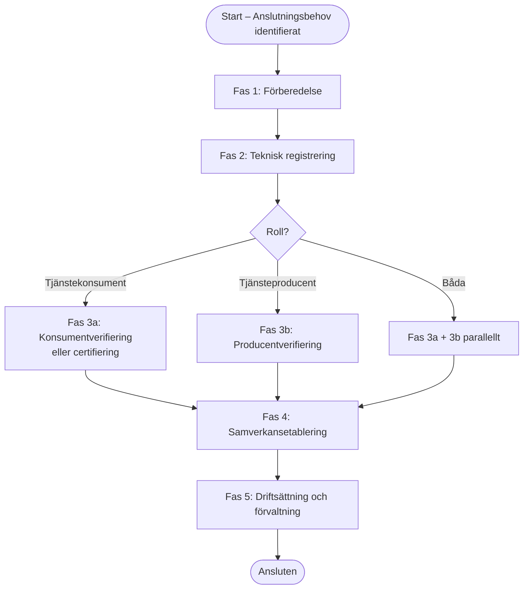

### 14.3 Steg per fas

#### Fas 1 – Förberedelse

Ansvarig: **Kund** med stöd av Inera.

1. Identifiera vilka tjänster som ska anslutas och i vilken roll (konsument/producent).
2. Inhämta och granska kravunderlag, tjänstekontraktsbeskrivningar och arkitekturkrav för aktuell tjänst.
3. Genomföra intern konsekvensanalys avseende säkerhet, juridik (GDPR, PDL) och informationshantering.
4. Teckna eller verifiera befintligt avtal/regelverk med Inera (RA-01..RA-03).
5. Utse kontaktperson/ansvarig hos kunden för anslutningsprocessen.

#### Fas 2 – Teknisk registrering

Ansvarig: **Kund** och **Inera gemensamt**.

1. **Federationsmedlemskatalog (FM)**: Kunden registreras som federationsmedlem. Rättslig grund och organisationstillhörighet verifieras.
2. **Klientmetadatakatalog (KM)**: Klientens tekniska metadata registreras – certifikat/nycklar (mTLS), OAuth2-klientuppgifter och kontaktinformation.
3. **Tjänstekatalog (TC)**: Aktuell tjänst och dess endpoint registreras (för producenter) alternativt att konsumenten behörighetsprövas mot katalogen.
4. Kunden erhåller tillgång till testmiljö (ej produktion) och nödvändiga testidentiteter.

#### Fas 3a – Verifiering/certifiering (tjänstekonsument)

Ansvarig: **Kund**, med Inera som granskare.

Processval baseras på tjänstens karaktär:

- **Verifiering (självdeklaration)**: Kunden genomför egentester mot Ineras testsviter och testmiljöer. Fokus på infrastrukturella krav och follows mot tjänstekontraktsbeskrivningarna. Kunden lämnar in testprotokoll och självdeklaration.
- **Certifiering (Inera-ledd)**: Tillämpas när anslutning ger tillgång till patientuppgifter eller när regelverket kräver certifiering. Inera granskar att juridiska och säkerhetsrelaterade krav uppfylls och att mottagen information hanteras enligt gällande lagar och förordningar.

Granskade artefakter:
- Testprotokoll från egentest i testmiljö.
- Självdeklaration (arkitektur, informationshantering, säkerhet, stabilitet).
- Säkerhetsanalys/DPIA vid tillgång till patientuppgifter.

#### Fas 3b – Verifiering (tjänsteproducent)

Ansvarig: **Kund**, med Inera som granskare.

1. Kunden verifierar att tjänsteproducenten uppfyller tillgänglighetskrav (NFR: 99,9 %/månad) och levererar korrekt information.
2. Tester körs mot Ineras mock-konsumenter och testsviter.
3. Lasttest och stabilitetstest genomförs för att verifiera kapacitetskrav.
4. Svarskvalitet valideras mot tjänstekontraktets scheman och profilkrav (RIV-TA, FHIR-profil).

#### Fas 4 – Samverkansetablering

Ansvarig: **Kund och Inera gemensamt**.

Syftet är att säkerställa att informationsutbytet fungerar *i en driftlik miljö* mellan en specifik tjänstekonsument och en specifik tjänsteproducent.

1. Konsument och producent konfigureras i kataloger och index för samverkan.
2. Integrationstester genomförs i samverkansmiljö (ej skarp produktion).
3. Engagemangsindex och Informationsindex uppdateras/synkroniseras korrekt.
4. Åtkomstintygstjänstens flöden (CC/AC) verifieras end-to-end.
5. Felisolering och felhantering valideras (partiella svar, timeout, circuit breaker).

#### Fas 5 – Driftsättning och förvaltning

Ansvarig: **Kund** och **Inera Operations**.

1. Slutgodkännande av Inera efter godkänt testprotokoll och självdeklaration/certifikat.
2. Konfiguration kopieras/promoveras från testmiljö till produktion med godkänd changehantering.
3. Kunden ansvarar för löpande egentester och att informera Inera vid väsentliga förändringar.
4. Livscykeln styrs av SemVer-policy: kunden notifieras vid ny major-version och har 18 månader på sig att migrera.

### 14.4 Verifiering och certifiering

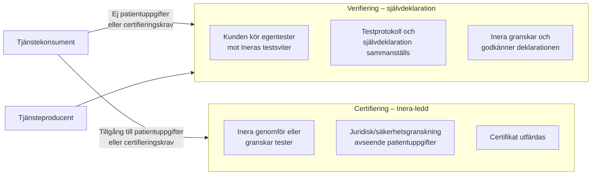

| Kvalitetssäkringstyp | Tillämpas för | Fokusområden |
|---|---|---|
| **Verifiering** | Konsument (ej känslig data), alla producenter | Infrastrukturkrav, tjänstekontrakt, tillgänglighet |
| **Certifiering** | Konsument med tillgång till patientuppgifter | Juridik (PDL/GDPR), säkerhet, informationshantering, regelefterlevnad |

### 14.5 Samverkansetablering

Samverkansetablering är den fas där konsument och producent verifierar informationsutbytet *gemensamt* i en driftlik miljö – i linje med testmodellens krav på att etablering av samverkan genomförs för att säkerställa att informationsutbyte kan ske.

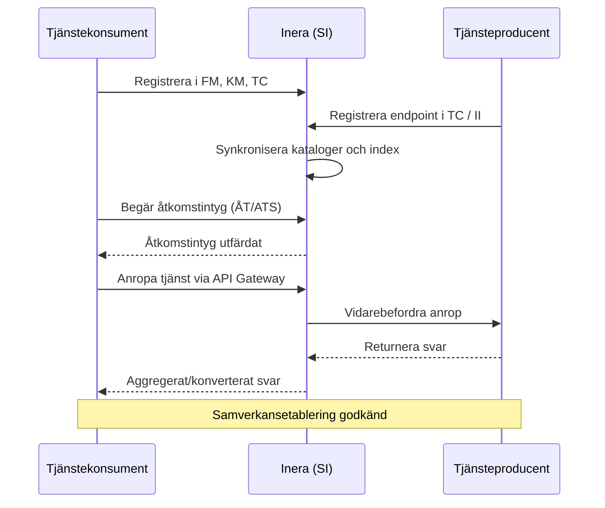

### 14.6 Testinfrastruktur och stöd från Inera

Inera tillhandahåller följande stöd under anslutningsprocessen:

| Resurskategori | Innehåll |
|---|---|
| **Testsviter** | Automatiserade kontraktstester mot tjänsteproducenter och konsumenter |
| **Mockar** | Mock-konsumenter och mock-producenter för isolerad test av respektive roll |
| **Testdata** | Syntetsiska patientidentiteter och informationsunderlag för realistisk test utan risk |
| **Testmiljöer** | Separata miljöer för komponenttest, integrationstest och samverkansetablering |
| **Dokumentation** | Tjänstekontraktsbeskrivningar, arkitekturkrav, profilbeskrivningar och instruktioner |
| **Support** | Teknisk support och rådgivning under hela anslutningsprocessen |

Anslutningsprocessen mappas mot MVP-planen (sektion 11) enligt:

| Anslutningsfas | Kräver MVP-nivå |
|---|---|
| Teknisk registrering (FM, KM, TC) | MVP 1 |
| Åtkomstflöde och verifiering (ÅT) | MVP 1 |
| Informationsförsörjning och samverkansetablering | MVP 2 |
| Strömmade svar och robust felhantering | MVP 3 |
| Standardiserad onboarding, full observability | MVP 4 |
