# Lösningsarkitektur – Samverkansinfrastrukturen

## 1. Syfte och omfattning

Detta dokument beskriver en komplett målarkitektur för samverkansinfrastrukturen med fokus på:

- säker tjänsteanrop mellan tjänstekonsument och tjänsteproducent,
- lös koppling via kataloger och index,
- informationsförsörjning via aggregerande tjänster,
- interoperabilitet mellan SOAP och FHIR,
- driftbarhet i modern API- och integrationsplattform.

Arkitekturen baseras på innehållet i `solution.md`, `t2-krav.md`, `Krav T2-infrastruktur.docx`, `MVP-indelning Samverkansinfrastrukturen` och `Krav Samverkansinfrastrukturen`.

---

## 2. Arkitekturprinciper

1. **Lös koppling före punktintegration**
	 - Tjänster hittas via kataloger, inte via hårdkodade endpoint-adresser.

2. **Federerad tillit och policydriven åtkomst**
	 - Åtkomstbeslut tas med federationsmedlemskap, klientmetadata och policys som grund.

3. **Separation mellan kontrollplan och dataplan**
	 - API-styrning, livscykel och policy hanteras i kontrollplanet, trafik i dataplanet.

4. **Informationscentrerad tjänsteexponering**
	 - Producentdata hämtas, normaliseras och levereras i efterfrågat format (FHIR/SOAP).

5. **Standardnära integration**
	 - Linjering mot nationella profiler och katalogmodeller (OIDC/OAuth2/Federation, tjänstekatalog, index).

---

## 3. Konceptuell målbild

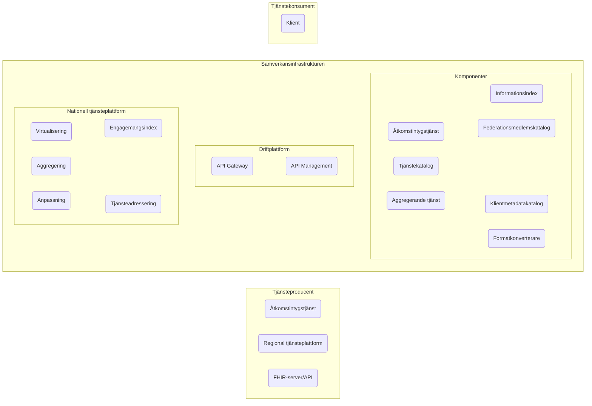

### 3.1 Detaljerad referensmålbild (från solution.md)

Den detaljerade målbilden kompletterar den konceptuella bilden med en tydlig lagerindelning:

- **Applikationslager (Inera)**: Inera-klienter, IAM-komponenter, informationsförsörjningstjänster, T2-stödtjänster, formatkonvertering, nationell tjänsteplattform, Inera-API:er.
- **Plattformslager**: WSO2 Kontrollplan, WSO2 Data Plane samt WSO2 Integration Layer.
- **Infrastrukturlager**: Kubernetes-kluster, nätverk, servrar och databaser.
- **Externa ekosystem**: Externa tjänstekonsumenter/-producenter, Nationell digital infrastruktur (EHM) och Samordnad identitet/behörighet (Digg).

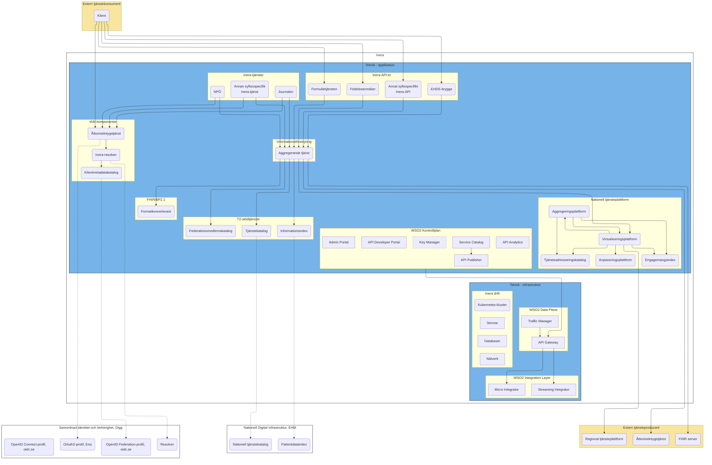

### 3.2 Nyckelkopplingar i den detaljerade målbilden

- Åtkomstintygstjänsten kopplas till resolver- och federationsmönster för tillitsupplösning.
- Tjänstekatalog och informationsindex modelleras mot nationella katalog- och indexmönster.
- Aggregerande tjänst fungerar som nav mot både T2-stödtjänster och producentlandskap.
- WSO2 Kontrollplan styr API-livscykel och policy, medan Data Plane/Integration Layer hanterar trafik och integration.

---

## 4. Byggblock och ansvar

### 4.1 Tjänstekonsument

- Initierar anrop och begär åtkomstintyg.
- Anropar API:er direkt eller via aggregerande informationsförsörjningstjänst.

### 4.2 Tillitshantering och åtkomst

- **Åtkomstintygstjänst (ÅT)**
	- Tar emot begäran om åtkomstintyg.
	- Verifierar federationsmedlemskap.
	- Hämtar klientmetadata.
	- Tar policybaserat åtkomstbeslut och utfärdar intyg.

- **Federationsmedlemskatalog (FM)**
	- Källa för medlemskap i federation.

- **Klientmetadatakatalog (KM)**
	- Källa för klientregistrering, metadata och tillitsattribut.

### 4.3 Lös koppling

- **Tjänstekatalog (TC)**
	- Sökning och upplösning av tjänster och tekniska gränssnitt.
	- Minskar beroende till statiska endpoint-konfigurationer.

- **Informationsindex (IT)**
	- Svarar på frågan vilka producenter som har data för visst subjekt/informationsmängd.

### 4.4 Datainhämtning och transformation

- **Aggregerande tjänst (AT)**
	- Orkestrerar hämtning från flera producenter.
	- Hanterar parallellisering, strömning av delsvar och sammanställning av slutresultat.

- **Formatkonverterare (FK)**
	- Konverterar mellan formatprofiler, t.ex. SOAP ↔ FHIR.

### 4.5 Exponering, styrning och drift

- **API Gateway (dataplan)**
	- Trafikstyrning, policy enforcement, throttling, routing.

- **API Management / Kontrollplan**
	- Publicering, livscykelhantering, utvecklarportal, nyckelhantering, analys.

- **Integrationslager**
	- Micro Integrator och Streaming Integrator för transformations- och integrationsflöden.

### 4.6 Externa beroenden och linjering

- **Nationell digital infrastruktur (EHM)**
	- Tjänstekatalog linjerar mot nationell tjänstekatalog.
	- Informationsindex linjerar mot patientdataindex.

- **Samordnad identitet och behörighet (Digg)**
	- Åtkomstintygstjänsten realiserar OAuth2-profil enligt Ena.
	- Resolver- och federationmönster används för tillitsupplösning och metadata.

- **Nationell tjänsteplattform**
	- Virtualiserings-/aggregerings-/anpassningsplattform används som integrationsyta mot regionala plattformar.

---

## 5. Huvudflöden

### 5.1 Flöde A – Anropa tjänst med åtkomstintyg

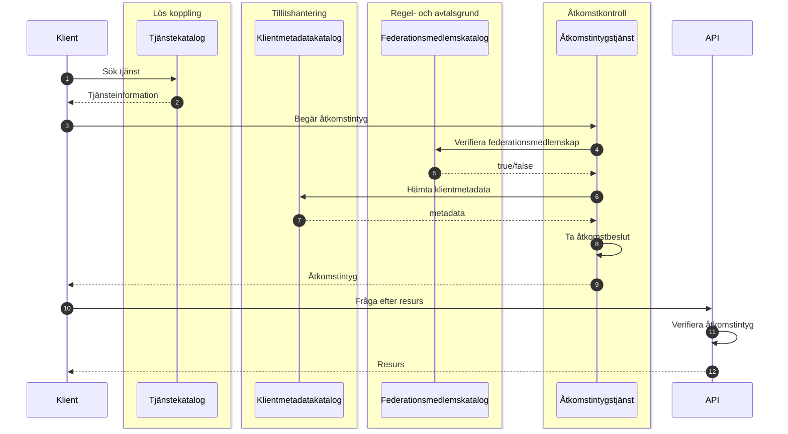

### 5.2 Flöde B – Katalogsynkronisering (central/lokal)

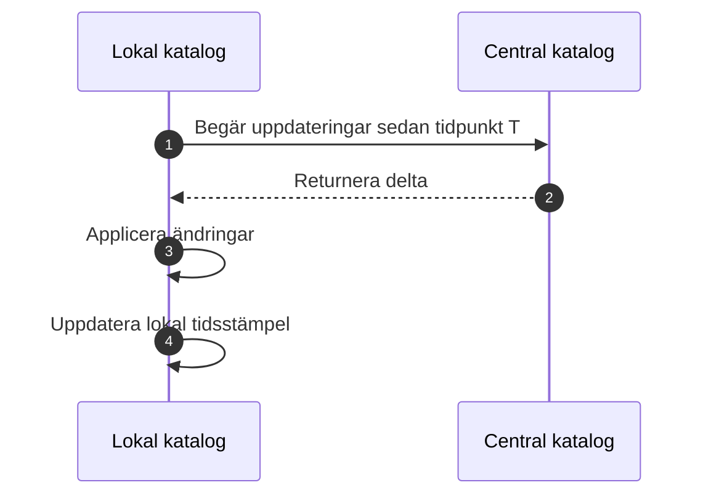

### 5.3 Flöde C – Informationsförsörjning (aggregerat/strömmat)

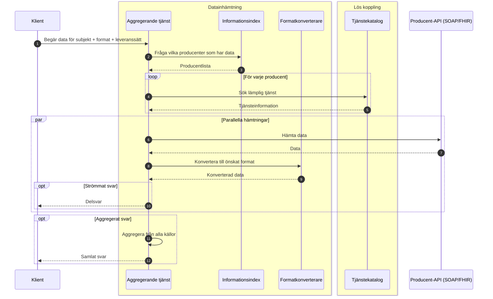

---

## 6. Säkerhetsarkitektur

### 6.1 Tillitsmodell

- Federerad tillit etableras via medlemskap och metadata.
- Åtkomstintyg är bäraren av beslutad behörighet i anropskedjan.

### 6.2 Kontrollpunkter

- Klientautentisering vid begäran om intyg.
- Policybeslut i Åtkomstintygstjänst.
- Intygsverifiering i mål-API/gateway.
- Spårbarhet med korrelations-id i hela kedjan.

### 6.3 Profilering och standardlinjering

- OAuth2/OIDC-profiler för tokenflöden.
- Federation-/resolvermönster för tillitsuppslag.
- Katalog- och indexmodeller linjerade med nationella motsvarigheter.

---

## 7. Informations- och integrationsarkitektur

### 7.1 Canonical och kontrakt

- Informationsindex används för att hitta datakällor per informationsbehov.
- Tjänstekatalog används för teknisk upplösning av endpoint/kontrakt.
- Formatkonvertering möjliggör en enhetlig extern konsumtion trots heterogena producentgränssnitt.

### 7.2 Integrationsmönster

- Synkront tjänsteanrop för punktfrågor.
- Parallell datainhämtning för minskad total svarstid.
- Strömmat delsvar för tidig tillgång till delmängder.
- Aggregerat slutsvar för komplett sammanställning.

---

## 8. Drift- och plattformsarkitektur

### 8.1 Logisk driftmodell

- Kontrollplan: API-publicering, portaler, nycklar, analys.
- Dataplan: gateway och trafikhantering.
- Integrationslager: transformering, routing och eventuella strömningsflöden.

Kontrollplan och dataplan/integrationslager realiseras enligt referensupplägg i `solution.md`:

- **Kontrollplan (WSO2)**: API Publisher, Developer Portal, Admin Portal, Key Manager, API Analytics och Service Catalog.
- **Data Plane (WSO2)**: API Gateway och Traffic Manager.
- **Integration Layer (WSO2)**: Micro Integrator och Streaming Integrator.

### 8.2 Infrastruktur

- Container-/Kubernetes-baserad drift.
- Separering av applikationslager, integrationslager och stödtjänster.
- Observability med loggning, mätvärden och distribuerad spårning.

### 8.3 Tillgänglighet och robusthet

- Horisontell skalning av gateway och aggregerande tjänst.
- Tydliga timeout-, retry- och circuit breaker-strategier mot producent-API:er.
- Degraderingsläge vid partiella producentfel (fortsatt strömmat/partiellt svar där policy tillåter).

---

## 9. Icke-funktionella krav (NFR)

### 9.1 Säkerhet och regelefterlevnad

- All transport ska vara krypterad och autentiserad med minst TLS 1.2.
- Åtkomstintygstjänst och tokenflöden ska följa profilerad OAuth2/OIDC (Ena/Digg).
- Auktorisation ska tillämpa least privilege via scopes/claims per resurs.
- Skydd mot OWASP API Top 10 ska realiseras i gateway/policylager.
- Personuppgiftshantering ska vara GDPR-förenlig inklusive DPIA där tillämpligt.

### 9.2 Prestanda

- Katalog- och indexsökningar: P95 ≤ 500 ms vid normal belastning.
- Tokenutgivning/validering i Åtkomstintygstjänst: P95 ≤ 300 ms.
- Minst 1000 samtidiga förfrågningar utan degradering utöver P95-krav.
- Inkrementell synk till lokala kataloger/index: ≤ 5 minuter.
- Full synk till lokala kataloger/index: ≤ 30 minuter.

### 9.3 Förvaltning och förändringsbarhet

- SemVer på gränssnitt, med minst två parallella majorversioner.
- Äldre majorversion ska kunna samexistera i minst 18 månader efter ny major.
- OpenAPI/AsyncAPI ska publiceras och förvaltas med livscykelpolicy.
- Automatiserade tester (enhet/kontrakt/e2e) ska finnas i CI/CD för kritiska flöden.

### 9.4 Tillgänglighet, robusthet och skalbarhet

- Tjänstetillgänglighet: minst 99,9% per kalendermånad.
- Redundans: minst två noder per kritisk komponent och zon.
- Lokala instanser med persisterad katalogdata ska möjliggöra fortsatt läsning vid centralt bortfall > 60 min.
- Timeouts, retry med ökande pauser och circuit breakers ska vara konfigurerbara per klient och endpoint.
- Graceful degradation ska stödjas (t.ex. read-only i kataloger och partiella svar i aggregerad dataleverans).
- Horisontell skalning/autoskalning ska stödjas med stateless-princip där möjligt.

### 9.5 Dataintegritet och observerbarhet

- Konfliktupplösning vid uppdatering/synk ska vara deterministisk och auditloggad.
- Revisionsspår ska innehålla vem/när/vad samt verifierbar integritet (t.ex. hash/signatur).
- Synkintegritet ska verifieras med checksummor/digests/signaturer.
- Strukturerade loggar, metrics, tracing och korrelations-id (traceparent) ska vara end-to-end.
- Larm ska utlösas på definierade trösklar för latens, felkvot och ködjup.

---

## 10. Beslutslista (ADR-kandidater)

1. Åtkomstintyg utfärdas av dedikerad Åtkomstintygstjänst och valideras vid konsumtion.
2. Tjänsteupplösning sker via katalog, inte via statisk endpoint-konfiguration.
3. Informationsförsörjning implementeras som aggregerande orkestrering med stöd för strömning och aggregering.
4. SOAP/FHIR-interoperabilitet hanteras via formatkonvertering och tydliga kontrakt.
5. API-hantering separeras i kontrollplan/dataplan.

---

## 11. MVP-indelning och införandeplan

### MVP 1 – Grundläggande åtkomst och katalog

- Etablera ÅT, KM, FM och TC.
- Införa basflöde för säkert API-anrop (A01, A02, A04, A06).
- Etablera maskinläsbar metadata (OpenAPI/Well-known) för upptäckt/bindning.

### MVP 2 – Informationsförsörjning

- Etablera IT, AT och FK.
- Aktivera parallell inhämtning och aggregerat svar (A08).
- Implementera producentspårbarhet i svar och deterministisk formatkonvertering.

### MVP 3 – Strömning och robusthet

- Aktivera strömmade delsvar via SSE (A03, A07).
- Säkerställ partiella svar vid källfel och konfigurerbar resilient kommunikation (timeouts/retry/circuit-breaker).

### MVP 4 – Plattformsmognad och förvaltning

- Konsolidera kontrollplan/dataplan-processer.
- Standardisera onboarding för nya producenter och konsumenter.
- Etablera full observability, policydriven drift, versions- och livscykelstyrning samt regelefterlevnad.

---

## 12. Spårbarhet till kravunderlag

- Från `t2-krav.md` täcks:
	- anropa tjänst med åtkomstintyg,
	- katalogsynkronisering,
	- informationsförsörjning med aggregering/strömning,
	- övergripande komponentrelationer.

- Från `solution.md` täcks:
	- målbildens byggblock och externa beroenden,
	- kontrollplan/dataplan/integrationslager,
	- linjering mot nationella profiler och katalogstrukturer,
	- resolvermönster och federationskoppling,
	- explicit lagerindelning (applikation/plattform/infrastruktur).

### 12.1 Spårbarhet – användningskrav (CSV)

- **A01 Hitta API**: realiseras i Tjänstekatalog med logisk adressering och interoperabilitetsmetadata.
- **A02 Hitta metadata för åtkomstbegäran**: realiseras i Tjänstekatalog (mTLS/OAuth2-metadata) samt ÅT/KM.
- **A03 Hitta metadata för API-anrop**: realiseras i Tjänstekatalog via metadata för synkront svar respektive SSE.
- **A04 Begär åtkomst till API**: realiseras i ÅT med stöd för CC/AC-flöden samt FM/KM-kontroller.
- **A06 Anropa API**: realiseras i API-gateway med token-/mTLS-verifiering och routing.
- **A07 Förmedla anrop (synkront/delsvar)**: realiseras i AT/API med valbart leveranssätt.
- **A08 Hämta aggregerad personrelaterad data**: realiseras i IT + TC + AT + FK med SOAP/FHIR-interoperabilitet.

### 12.2 Spårbarhet – systemkrav (CSV)

- **Lös koppling (LK-01..LK-05)**: SemVer, OpenAPI/Well-known, logisk adressering och standardprotokoll.
- **Tillit/Åtkomst (TH-01..TH-04, Å-01..Å-04, RA-01..RA-03)**: federationskontroller, metadata, tokenprofiler och policystyrd åtkomst.
- **Datainhämtning (D-01..D-11)**: AT för aggregation/partiella svar, FK för deterministisk konvertering, IT för indexering/ägarskap/deduplicering.
- **Tillgänglighet/Prestanda/Robusthet (TG-01..TG-05, P-01..P-03, R-01..R-06)**: lokala instanser, redundans, SLA/SLO, synkkrav och resilient anropsmönster.
- **Säkerhet/Skalbarhet/Integritet (SÄ-01..SÄ-08, SK-01..SK-03, DI-01..DI-05)**: TLS, least privilege, autoskalning, revisionsspår, backup och verifierbar synk.
- **Övervakning/Förvaltning/Regelefterlevnad (Ö-01..Ö-04, F-01..F-05, RE-01..RE-05)**: metrics/logs/tracing, CI/CD-kvalitet, livscykelhantering, GDPR/RIV-TA/eIDAS/WCAG.

### 12.3 Tolkningar och öppna punkter från kravunderlag

- Kravet kring asynkrona mönster i LK-03 tolkas som **obligatoriskt för informationsförsörjning (AT/API)** men **inte obligatoriskt för katalogernas synkgränssnitt**, där pull-baserad delta/full-synk är huvudmönster.
- I systemkravslistan finns dubbel-ID för P-02; tolkning i detta dokument är att båda prestandakraven gäller (1000 samtidiga förfrågningar samt 5 min inkrementell synk).
- RE-02 anger profiler utan uttömmande lista; arkitekturen utgår från Ena OAuth2-profil, OIDC/OAuth2-profiler samt RIV-TA.

---

## 13. Kompakta krav per komponent

| Komponent | Primärt ansvar | Nyckelkrav (ID) | MVP-fokus | Status |
|---|---|---|---|---|
| Tjänstekatalog (TC) | API-upptäckt, logisk adressering, metadata för anrop/åtkomst | A01, A02, A03, LK-01..LK-05, TG-02, TG-05, P-01, R-02, F-03 | MVP 1 | Planerad |
| Klientmetadatakatalog (KM) | Klientidentitet, nycklar/certifikat, metadata för tillit | A04, TH-02, TH-04, TG-02, P-01, DI-01..DI-04, SÄ-07, SÄ-08 | MVP 1 | Planerad |
| Federationsmedlemskatalog (FM) | Verifiering av medlemskap och rättslig grund | A04, TH-01, RA-01..RA-03, TG-02, R-02, RE-01 | MVP 1 | Planerad |
| Åtkomstintygstjänst (ÅT/ATS) | Utfärda/validera åtkomstintyg och tokenflöden (CC/AC) | A04, TH-03, Å-02, Å-03, P-03, SÄ-01..SÄ-03, RE-04 | MVP 1 | Planerad |
| API Gateway | Verifiering (OAuth2/mTLS), policy enforcement, routing | A06, Å-01, Å-03, SÄ-05, Ö-01..Ö-03, SK-01, TG-03 | MVP 1 | Planerad |
| Informationsindex (IT) | Indexera subjekt/adressat/informationstyp och hitta datakällor | A08, D-05..D-11, TG-02, P-01, R-02, DI-01..DI-04 | MVP 2 | Planerad |
| Aggregerande tjänst (AT) | Orkestrera hämtning, aggregat/delsvar, felisolering | A07, A08, D-01..D-03, R-03, SK-03, Ö-04, SÄ-03 | MVP 2-3 | Planerad |
| Formatkonverterare (FK) | Deterministisk och versionsstyrd SOAP/FHIR-konvertering | A08, D-04, P-02, SÄ-01, F-02, F-04 | MVP 2 | Planerad |
| Katalogsynk (lokal-central) | Delta/full-synk, cache-resiliens och fortsatt läsning | TG-02, P-02 (synk 5 min), R-01, R-02, R-05, DI-04 | MVP 1-2 | Planerad |
| Drift/Observability | Larm, tracing, loggar/metrics, tillgänglighet och autoskalning | TG-01, TG-03, SK-01..SK-03, Ö-01..Ö-04, R-04, F-05 | MVP 3-4 | Planerad |

Statusvärden: **Planerad**, **Pågår**, **Klar**.

### 13.1 Minimikrav för produktionssättning per komponent

- **Säkerhet**: SÄ-01, SÄ-02, SÄ-03 uppfyllda före produktion.
- **Observerbarhet**: Ö-01, Ö-02, Ö-03 och korrelations-id (Ö-04) verifierade i testmiljö.
- **Resiliens**: R-03/R-04 implementerade för AT och gateway; R-01/R-02 för kataloger/index.
- **Prestanda**: P95-krav verifierade (P-01/P-03) samt samtidighet/synkkrav (P-02).
- **Förvaltningsbarhet**: SemVer + publicerade kontrakt (F-01..F-04) och CI/CD-testning (F-05).

---

## 14. Visuella vyer för samtliga arkitekturområden

### 14.1 Intressentvy

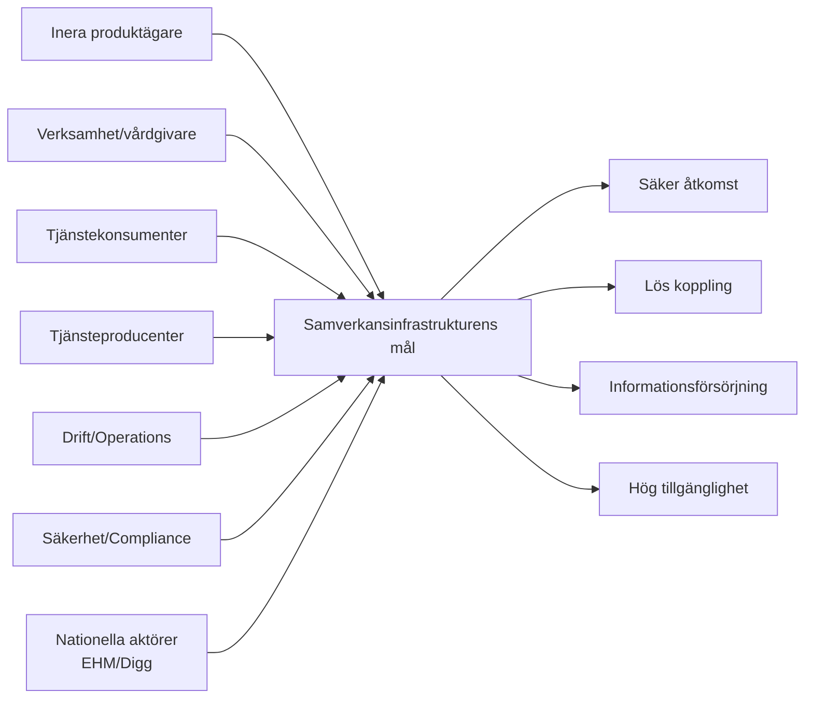

### 14.2 Affärs- och förmågevy

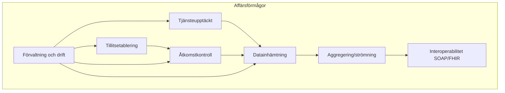

### 14.3 Logisk vy (containers)

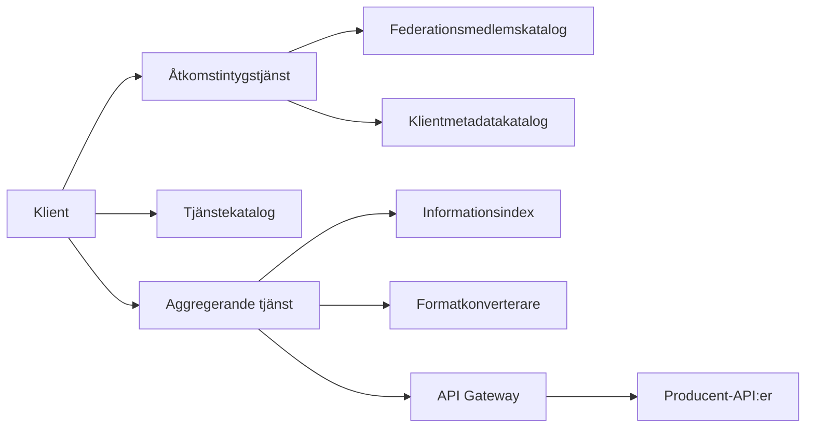

### 14.4 Processvy (E2E)

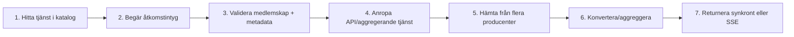

### 14.5 Implementationsvy (tekniska byggblock)

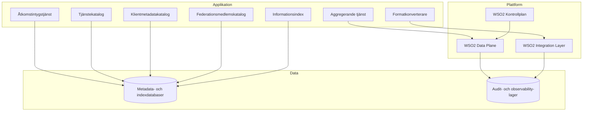

### 14.6 Distributionsvy (drift och zoner)

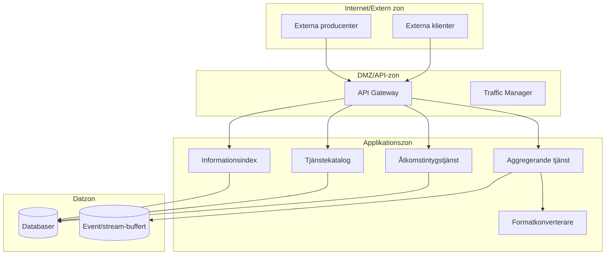

### 14.7 Säkerhetsvy (tillit och kontroller)

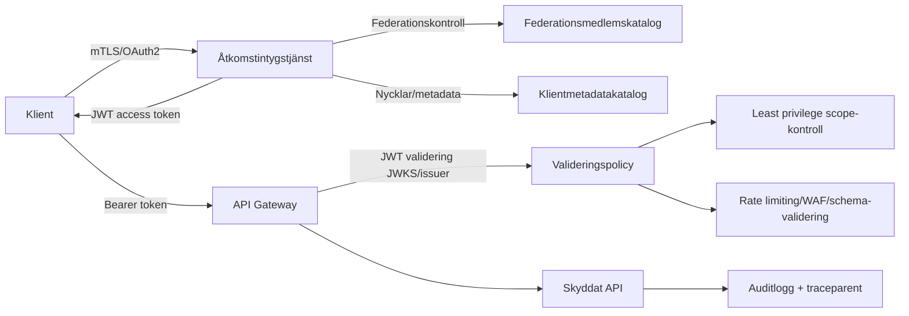

### 14.8 Datavy (informationsobjekt)

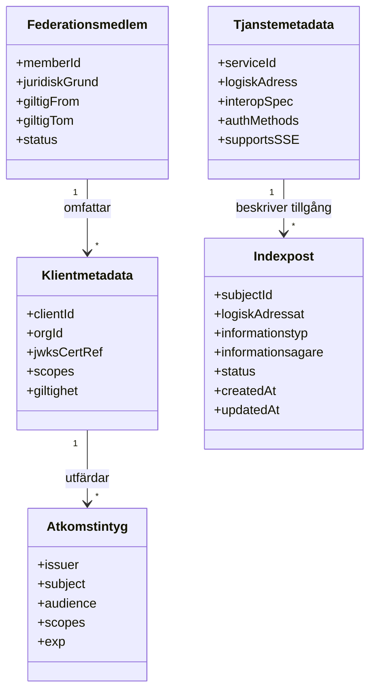

### 14.9 NFR-vy (målnivåer)

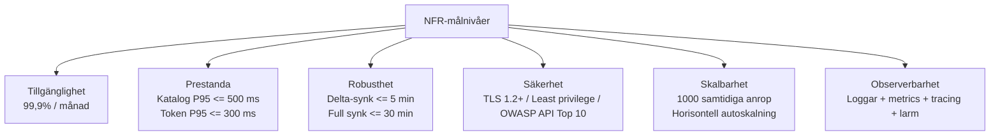

### 14.10 Spårbarhetsvy (kravområde till komponent)

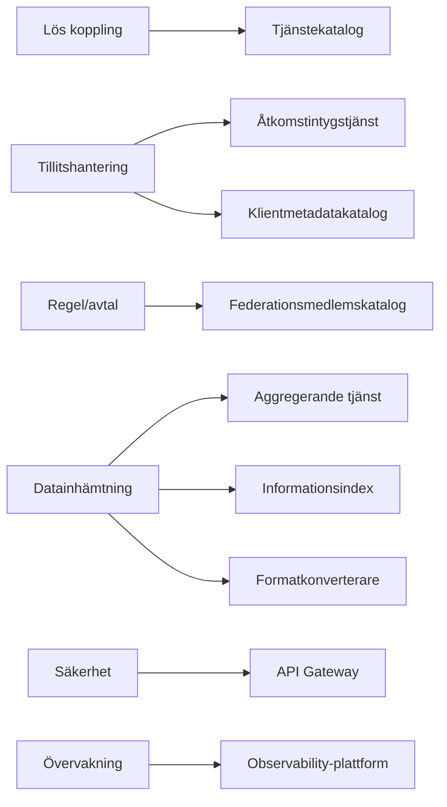

Denna arkitektur kan användas som bas för detaljdesign, ADR:er och implementation per etapp.
