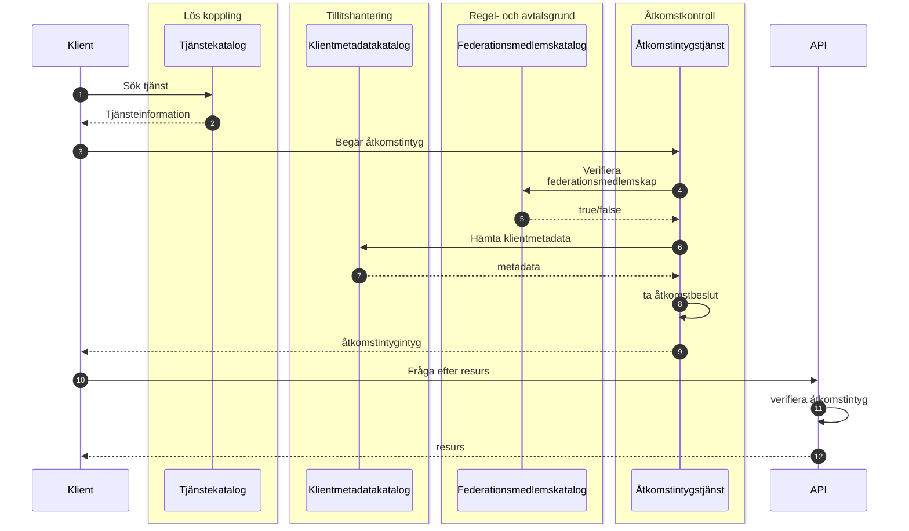
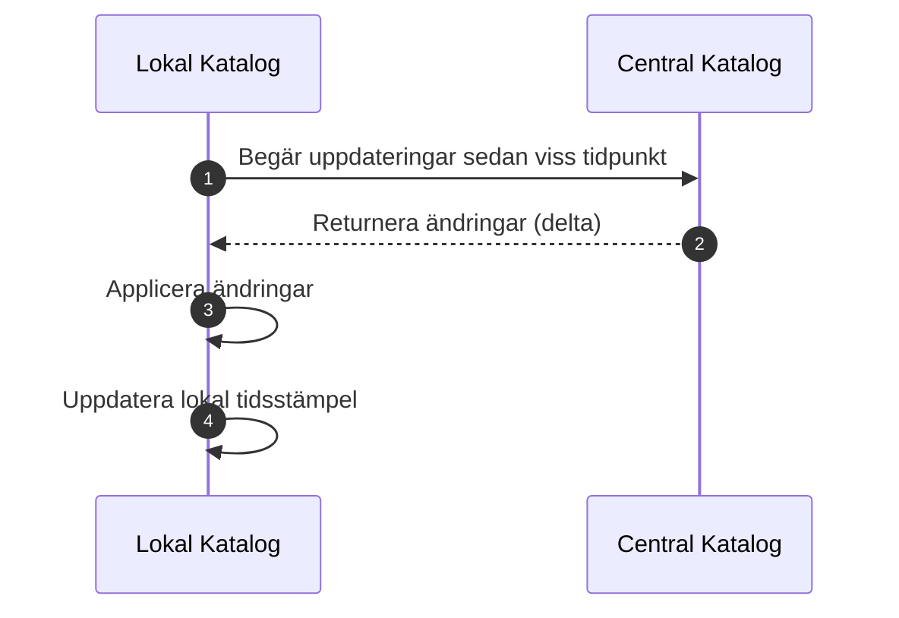
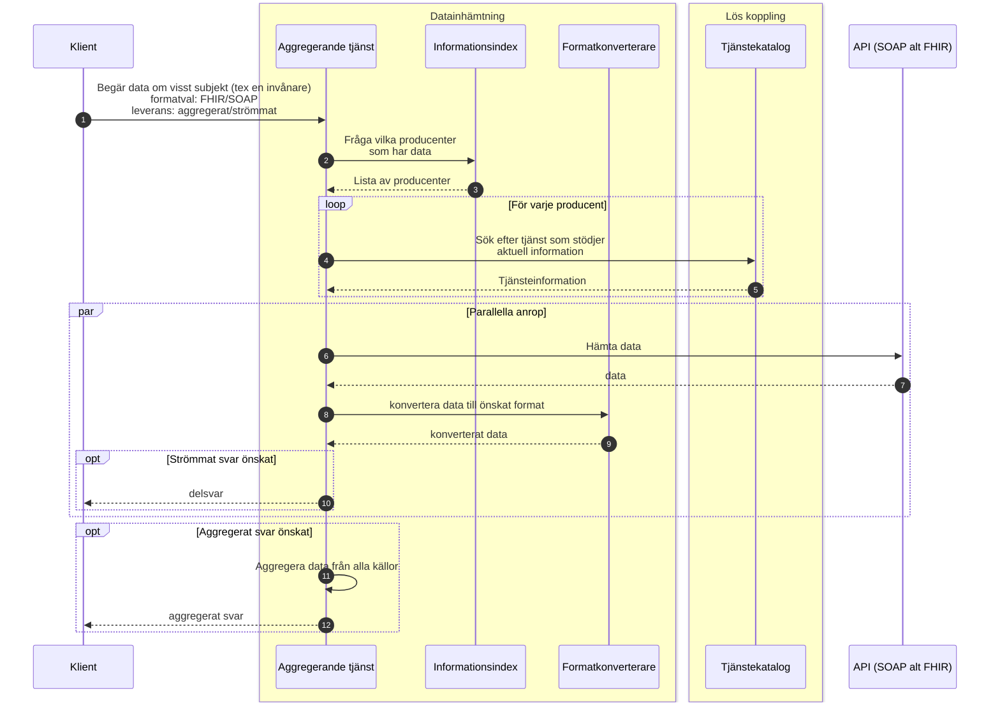
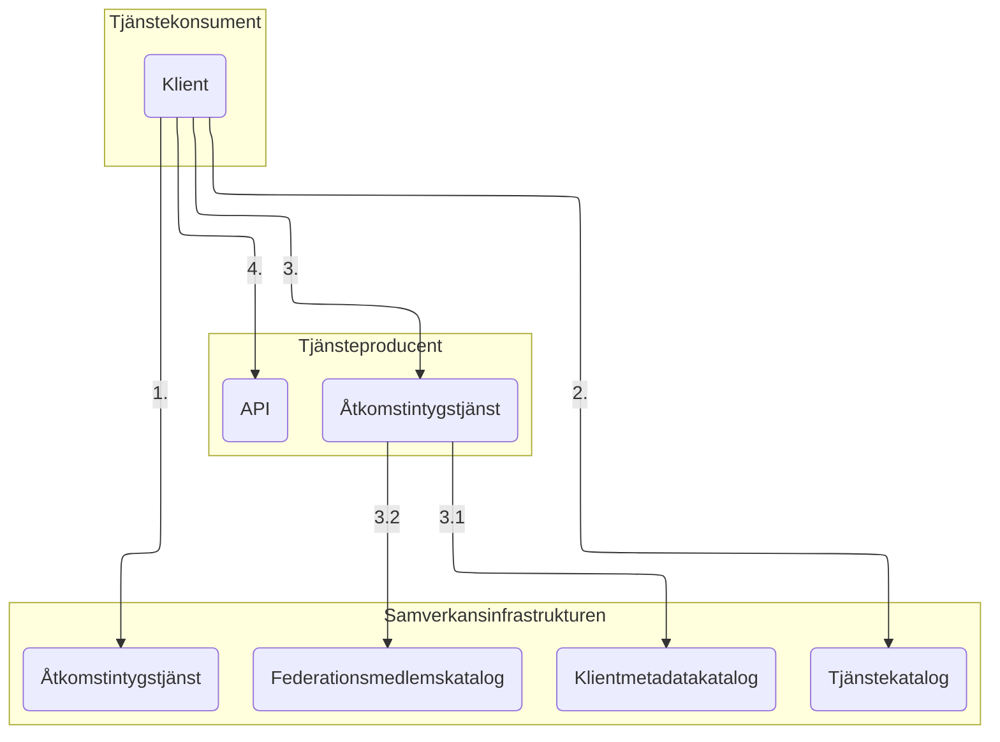

# Samverkansinfrastrukturen

## Anropa tjänst

```mermaid

sequenceDiagram
    autonumber
    participant Klient

    box rgb(255,255,204) Lös koppling
        participant TC as Tjänstekatalog
    end
    box rgb(255,255,204) Tillitshantering
        participant KM as Klientmetadatakatalog
    end
    box rgb(255,255,204) Regel- och avtalsgrund 
        participant FM as Federationsmedlemskatalog
    end
    box rgb(255,255,204) Åtkomstkontroll
        participant ÅT as Åtkomstintygstjänst
    end
    participant API
 
    Klient->>TC: Sök tjänst
    TC-->>Klient: Tjänsteinformation
    Klient->>ÅT: Begär åtkomstintyg
    ÅT->>FM: Verifiera <br>federationsmedlemskap
    FM-->>ÅT: true/false
    ÅT->>KM: Hämta klientmetadata
    KM-->>ÅT: metadata
    ÅT->>ÅT: ta åtkomstbeslut
    ÅT-->>Klient: åtkomstintygintyg
    Klient->>API: Fråga efter resurs
    API->>API: verifiera åtkomstintyg
    API-->>Klient: resurs
```

## Katalogsynkronisering

```mermaid
sequenceDiagram
    autonumber
    participant LK as Lokal Katalog
    participant CK as Central Katalog

    LK->>CK: Begär uppdateringar sedan viss tidpunkt
    CK-->>LK: Returnera ändringar (delta)
    LK->>LK: Applicera ändringar
    LK->>LK: Uppdatera lokal tidsstämpel
```

## Informationsförsörjningstjänst

```mermaid
sequenceDiagram
    autonumber
    participant K as Klient
    box  rgb(255,255,204) Datainhämtning
        participant AT as Aggregerande tjänst
        participant IT as Informationsindex
        participant FK as Formatkonverterare
    end
    box  rgb(255,255,204) Lös koppling
        participant TC as Tjänstekatalog
    end
    participant TP as API (SOAP alt FHIR)

    K->>AT: Begär data om visst subjekt (tex en invånare)<br>formatval: FHIR/SOAP<br>leverans: aggregerat/strömmat
    AT->>IT: Fråga vilka producenter <br>som har data
    IT-->>AT: Lista av producenter
    
    loop För varje producent
        AT->>TC: Sök efter tjänst som stödjer<br>aktuell information
        TC-->>AT: Tjänsteinformation
    end
    
    par Parallella anrop
        AT->>TP: Hämta data 
        TP-->>AT: data
        AT->>FK: konvertera data till önskat format
        FK-->>AT:konverterat data

        opt Strömmat svar önskat
            AT-->>K: delsvar
        end
    end
    
    opt Aggregerat svar önskat
        AT->>AT: Aggregera data från alla källor
        AT-->>K: aggregerat svar
    end
```

## Anropa API

```mermaid
%%{init: {"flowchart": {"defaultRenderer": "elk"}} }%%
graph 
    subgraph tk[Tjänstekonsument]
        tkc(Klient)
    end
    subgraph si[Samverkansinfrastrukturen]
        sias(Åtkomstintygstjänst)
        sitk(Tjänstekatalog)
%%        siagg(Aggregerande tjänst)
%%        siii(Informationsindex)
        sifmk(Federationsmedlemskatalog)
        sikk(Klientmetadatakatalog)
%%        sifk(Formatkonverterare)
    end
    subgraph tp[Tjänsteproducent]
        tpas(Åtkomstintygstjänst)
        tpapi(API)
    end
    tkc-- 1. -->sias
    tkc-- 2. -->sitk
    tpas-- 3.2 -->sifmk
    tpas-- 3.1 -->sikk
    tkc-- 3. -->tpas
    tkc-- 4. -->tpapi  
    
```
