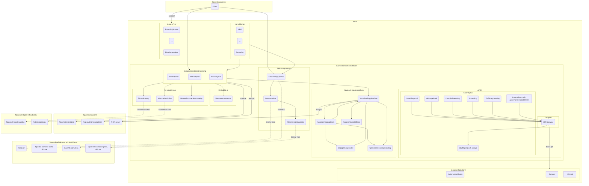

# Bla

```mermaid
flowchart TD
%%{init: {"flowchart": {"defaultRenderer": "dagre"}} }%%

subgraph inera["Inera"]
    subgraph itk["Inera-klienter"]
        npo(NPÖ)
        itkmm(...)
        journalen(Journalen)
    end

    subgraph si["Samverkansinfrastrukturen"]

        subgraph siit["Inera informationsförsörjning"]
            svodc(SVOD-tjänst)~~~
            ehdsc(EHDS-tjänst)~~~
            jc(Invånartjänst)
        end

        subgraph si1["T2-stödtjänster"]
            sitk(Tjänstekatalog)
            siii(Informationsindex)
            sifmk(Federationsmedlemskatalog)
        end

        subgraph si2["FHIR/BP2.1"]
            sifk(Formatkonverterare)
        end

        subgraph siiam["IAM-komponenter"]
            sias(Åtkomstintygstjänst)
            sikk(Klientmetadatakatalog)
            sir(Inera-resolver)
        end

        subgraph ntjp["Nationell tjänsteplattform"]
            vp(Virtualiseringsplattform)
            ag(Aggregeringsplattform)
            anp(Anpassningsplattform)
            ei(Engagemangsindex)
            tak(Tjänsteadresseringskatalog)
        end
        
        subgraph apim["APIM"]
            subgraph dp["Dataplan"]
                gw(API Gateway)
            end

            subgraph cp["Kontrollplan"]
                cp1(Utvecklarportal)
                cp2(API-regelverk)
                cp3(Uppföljning och analys)
                cp4(Livscykelhantering)
                cp5(Anslutning)
                cp6(Trafikbegränsning)
                cp7(Integrations- och governance-kapabiliteter)
            end
        end
    end

    subgraph itp["Inera-API:er"]
        formular(Formulärtjänsten)
        itpmm(...)
        fodelse(Födelseanmälan)
    end

    subgraph drift["Ineras driftplattform"]
        kubernetes("Kubernetes-kluster")
        Servrar
        Nätverk
    end
end

subgraph tk["Tjänstekonsument"]
    tkc(Klient)
end

subgraph tp["Tjänsteproducent"]
    tpas(Åtkomstintygstjänst)
    tprtp(Regional tjänsteplattform)
    tpfs(FHIR server)
end

subgraph ndi["Nationell Digital Infrastruktur"]
    ntk(Nationell tjänstekatalog)
    pdi(Patientdataindex)
end

subgraph sib["Samordnad identitet och behörighet"]
    res(Resolver)
    oi(OpenID Connect-profil, oidc.se)
    o2(OAuth2-profil, Ena)
    of(OpenID Federation-profil, oidc.se)
end

cp1 --> gw
cp2 --> gw
cp4 --> gw
cp5 --> gw
cp6 --> gw
cp7 --> gw
gw --> cp3
sias -. "realiserar" .-> o2
sitk -. "modelleras efter" .-> ntk
siii -. "modelleras efter" .-> pdi
sikk -. "linjerar med" .-> of
sir -. "linjerar med" .-> res
sias --> sir
sir --> sikk
ag --> vp
ag --> ei
ag --> tak
vp --> anp
vp --> ag
vp --> ei
vp --> tak
siit --> vp
siit --> siii
siit --> sifk
siit --> sifmk
siit --> sitk
vp -- "anropar" --> tprtp
gw -- "driftas på" --> drift
tkc --> siit
itk --> siit
siit -- "anropar" --> tpas
siit -- "anropar" --> tpfs
tkc --> sias
itk --> sias
tkc -- "anropar" --> itp
%%si --> itp
%%apim -- "integrerar med" --> siiam
%%gw -- "integrerar med" --> sias

tkc~~~itk
ei~~~kubernetes

```
