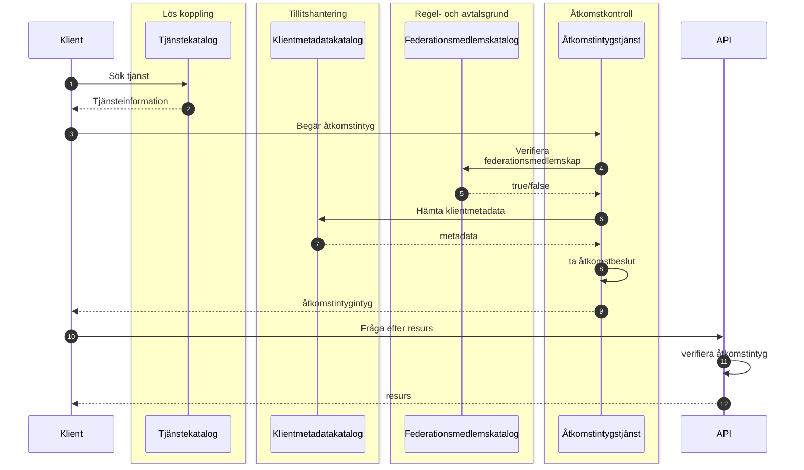
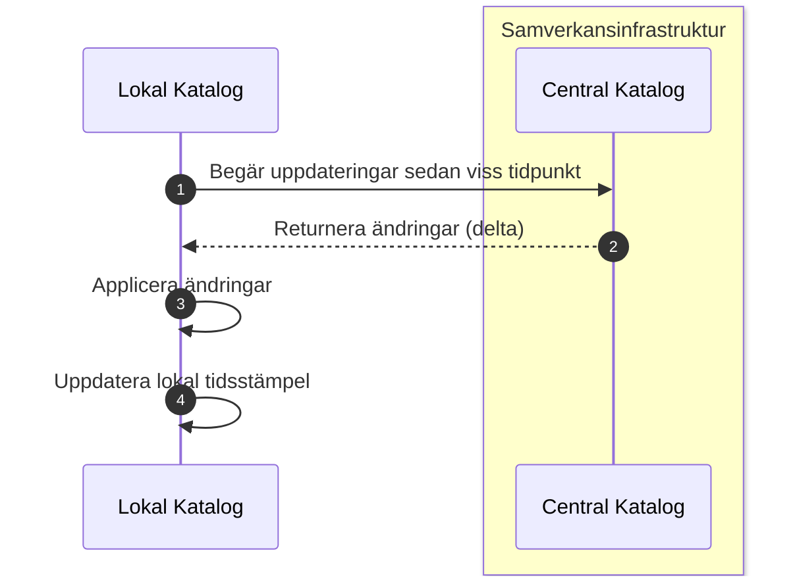
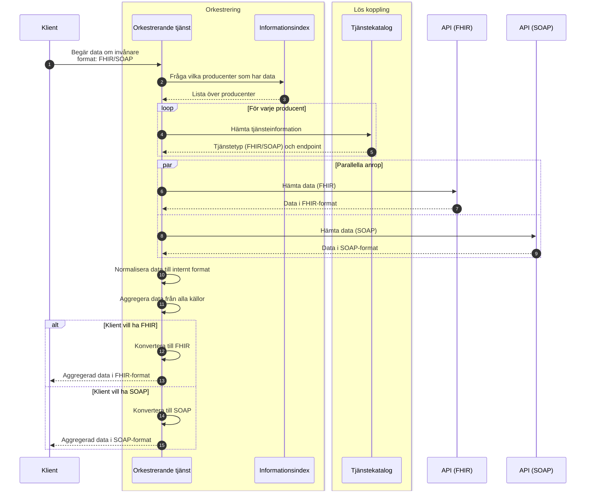

# Anropa tjänst

```mermaid

sequenceDiagram
    autonumber
    participant Klient
    box rgb(255,255,204) Lös koppling
        participant TC as Tjänstekatalog
    end
    box  rgb(255,255,204) Tillitshantering
        participant KM as Klientmetadatakatalog
    end
    box  rgb(255,255,204) Regel- och avtalsgrund 
        participant FM as Federationsmedlemskatalog
    end
    box  rgb(255,255,204) Åtkomstkontroll
        participant ÅT as Åtkomstintygstjänst
    end
    participant API
 
    Klient->>TC: Sök tjänst
    TC-->>Klient: Tjänsteinformation
    Klient->>ÅT: Begär åtkomstintyg
    ÅT->>FM: Verifiera <br>federationsmedlemskap
    FM-->>ÅT: true/false
    ÅT->>KM: Hämta klientmetadata
    KM-->>ÅT: metadata
    ÅT->>ÅT: ta åtkomstbeslut
    ÅT-->>Klient: åtkomstintygintyg
    Klient->>API: Fråga efter resurs
    API->>API: verifiera åtkomstintyg
    API-->>Klient: resurs
```

# Katalogsynkronisering

```mermaid
sequenceDiagram
    autonumber
    participant LK as Lokal Katalog
    box  rgb(255,255,204) Samverkansinfrastruktur
        participant CK as Central Katalog
    end
    LK->>CK: Begär uppdateringar sedan viss tidpunkt
    CK-->>LK: Returnera ändringar (delta)
    LK->>LK: Applicera ändringar
    LK->>LK: Uppdatera lokal tidsstämpel
```

## Orkestrerande tjänst

```mermaid
sequenceDiagram
    autonumber
    participant K as Klient
    box  rgb(255,255,204) Orkestrering
        participant AT as Orkestrerande tjänst
        participant IT as Informationsindex
    end
    box  rgb(255,255,204) Lös koppling
        participant TC as Tjänstekatalog
    end
    participant TP1 as API (FHIR)
    participant TP2 as API (SOAP)

    K->>AT: Begär data om invånare<br>format: FHIR/SOAP
    AT->>IT: Fråga vilka producenter som har data
    IT-->>AT: Lista över producenter
    
    loop För varje producent
        AT->>TC: Hämta tjänsteinformation
        TC-->>AT: Tjänstetyp (FHIR/SOAP) och endpoint
    end
    
    par Parallella anrop
        AT->>TP1: Hämta data (FHIR)
        TP1-->>AT: Data i FHIR-format
    and
        AT->>TP2: Hämta data (SOAP)
        TP2-->>AT: Data i SOAP-format
    end
    
    AT->>AT: Normalisera data till internt format
    AT->>AT: Aggregera data från alla källor
    
    alt Klient vill ha FHIR
        AT->>AT: Konvertera till FHIR
        AT-->>K: Aggregerad data i FHIR-format
    else Klient vill ha SOAP
        AT->>AT: Konvertera till SOAP
        AT-->>K: Aggregerad data i SOAP-format
    end
```

