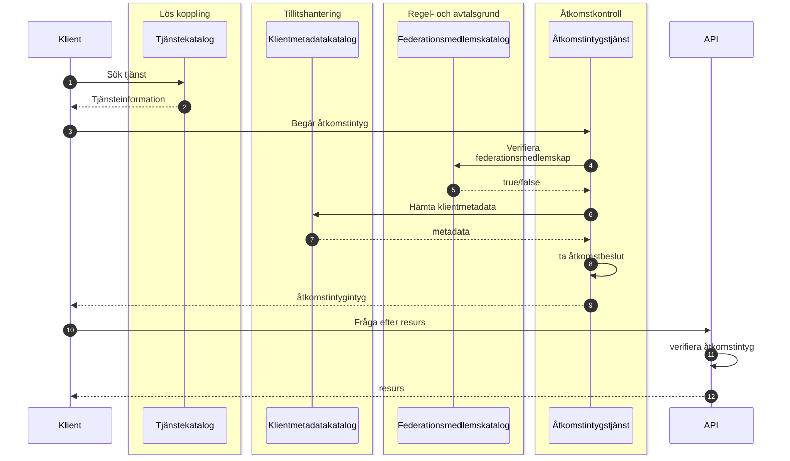
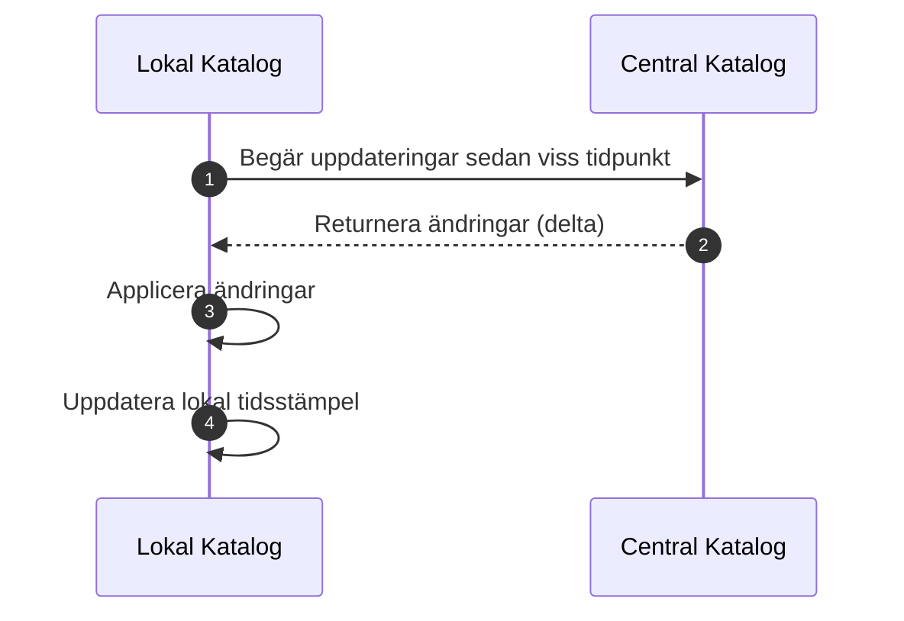
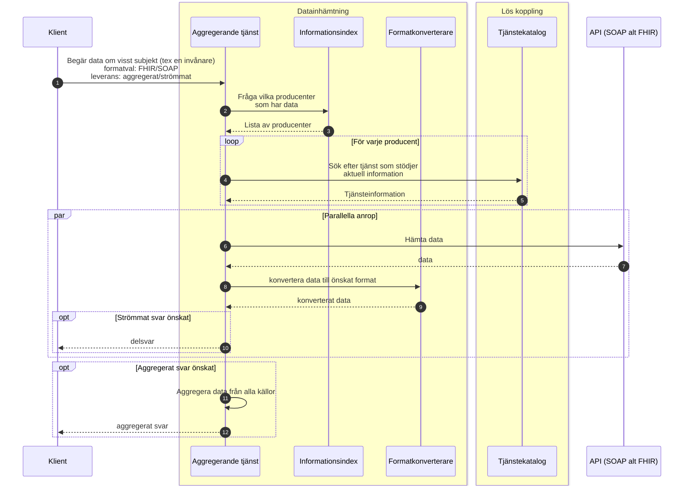
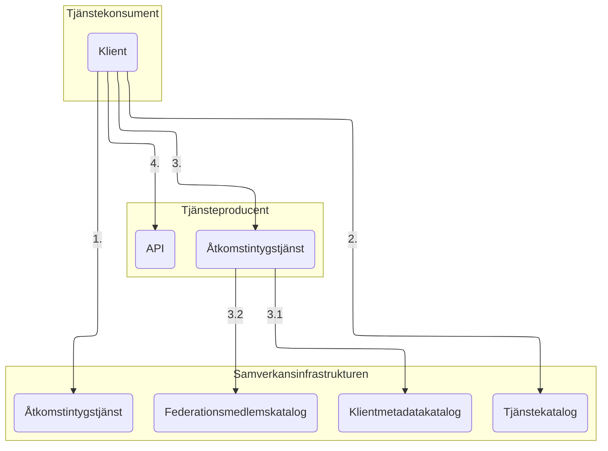
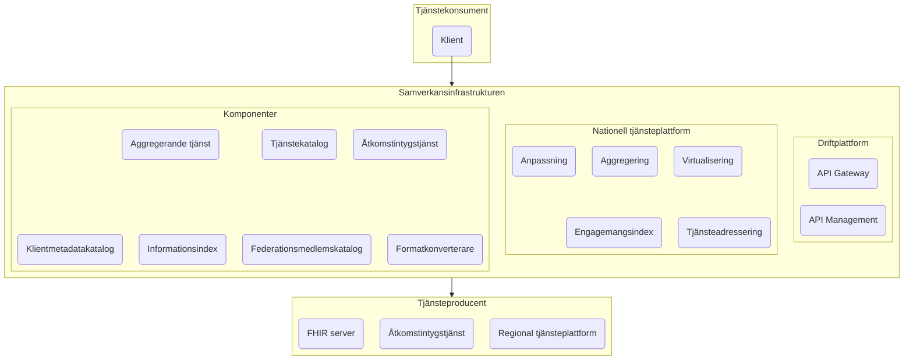

# Anropa tjänst



# Katalogsynkronisering



# Informationsförsörjningstjänst



# Lösningsarkitektur






# Total lösningsarkitektur
%%{init: {"flowchart": {"defaultRenderer": "elk"}} }%%

```mermaid
graph LR

classDef extern fill:#F8E5A0
classDef box fill:#ffffff,stroke:#000000

subgraph i[Inera]
    subgraph itk[Inera-tjänster]
        NPÖ
        mmm(...)
        Journalen
    end

    subgraph si[Samverkansinfrastrukturen]
        subgraph siit[Inera informationsförsörjning]
            svodc[SVOD-tjänst]
            ehdsc[EHDS-tjänst]
            jc[Invånartjänst]
        end
        subgraph si1[T2-stödtjänster]
            sitk(Tjänstekatalog)
            siii(Informationsindex)
            sifmk(Federationsmedlemskatalog)
        end
        subgraph si2[FHIR<-->BP2.1]
            sifk(Formatkonverterare)
        end
        subgraph siiam[IAM-komponenter]
            sias(Åtkomstintygstjänst)
            sikk(Klientmetadatakatalog)
            sir(Inera-resolver)
        end
        subgraph ntjp[Nationell tjänsteplattform]
            vp(Virtualiserings-<br>plattform)
            ag(Aggregerings-<br>plattform)
            anp(Anpassnings-<br>plattform)
            ei(Engagemangsindex)
            tak(Tjänsteadresserings-<br>katalog)
        end
        subgraph apim[APIM]
            subgraph dp[Dataplan]
                gw(API Gateway)
            end
            subgraph cp[Kontrollplan]
                cp1(Utvecklarportal)
                cp2(API-regelverk)
                cp3(Uppföljning & analys)
                cp4(Livscykelhantering)
                cp5(Anslutning)
                cp6(Trafikbegränsning)
                cp7(Integrations- och governance‑kapabiliteter)
            end
        end
        cp1 & cp2 & cp4 & cp5 & cp6 & cp7 -->gw -->cp3
    end
    si:::box

    subgraph itp[Inera-tjänster]
        Formulärtjänsten
        mm(...)
        Födelseanmälan

    end

    subgraph drift[Ineras driftplattform]
        subgraph kk[Kubernetes kluster]
            s[...]
        end
    end
end
i:::box

subgraph tk[Tjänstekonsument]
    tkc(Klient)
end
tk:::extern

subgraph tp[Tjänsteproducent]
    tpas(Åtkomstintygstjänst)
    tprtp(Regional tjänsteplattform)
    tpfs(FHIR server)
end
tp:::extern


subgraph ndi[Nationell Digital Infrastruktur]
    ntk(Nationell tjänstekatalog)
    pdi(Patientdataindex)
end
ndi:::extern

subgraph sib[Samordnad identitet och behörighet]
    res(Resolver)
    oi([OpenID Connect-profil, oidc.se])
    o2([OAuth2-profil, Ena])
    of([OpenID Federation-profil, oidc.se])
end
sib:::extern


sias-.realiserar.->o2
sitk-.modelleras efter.-ntk
siii-.modelleras efter.-pdi
sikk-.linjerar med.->of
sir-.linjerar med.-res
sias-->sir-->sikk
ag-->vp & ei & tak
vp-->anp & ag & ei & tak
siit-->vp  & siii & sifk & sifmk & sitk
vp--anropar-->tprtp
si--driftas på-->drift 
tkc & itk -->siit--anropar-->tpas & tpfs
tkc & itk-->sias
tkc--anropar-->itp
si~~~itp
apim--integrerar med-->siiam

```
