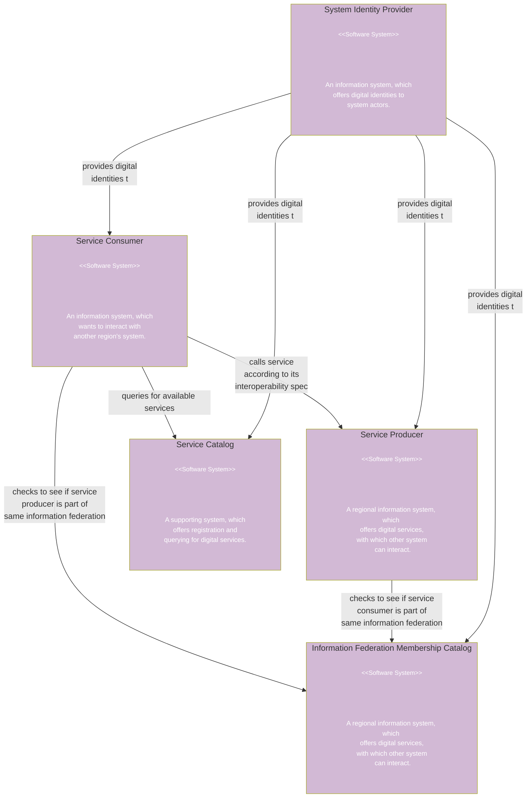

```mermaid
flowchart TB

subgraph serviceConsumer[Service Consumer]
    h1[&lt&ltSoftware System&gt&gt]:::type
    d1[An information system, which \n wants to interact with \n another region's system.]:::description
end
serviceConsumer:::system

subgraph serviceCatalog[Service Catalog]
    h2[&lt&ltSoftware System&gt&gt]:::type
    d2[A supporting system, which \n offers registration and \n querying for digital services.]:::description
end
serviceCatalog:::system

subgraph serviceProducer[Service Producer]
    h3[&lt&ltSoftware System&gt&gt]:::type
    d3[A regional information system, which \n offers digital services, \n with which other system \n can interact.]:::description
end
serviceProducer:::system

subgraph federationCatalog[Information Federation Membership Catalog]
    h4[&lt&ltSoftware System&gt&gt]:::type
    d4[A regional information system, which \n offers digital services, \n with which other system \n can interact.]:::description
end
federationCatalog:::system

subgraph identityProvider[System Identity Provider]
    h5[&lt&ltSoftware System&gt&gt]:::type
    d5[An information system, which \n offers digital identities to \n system actors.]:::description
end
identityProvider:::system

serviceConsumer--calls service\naccording to its\ninteroperability spec-->serviceProducer
serviceConsumer--checks to see if service\nproducer is part of \nsame information federation-->federationCatalog
serviceProducer--checks to see if service\nconsumer is part of \nsame information federation-->federationCatalog
serviceConsumer--queries for available services-->serviceCatalog
identityProvider--provides digital \n identities to-->serviceConsumer & serviceProducer & serviceCatalog & federationCatalog
%% Element types definitions
classDef system fill:#D2B9D5
classDef type stroke-width:0px, color:#fff, fill:transparent, font-size:12px
classDef description stroke-width:0px, color:#fff, fill:transparent, font-size:13px
```