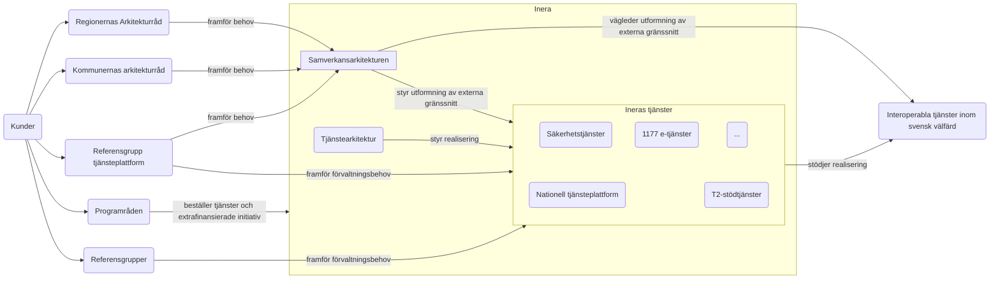
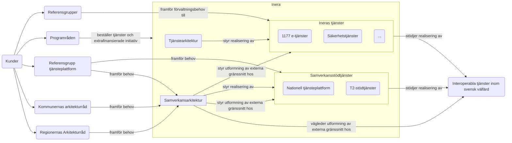

# Inledning
- Samverkansarkitekturen styr utformningen av interoperabla gränssnitt för samverkan över organisationsgränser (Inera-kund, kund-Inera, kund-kund) för interoperabla tjänster där Inera agerar tjänsteleverantör/federationsoperatör. 
- Samverkansarkitekturen stöttar realiseringar via anvisningar och vägledningar, samt tolkningsstöd av dessa.
- Inera tjänstearkitektur styr Ineras tjänsters realisering och säkerställer följsamhet mot interna riktlinjer och beslutad samverkansarkitektur.
- Arkitekturella beslut om avsteg från arkitekturella ramar ska dokumenteras i dels SAD (för avsteg från interna riktlinjer), dels som ett arkitekturellt beslut i interopspec/TKB (för avsteg från samverkansarkitekturella anvisningar). Beslut ska eskaleras minst till chefsarkitektsnivå.
- Ineras ledning beslutar om vilka tjänster som ska etableras, ofta baserat på intresseanmälan och avsiktsförklaring
- Ineras ledning beslutar om vilka tjänster som ska etableras, ofta baserat på intresseanmälan och avsiktsförklaring

# Alternativ 1
**NTjP & T2-stödtjänster ses som vilka andra tjänster som helst**

# Alternativ 2
**NTjP och T2-stödtjänster ses inte som Inera-tjänster utan som "samverkansstödtjänster"**

Kan ej rekommenderas eftersom det skapar en otydlighet kring tjänster som HSA och SITHS som är centrala för samverkan men också är självstående tjänster.

