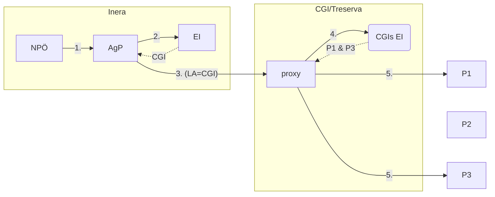
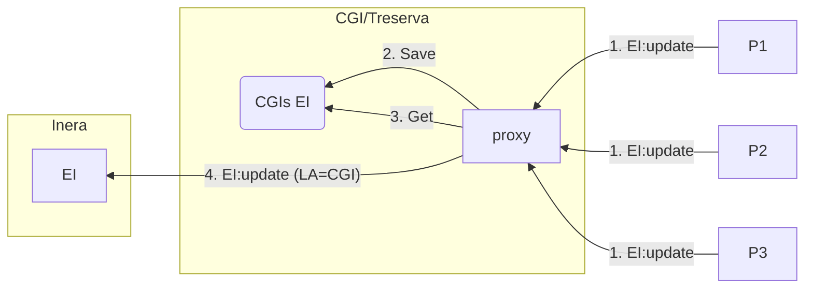
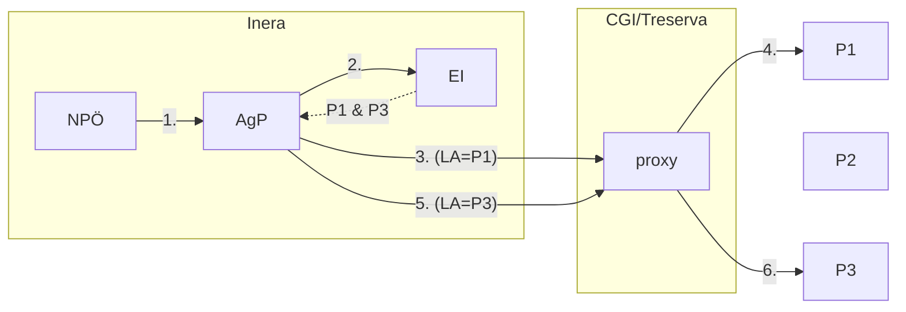
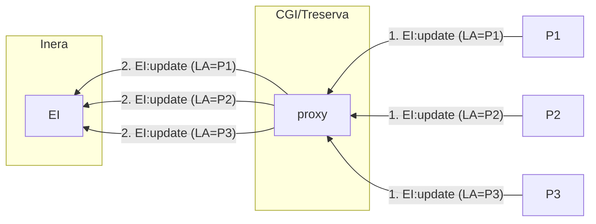

# Dagens lösning
- Journal och Läkemedelskontrakt

```mermaid 
graph LR

subgraph i[Inera]
    NPÖ
    AgP
    EI
end

subgraph cgi[CGI/Treserva]
    proxy
    ei2(CGIs EI)
end

NPÖ--1.-->AgP
AgP--2.-->EI-.CGI.->AgP
AgP--3. (LA=CGI)--->proxy
proxy--4.-->ei2-.P1 & P3.->proxy
proxy--5. ---> P1 
proxy~~~~P2
proxy--5. ---> P3 

```
- EI:update

```mermaid 
graph RL

subgraph i[Inera]
    EI
end

subgraph cgi[CGI/Treserva]
    proxy
    ei2(CGIs EI)
end

P1 & P2 & P3--1. EI:update-->proxy
proxy--2. Save-->ei2
proxy--3. Get-->ei2
proxy--4. EI:update (LA=CGI)--->EI


```
# Målbild
- Journal och Läkemedelskontrakt
- Tillgänglig Patient 

```mermaid 
graph LR

subgraph i[Inera]
    NPÖ
    AgP
    EI
end

subgraph cgi[CGI/Treserva]
    proxy
end

NPÖ--1. -->AgP
AgP--2. -->EI
EI-.P1 & P3.->AgP
AgP--3. (LA=P1)--->proxy
proxy--4. -->P1
proxy~~~P2
AgP--5. (LA=P3)--->proxy
proxy--6. -->P3


```
- EI:update

```mermaid 
graph RL

subgraph i[Inera]
    EI
end

subgraph cgi[CGI/Treserva]
    proxy
end

P1--1. EI:update (LA=P1)-->proxy
P2--1. EI:update (LA=P2)-->proxy
P3--1. EI:update (LA=P3)-->proxy
proxy-- 2. EI:update (LA=P1) -->EI
proxy-- 2. EI:update (LA=P2) -->EI
proxy-- 2. EI:update (LA=P3) -->EI

```
