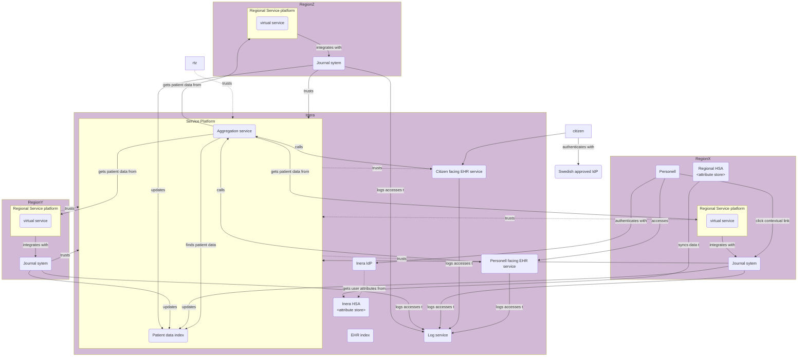

```mermaid
flowchart TB

subgraph RegionX
    px(Personell)
    hsax(Regional HSA\n&ltattribute store&gt)
    ehrx(Journal sytem)
    subgraph rtpx[Regional Service platform]
        vpx(virtual service)
    end
    px--click contextual link-->ehrx
    rtpx--integrates with-->ehrx
end
RegionX:::actor

subgraph RegionY
    ehry(Journal sytem)
    subgraph rtpy[Regional Service platform]
        vpy(virtual service)
    end
    rtpy--integrates with-->ehry
end
RegionY:::actor

subgraph RegionZ
    ehrz(Journal sytem)
    subgraph rtpz[Regional Service platform]
        vpz(virtual service)
    end
    rtpz--integrates with-->ehrz
end
RegionZ:::actor

subgraph Inera
    subgraph ntjp[Service Platform]
        agg(Aggregation service)
        --finds patient data
        -->ei(Patient data index)
    end
    ehr(Personell facing EHR service) & uehr(Citizen facing EHR service)
    --calls-->agg
    idp(Inera IdP) 
    -.gets user attributes from.-> hsa(Inera HSA\n&ltattribute store&gt)
    index(EHR index)
    ntjp-.trusts.->ehr & uehr
    log(Log service)
end
Inera:::actor

hsax--syncs data to--->hsa
ehrx & ehry & ehrz --updates--->ei
ehrx & ehry & ehrz --trusts--->ntjp


citizen --> uehr
citizen --authenticates with-->sidp(Swedish approved IdP)
px--authenticates with--->idp
px--accesses--->ehr
agg--gets patient data from--->rtpx & rtpy & rtpz
rtpx & rtpy & rtz -.trusts..->ntjp
ehr & uehr & ehrx & ehry & ehrz --logs accesses to-->log

%% Element type definitions
classDef actor fill:#D2B9D5
```