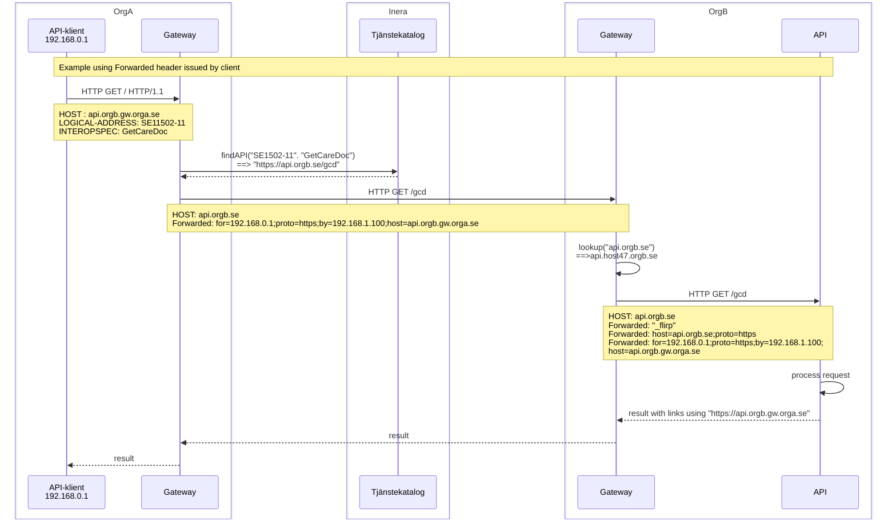
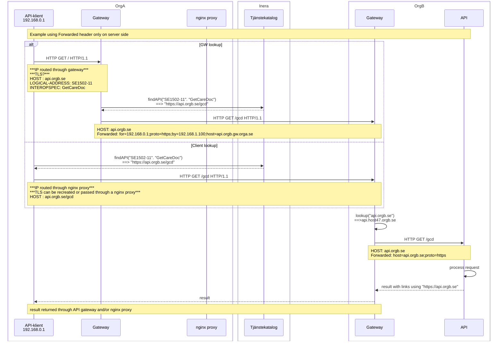

# Föreslagen lösningsarkitektur

```mermaid
%%{init: {"sequence": {"noteAlign": "left"}} }%%

sequenceDiagram
box OrgA
    participant c as API-klient<br>192.168.0.1
    participant pa as Gateway
end
box Inera
    participant tk as Tjänstekatalog
end
box OrgB
    participant pb as Gateway
    participant api as API
end

note over c, api: Example using Forwarded header issued by client
c->>pa: HTTP GET / HTTP/1.1
note over c,pa: HOST : api.orgb.gw.orga.se<br>LOGICAL-ADDRESS: SE11502-11<br>INTEROPSPEC: GetCareDoc

pa->>tk: findAPI("SE1502-11". "GetCareDoc")<br>==> "https://api.orgb.se/gcd"
tk-->>pa: 

pa->>pb: HTTP GET /gcd
note over pa,pb: HOST: api.orgb.se<br>Forwarded: for=192.168.0.1#59;proto=https#59;by=192.168.1.100#59;host=api.orgb.gw.orga.se
pb->>pb: lookup("api.orgb.se")<br>==>api.host47.orgb.se

pb->>api: HTTP GET /gcd
note over pb,api: HOST: api.orgb.se<br>Forwarded: "_flirp"<br>Forwarded: host=api.orgb.se#59;proto=https<br>Forwarded: for=192.168.0.1#59;proto=https#59;by=192.168.1.100#59;<br>host=api.orgb.gw.orga.se
api->>api: process request
api-->>pb: result with links using "https://api.orgb.gw.orga.se"
pb-->>pa: result
pa-->>c: result
```
# Anders lösningsarkitektur
1. Org A issues their own TLS certificates

```mermaid
%%{init: {"sequence": {"noteAlign": "left"}} }%%

sequenceDiagram
box OrgA
    participant c as API-klient<br>192.168.0.1
    participant pa as Gateway
    participant p2a as nginx proxy
end
box Inera
    participant tk as Tjänstekatalog
end
box OrgB
    participant pb as Gateway
    participant api as API
end

note over c, api: Example using Forwarded header only on server side
alt GW lookup
    c->>pa: HTTP GET / HTTP/1.1
    note over c,pa: ***IP routed through gateway***<br>***TLS?***<br>HOST : api.orgb.se<br>LOGICAL-ADDRESS: SE1502-11<br>INTEROPSPEC: GetCareDoc
    pa->>tk: findAPI("SE1502-11". "GetCareDoc")<br>==> "https://api.orgb.se/gcd"
    tk-->>pa: 
    pa->>pb: HTTP GET /gcd HTTP/1.1
    note over pa,pb: HOST: api.orgb.se<br>Forwarded: for=192.168.0.1#59;proto=https#59;by=192.168.1.100#59;host=api.orgb.gw.orga.se
else Client lookup
    c->>tk: findAPI("SE1502-11". "GetCareDoc")<br>==> "https://api.orgb.se/gcd"
    tk-->>c: 
    c->>pb: HTTP GET /gcd HTTP/1.1
    note over c,pb: ***IP routed through nginx proxy***<br>***TLS can be recreated or passed through a nginx proxy***<br>HOST : api.orgb.se/gcd<br>
end

pb->>pb: lookup("api.orgb.se")<br>==>api.host47.orgb.se

pb->>api: HTTP GET /gcd
note over pb,api: HOST: api.orgb.se<br>Forwarded: host=api.orgb.se#59;proto=https
api->>api: process request
api-->>pb: result with links using "https://api.orgb.se"
pb-->>c: result
note over c,pb: result returned through API gateway and/or nginx proxy
```
