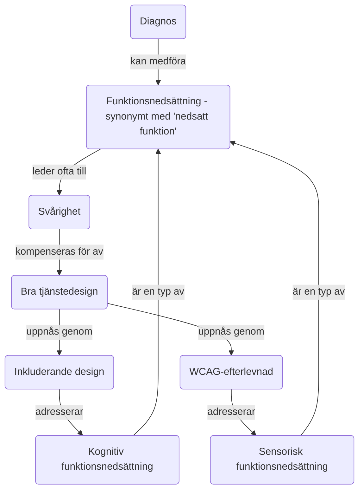

```mermaid
flowchart TB

d(Diagnos) -- kan medföra --> f(Funktionsnedsättning - synonymt med 'nedsatt funktion') 
kf("Kognitiv funktionsnedsättning") & ff("Sensorisk funktionsnedsättning") --är en typ av --> f

f -- leder ofta till --> s(Svårighet)
s -- kompenseras för av-->td(Bra tjänstedesign)
td -- uppnås genom --> id("Inkluderande design") & dos(WCAG-efterlevnad)
id -- adresserar --> kf
dos -- adresserar -->ff
```