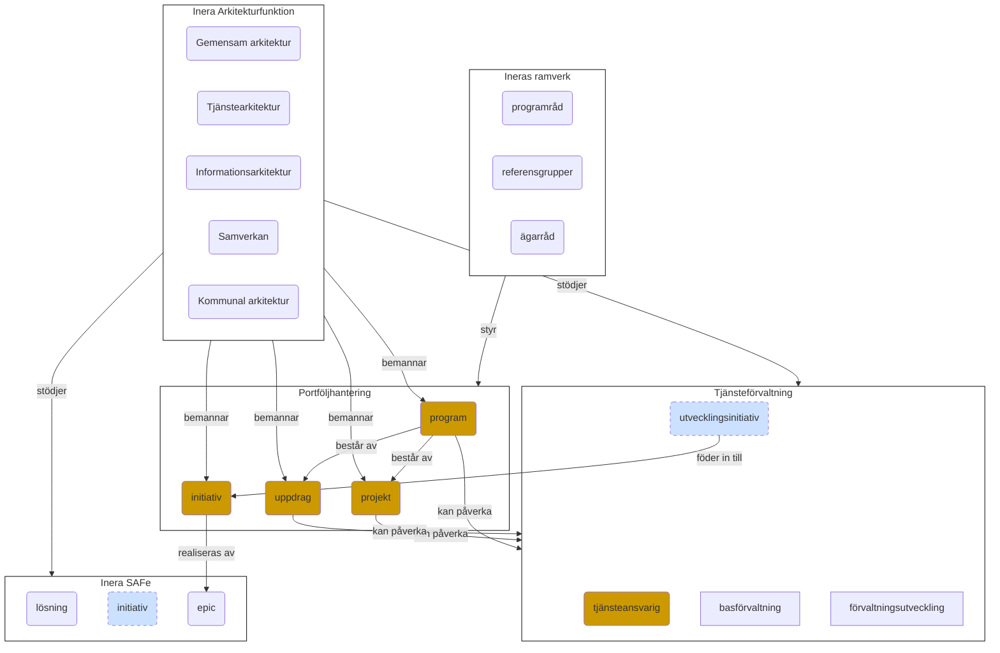

# Ineras process(er) för ledning och styrning

```mermaid
flowchart 

classDef org fill:#F8E5A0
classDef styr fill:#cc9900
classDef box fill:#ffffff,stroke:#000000
classDef spec fill:#FFC0CB
classDef dash fill:#CCE1FF,stroke-dasharray: 5 5

subgraph r[Ineras ramverk]
    rp(programråd)
    rg(referensgrupper)
    rä(ägarråd)
end
r:::box

subgraph p[Portföljhantering]
    p1(program):::styr--består av-->p2(projekt):::styr & p3(uppdrag):::styr
    pi(initiativ):::styr
end
p:::box

subgraph f[Tjänsteförvaltning]
    ta(tjänsteansvarig):::styr
    basförvaltning
    förvaltningsutveckling
    fi(utvecklingsinitiativ):::dash
end
f:::box
fi--föder in till-->pi

subgraph safe[Inera SAFe]
    s1(lösning)
    s2(initiativ):::dash
    si(epic)

end
safe:::box

subgraph ax[Inera Arkitekturfunktion]
    a1(Gemensam arkitektur)
    a2(Tjänstearkitektur)
    a3(Informationsarkitektur)
    a4(Samverkan)
    a5(Kommunal arkitektur)
end
ax:::box


r--styr-->p

ax--stödjer---->safe & f
ax--bemannar-->p1 & p2 & p3 & pi

p1 & p2 & p3 --kan påverka-->f
pi --realiseras av-->si

```