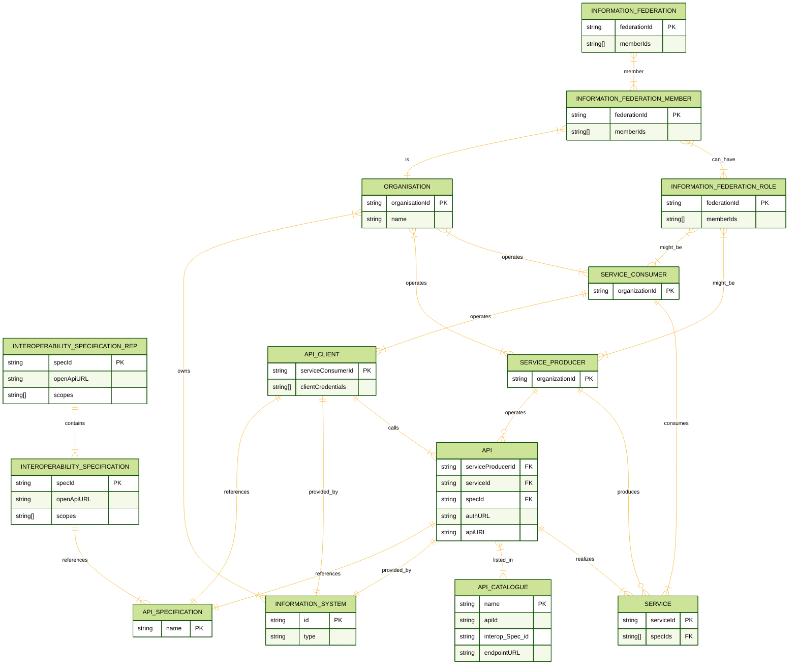

```mermaid
%%{ init: { 'theme': 'base', 'themeVariables': { 'primaryColor': '#FF2728', 'primaryTextColor': '#000', 'primaryBorderColor': '#7C0F00', 'lineColor': '#F8B229', 'secondaryColor': '#006100', 'tertiaryColor': '#fff' } } }%% %%{init: {'theme':'forest'}}%%

erDiagram
API {
    string serviceProducerId FK
    string serviceId FK
    string specId FK
    string authURL
    string apiURL
}
INTEROPERABILITY_SPECIFICATION_REP {
    string specId PK
    string openApiURL
    string[] scopes
}
INTEROPERABILITY_SPECIFICATION {
    string specId PK
    string openApiURL
    string[] scopes
}
API_SPECIFICATION {
    string name PK
}

API_CATALOGUE {
    string name PK
    string apiId
    string interop_Spec_id
    string endpointURL 

}
ORGANISATION {
    string organisationId PK
    string name
}
INFORMATION_FEDERATION {
    string federationId PK
    string[] memberIds
}

INFORMATION_FEDERATION_MEMBER {
    string federationId PK
    string[] memberIds
}
INFORMATION_FEDERATION_ROLE {
    string federationId PK
    string[] memberIds
}

INFORMATION_SYSTEM {
    string id 
    PK
    string type
}
SERVICE_PRODUCER {
    string organizationId PK
}
SERVICE_CONSUMER {
    string organizationId PK
}
SERVICE {
    string serviceId PK
    string[] specIds FK
}    

API_CLIENT {
    string serviceConsumerId PK
    string[] clientCredentials
}

INFORMATION_FEDERATION }|--|{ INFORMATION_FEDERATION_MEMBER : member
INFORMATION_FEDERATION_MEMBER }|--|{ INFORMATION_FEDERATION_ROLE: can_have
INFORMATION_FEDERATION_MEMBER }|--|| ORGANISATION: is
INFORMATION_FEDERATION_ROLE }|--|{ SERVICE_PRODUCER : might_be
INFORMATION_FEDERATION_ROLE }|--|{ SERVICE_CONSUMER : might_be
ORGANISATION}|--|{ SERVICE_CONSUMER : operates
ORGANISATION}|--|{ SERVICE_PRODUCER : operates
ORGANISATION}|--|{ INFORMATION_SYSTEM : owns

SERVICE_PRODUCER ||--o{ SERVICE : produces
SERVICE_PRODUCER ||--o{ API : operates

INTEROPERABILITY_SPECIFICATION_REP||--|{ INTEROPERABILITY_SPECIFICATION : contains
INTEROPERABILITY_SPECIFICATION ||--|{ API_SPECIFICATION : references
API ||--|{ SERVICE : realizes
API }|--|{ API_CATALOGUE : listed_in
API_CLIENT ||--|{ API : calls
API_CLIENT ||--|| INFORMATION_SYSTEM : provided_by
API ||--|| INFORMATION_SYSTEM : provided_by
SERVICE_CONSUMER ||--|{ SERVICE : consumes
SERVICE_CONSUMER ||--|{ API_CLIENT : operates
API ||--|| API_SPECIFICATION : references
API_CLIENT ||--|| API_SPECIFICATION : references
```