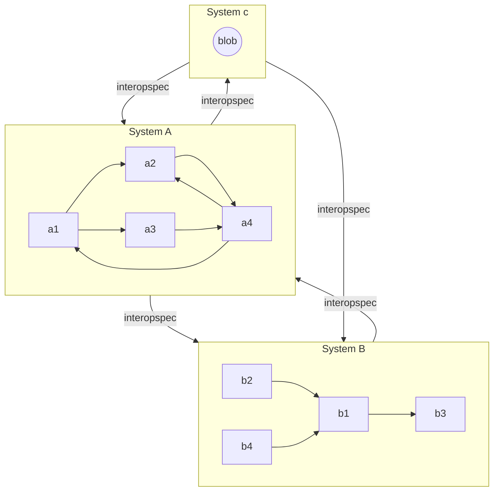

```mermaid
graph 
subgraph a[System A]
    a1-->a2 & a3-->a4-->a2 & a1
end
subgraph b[System B]
    b2 & b4 -->b1-->b3
end
subgraph c[System c]
 c1((blob))
end
a--interopspec-->b & c
b--interopspec-->a
c--interopspec-->a & b

```