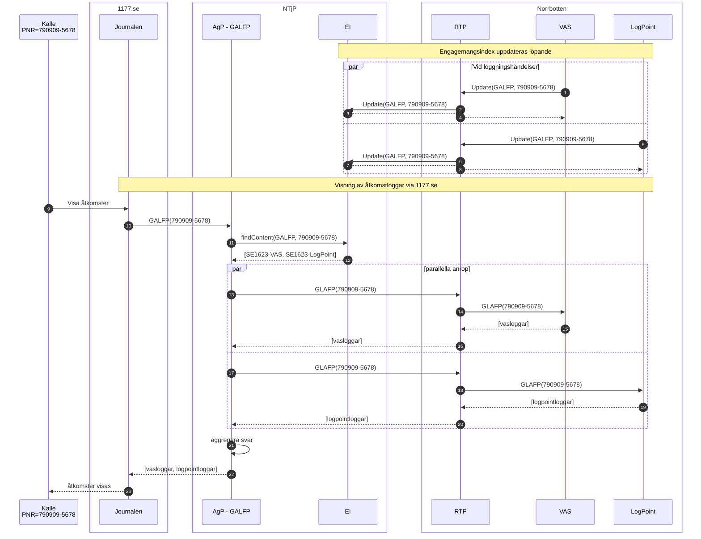
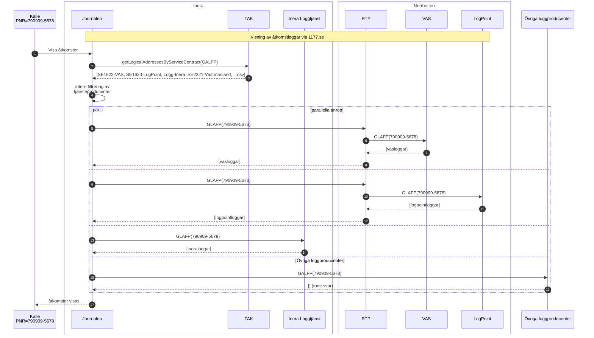

1. Norrbotten har anslutit sin RTP som tjänstekonsument till EI:Update. Detta betyder att vi utifrån TAKningarna inte ser vilka bakomliggande system som skriver EI-poster.
1. Vi antar att Norrbottens RTP idag skriver EI-poster för GALFP på uppdrag av VAS
1. Norrbotten kan utan ny TAKning börja skriva EI-poster för GALFP på uppdrag av LogPoint 
1. Norrbotten - VAS är redan ansluten som producent av GALFP
1. Norrbotten LogPoint behöver anslutas som producent av GALFP och då med ett HSA-Id för det källsystemet

1. Norrbotten - VAS är redan ansluten som producent av GALFP
1. Norrbotten LogPoint behöver anslutas som producent av GALFP och då med ett HSA-Id för det källsystemet
1. LogPoint behöver registreras att inkluderas av Joournalens aggregering
1. Journalen kommer ställa förfrågningar till både VAS och LogPoint