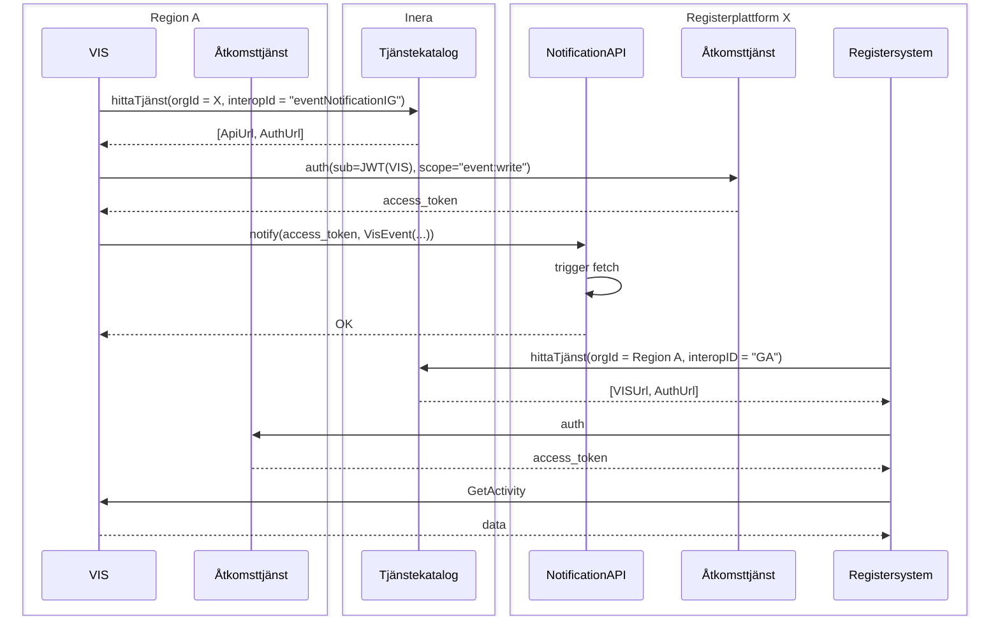

```mermaid
sequenceDiagram
box Region A
    participant vis as VIS
    participant as as Åtkomsttjänst
end

box Inera
    participant tk as Tjänstekatalog
end

box Registerplattform X
    participant rapi as NotificationAPI
    participant ras as Åtkomsttjänst
    participant r as Registersystem
end

vis->>tk: hittaTjänst(orgId = X, interopId = "eventNotificationIG")
tk-->>vis: [ApiUrl, AuthUrl]
vis->>ras: auth(sub=JWT(VIS), scope="event:write") 
ras-->>vis: access_token
vis->>rapi: notify(access_token, VisEvent(...))
rapi->>rapi: trigger fetch
rapi-->>vis: OK
r->>tk: hittaTjänst(orgId = Region A, interopID = "GA")
tk-->>r: [VISUrl, AuthUrl]
r->>as: auth
as-->>r: access_token
r->>vis: GetActivity
vis-->>r: data
```