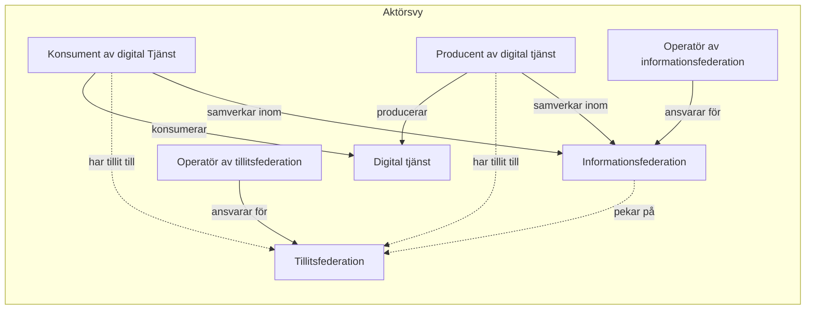

```mermaid
flowchart LR
subgraph coop[Aktörsvy]
    tfed[Tillitsfederation]
    ifed[Informationsfederation]
    t[Digital tjänst]
    k[Konsument av digital Tjänst]
    p[Producent av digital tjänst]
    tfedo[Operatör av tillitsfederation]
    ifedo[Operatör av informationsfederation]
end
k & p -- samverkar inom --> ifed
ifedo -- ansvarar för --> ifed
tfedo -- ansvarar för --> tfed
ifed -. pekar på .-> tfed
p & k -. har tillit till .-> tfed
p -- producerar --> t
k -- konsumerar --> t
```