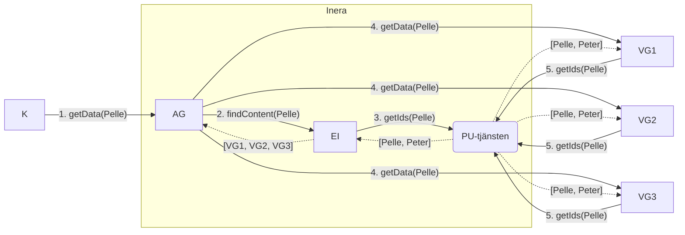

```mermaid
graph LR 

subgraph i[Inera]
    AG
    EI
    ids
end
K--1. getData(Pelle)-->AG

AG--2. findContent(Pelle)-->EI
EI-.[VG1, VG2, VG3].->AG

EI--3. getIds(Pelle)-->ids(PU-tjänsten)
ids-.[Pelle, Peter].->EI

AG--4. getData(Pelle)-->VG1 & VG2 & VG3
VG1 & VG2 & VG3 --5. getIds(Pelle)-->ids
ids-.[Pelle, Peter].->VG1 & VG2 & VG3


```