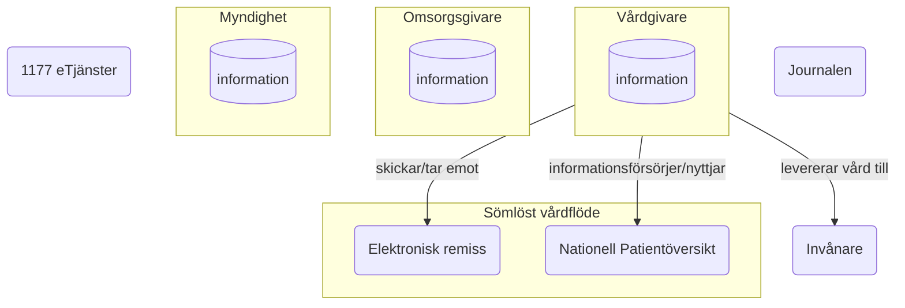

```mermaid
graph

i(Invånare)

subgraph vg[Vårdgivare]
    s1[(information)]
end
subgraph og[Omsorgsgivare]
    s2[(information)]
end
subgraph m[Myndighet]
    s3[(information)]
end

subgraph sv[Sömlöst vårdflöde]
    r(Elektronisk remiss)
    npö(Nationell Patientöversikt)
end

j(Journalen)
1177(1177 eTjänster)

vg--skickar/tar emot-->r
vg--levererar vård till-->i
vg--informationsförsörjer/nyttjar-->npö


```