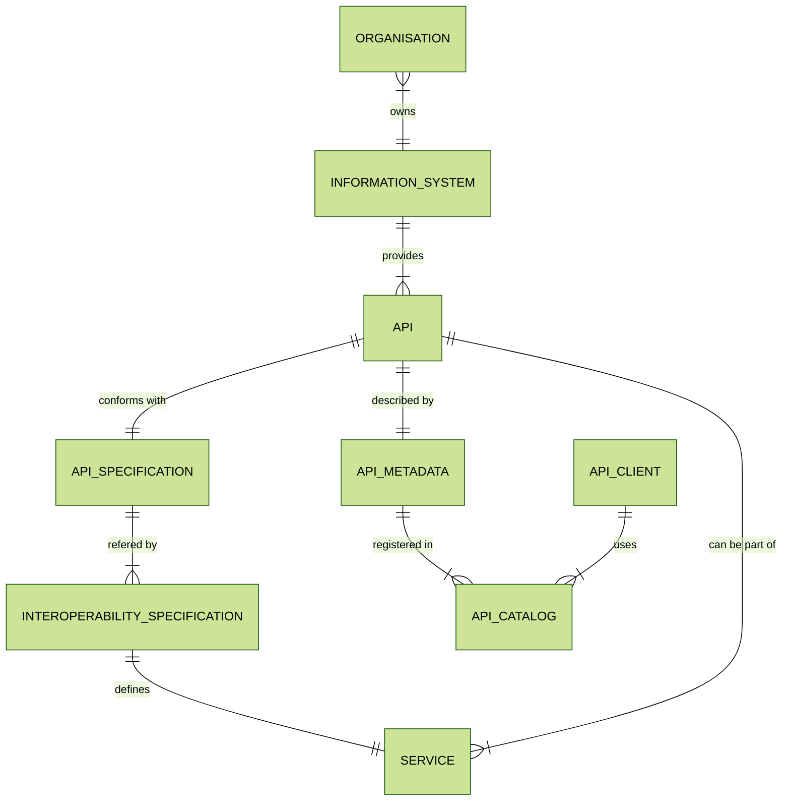

```mermaid
erDiagram
%%{init: {'theme':'forest'}}%%

API_SPECIFICATION ||--|{ INTEROPERABILITY_SPECIFICATION : "refered by"
INTEROPERABILITY_SPECIFICATION ||--|| SERVICE: "defines"
ORGANISATION }|--|| INFORMATION_SYSTEM: "owns"
INFORMATION_SYSTEM ||--|{ API : "provides"

API ||--|| API_SPECIFICATION : "conforms with"
API ||--|{SERVICE : "can be part of"
API_METADATA ||--|{API_CATALOG: "registered in"

API_CLIENT ||--|{API_CATALOG : "uses"

API ||--|| API_METADATA: "described by"


```