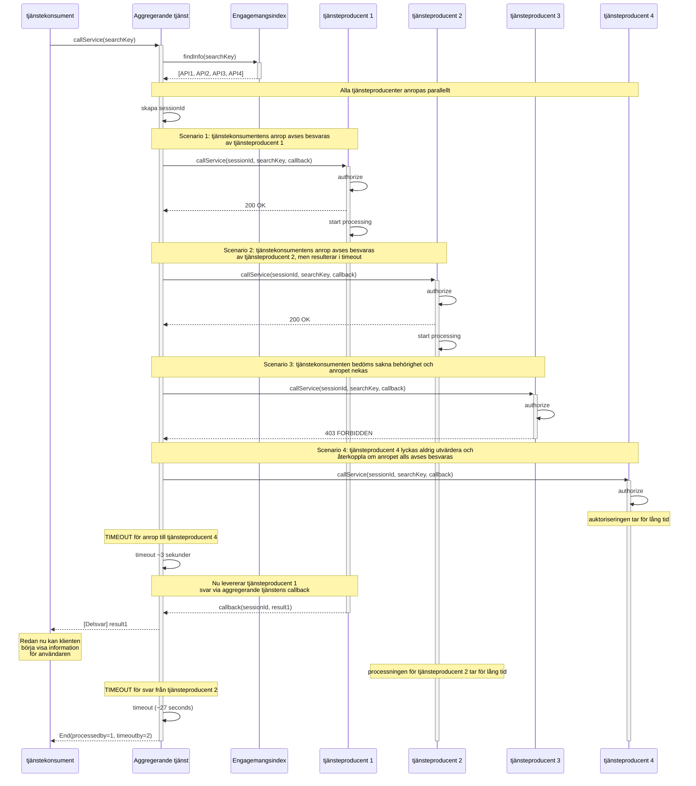

```mermaid
sequenceDiagram

participant c as tjänstekonsument
participant agg as Aggregerande tjänst
participant idx as Engagemangsindex
participant p1 as tjänsteproducent 1
participant p2 as tjänsteproducent 2
participant p3 as tjänsteproducent 3
participant p4 as tjänsteproducent 4


c->>+agg: callService(searchKey)
agg->>+idx: findInfo(searchKey)
idx-->>-agg: [API1, API2, API3, API4]

note over agg, p4: Alla tjänsteproducenter anropas parallellt
agg->>agg: skapa sessionId
note over agg,p1: Scenario 1: tjänstekonsumentens anrop avses besvaras<br>av tjänsteproducent 1
agg->>+p1: callService(sessionId, searchKey, callback)
p1->>p1: authorize
p1-->>agg: 200 OK
p1->>p1: start processing
note over agg,p2: Scenario 2: tjänstekonsumentens anrop avses besvaras<br>av tjänsteproducent 2, men resulterar i timeout
agg->>+p2: callService(sessionId, searchKey, callback)
p2->>p2: authorize
p2-->>agg: 200 OK
p2->>p2:start processing
note over agg,p3: Scenario 3: tjänstekonsumenten bedöms sakna behörighet och<br>anropet nekas
agg->>+p3: callService(sessionId, searchKey, callback)
p3->>p3: authorize
p3-->>-agg: 403 FORBIDDEN
note over agg,p4: Scenario 4: tjänsteproducent 4 lyckas aldrig utvärdera och<br> återkoppla om anropet alls avses besvaras
agg->>p4: callService(sessionId, searchKey, callback)
activate p4
p4->>p4: authorize
note over p4:  auktoriseringen tar för lång tid
note over agg: TIMEOUT för anrop till tjänsteproducent 4
agg->>agg: timeout ~3 sekunder
note over agg,p1: Nu levererar tjänsteproducent 1 <br>svar via aggregerande tjänstens callback
p1-->>agg: callback(sessionId, result1)
deactivate p1
agg-->>c: [Delsvar] result1
note over c: Redan nu kan klienten<br/> börja visa information<br/>för användaren
note over p2: processningen för tjänsteproducent 2 tar för lång tid
note over agg: TIMEOUT för svar från tjänsteproducent 2
agg->>agg: timeout (~27 seconds)
agg-->>c: End(processedby=1, timeoutby=2)
deactivate agg
deactivate p2
deactivate p4
```